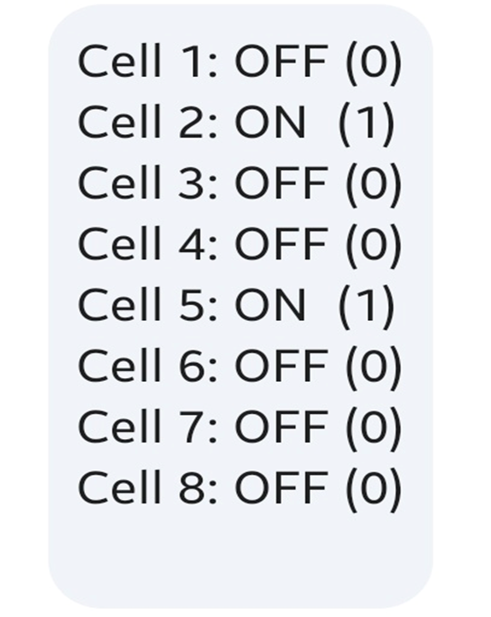
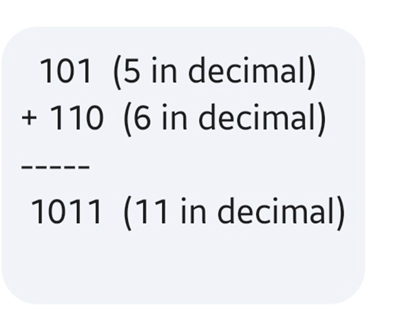

##### Below is the hardware hierarchy

Transistor-> Regsisters -> ALU -> Register-> RAM -> OS -> Secondary storage

##### High level understanding about how the data is converted into binary, then manipulated, and finally return back to secondary storage.

Register contains lot of transistors, check the binary value based on switches and its stored into Register. It's moved to alu for computation. Finally the computed value moved into register lastly data moved from registers into ram then OS will swap the data from Ram into secondary storage

Simply a transistor can store only one bit of data, a register can store 32 or 64 bit of data based on processor architecture. If the processor is 32 bit so the register will store 32 bit amount of data's.

**First transistor is primary thing to build a processor**. It's made up of silicon and its called semiconductor material. It like a switch (on or off). On means it will consider 1 and off means it will consider 0. Based on this it will consider values.
Transistor will perform Logical operations (using logic gates (AND, OR, NOT, XOR etc))based on binary values, it also store values(costruct memory cells using circuits) and manipulate (calculated value).


**Question : But how below code work using transistor**

```
Public static void main(String[] args)
{
System.out.println("Hello");
int start = 0;
System.out.println("Started No "+ start);
Char char = 'a';

Int result = 5 + 6;
functionaToDisplayValues(result);
}

functionaToDisplayValues(int res){
System.out.println("Ended No "+ res);
}
```
Let's break down, how the below value Hello is consume by transistor inside a processor

**System.out.println("Hello");**

1. JVM will convert into bytecode first (platform independent)
2. JVM will use JIT compiler to convert the bytecode into machine code next (0's and 1's)
3. Let's say Hello will be considered as ASCII value<br>
     H is 72 <br>
     e is 101 <br>
     l and l is 108 <br>
     Finally o is 111 <br>
4. Let's break more deeper, above ASCII values are converted into machine code<br>
   H - 72 - 01001000<br>
   e - 101 - 01100101<br>
   l and l - 108 - 01101100<br>
   o - 111 - 01101111<br>
5. Now take only the first letter H and its binary value 01001000

So few transistor will perform operations, and each value is consider as 1 bit of size. So each value will be stored in each cell. So it's requires 8 bits of size is equal to one byte.
So storing a value Hello requires 5 byte of memory.
<br>
Also, if you consider letter H, it's 8 bits or 1 byte. So, to store a Char value it requires maximum 8 bits or 1 byte, but Java allocated 2 bytes for character for various reason as Java consider each character in Unicode(its convering around 65K characters from all international languages, englisj letter a to z included in those 65K letters).

7. Now consider we're going to perform addition operation using 5 + 6 value
   5 is 101 in binary and 6 is 110 in binary and (+ sign is 0 and - sign is 1 in binary)
   To perform any arithmetic operation (ALU) exits in processor its made up of several transistors.

From high level, 101 and 110 will be performed by Logical gates. So we'll get 1011 as an output (it will be stored in registers or memory) which is 11.<br>
<br>
Also, if you consider any Integer value it should be 32 bits or 4 bytes in memory.

**Conclusion,**

Whether a number, alphabet. All things will be converted into binaries (0s and 1s). To store binary its requires memory cell. In other hand to perform any calculations (ALU may be for arithmetics, it access transistors to calculate result using logic gates).

Each memory cell consists of single bit. 1 byte is equal to 8 bits. So Integer should be maximum of 32 bits or 4 bytes. Long

should be maximum of 64 bits or 8 bytes. Also Char should be maximum of 16 bits or 2 characters.

Finally I know which datatype requires how much memory, but i understood what is actually a bit is and how it's converted. Thanks to Gemini AI.

