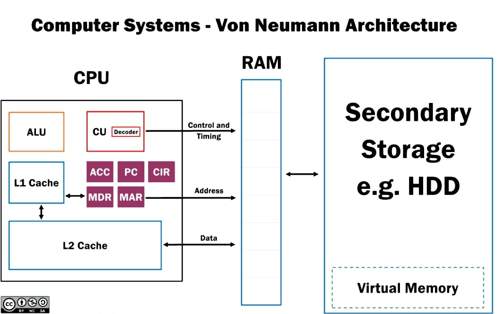

**CPU Organization: Registers, ALU, control unit, instruction cycle**

To understand computer organization or computer architecture, consider Kitchen as an example.

Chef (Control Unit): Directs the cooking process by reading the recipe and telling the cook what to do.
Spices and Oils next to the Stove (Cache): Frequently used items kept readily available for quick access.
Small Bowls of Prepped Ingredients (Registers): Ingredients the chef is actively working with or intermediate results waiting to be used in the next few steps.
Recipe Notes (RAM): Instructions and data that the chef refers to throughout the cooking process.
Stove/Cutting Board (ALU): Where the actual cooking actions (calculations/operations) take place.

**Registers** : Registers are very small and present within the CPU. It is very fast and less storage area. So CPU will keep most frequent data to achieve performance.
Registers will store some data which going to compute (adding 2 numbers, these 2 numbers will be stored in a register), also register will store intermediate results, some registers will keep the memory addresses (indicating where it needs to be stored and where it needs to fetch, some registers called special pointer registers (tracks the address of next instruction to execute or Stack Pointer, which manager the call stack).

**ALU** : It will perform all type of arithmetic and logical operation. It will process the data from the registers and stores back to registers or RAM or any secondary memory.

**Control unit** (it’s a hardware - handles by CPU) : Billions of transistors working together, to fetch the data from RAM or secondary storage, decodes it and finally tells to the ALU what operations needs to perform and which registers are used to get the values. 
o	**Instruction Fetch:** Retrieves the next instruction from memory (pointed to by the Instruction Pointer/Program Counter). 
o	**Instruction Decode:** Interprets the instruction to determine what operation needs to be performed and what operands are needed. 
o	**Instruction Execution:** Directs the ALU to perform the operation, manages data flow between registers and memory, and updates the Instruction Pointer/Program Counter to point to the next instruction. 

**Instruction Cycle :** It’s a set of procedure for CPU (fetch, decode, execute) and control unit will take care these steps. But the steps are predefined.

[Explore zero to 100 about, how the data is processed](0to100_how_data_executed.md)
