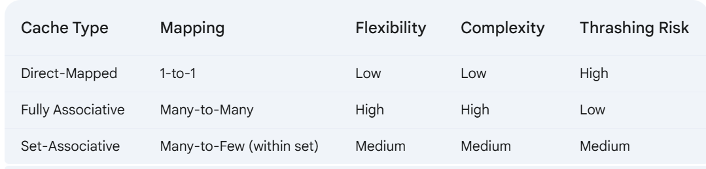

<h2>Memory Hierarchy: Registers,Cache memory, RAM, secondary storage, virtual memory</h3>

First understand how the memory will be use

**Program Start:** When you run a program, its instructions and data are initially stored on secondary storage. 
**Loading into RAM:** The operating system loads the necessary parts of the program into RAM. 
**CPU Access:** The CPU fetches instructions and data from RAM to execute the program. 
**Cache Hits:** If the data or instruction is in the cache, the CPU accesses it quickly. 
**Cache Misses:** If the data or instruction is not in the cache, the CPU accesses it from RAM (slower). 
**Virtual Memory:** If the data or instruction is not in RAM, the operating system uses virtual memory techniques to load it from secondary storage (which is the slowest step). 

<h3>Memory Hierarchy</h3>

○ Fastest and most expensive: Registers (inside the CPU) and Cache memory. 
○ Slower and less expensive: RAM (Random Access Memory). 
○ Slowest and least expensive: Secondary storage (Hard Drives, SSDs). 

<h3>Cache Memory</h3>
**Location:** Resides between the CPU and RAM. 
**Purpose:** Stores the most frequently accessed data and instructions. 
**Speed:** Extremely fast access times, significantly faster than RAM. 
**Levels:** Often organized in levels (L1, L2, L3). L1 is the smallest and fastest, L2 is larger and slower, and so on. 
**How it Works:** When the CPU needs data, it first checks the cache. If the data is present (a "cache hit"), the CPU retrieves it quickly. If the data is not in the cache (a "cache miss"), the CPU must access RAM, which is slower. The cache uses algorithms to predict which data the CPU will need next and preloads it from RAM. 

<h4>Cache Organization (How Data is Stored):</h4>

Direct-Mapped Cache:
				□ Concept: Each memory location in RAM has only one specific location where it can be stored in the cache. Think of it like assigned parking spots. If your spot is taken, you can't park there. 
				□ Example: Imagine a cache with 4 slots and RAM with 8 locations. Location 0 of RAM always maps to slot 0 of the cache, location 1 of RAM always maps to slot 1 of the cache, and so on. If you need to access location 8 of RAM, it would map to slot 0 (8 mod 4 = 0), potentially replacing the data that was previously there. 
				□ Advantages: Simple to implement. 
				□ Disadvantages: Can lead to "cache thrashing" if frequently used data maps to the same cache location. This means the CPU spends a lot of time swapping data in and out of the cache. 
Fully Associative Cache:
				□ Concept: A memory location from RAM can be stored in any location in the cache. Think of it like open parking – you can park in any available spot. 
				□ Example: In our 4-slot cache, RAM location 0, 1, 2, or any other location could be stored in any of the 4 cache slots. 
				□ Advantages: More flexible, reduces cache thrashing. 
				□ Disadvantages: More complex hardware is needed to search the cache because the CPU has to check every slot to see if the data is present. 
Set-Associative Cache:
				□ Concept: A compromise between direct-mapped and fully associative. The cache is divided into sets (groups of slots). A memory location can be stored in any slot within its assigned set. Think of it like assigned parking zones – you can park in any available spot within your zone. 
				□ Example: A 2-way set-associative cache with 4 slots has 2 sets, each with 2 slots. RAM location 0 might map to set 0 (either of the 2 slots), RAM location 1 might map to set 1 (either of the 2 slots), and so on. 
**Advantages**: Balances flexibility and implementation complexity. Reduces thrashing compared to direct-mapped.

**Cache Policies (How Data is Managed): (DSA)**
**Replacement Policies:** When the cache is full, a decision must be made which data to replace to make room for new data. Common policies include Least Recently Used (LRU), First-In First-Out (FIFO), and Random Replacement. 
**Write Policies:** Determine how and when data written to the cache is also written to main memory. Common policies include Write-Through (data is written to both cache and main memory simultaneously) and Write-Back (data is written only to the cache, and main memory is updated later).

<h3>RAM (Random Access Memory)</h3>
• **Location**: Main memory of the computer. 
• **Purpose**: Stores the data and instructions that the CPU is actively using. 
• **Speed**: Much faster than secondary storage but slower than cache. 
• **Volatility**: Data in RAM is lost when the computer is powered off (volatile). 
• **Access**: Data can be accessed randomly, meaning any location in RAM can be accessed directly without needing to go through other locations. 

<h3>Secondary Storage</h3>
Location: External to the CPU and RAM (e.g., hard drives, SSDs).
• **Purpose**: Stores data persistently. Data remains even when the computer is turned off (non-volatile). 
• **Speed**: Much slower than RAM. 
• **Capacity**: Stores vast amounts of data. 
• **Types**:

**Hard Disk Drives (HDDs):** Mechanical drives with spinning platters.
**Solid State Drives (SSDs):** Electronic drives with no moving parts, faster than HDDs.

<h3>Virtual Memory (Its a feature by OS)</h3>

* At present all types of OS supporting virtual memory technique.
* Virtual Memory is a memory management technique, and its introduced for efficiently use the memory even the RAM size not met for to run the application.
* It uses a concept called paging. Consider one table will be created (page table) in Primary storage.
* If the RAM is nearly full, a data from the page will be swapped (based on algorithm like FIFO, LRU etc..) into secondary storage's by OS
* So opened applications data will be travelled between RAM and Secondary storage.
* Based on the demand, the pages will be loaded from secondary storage into RAM.
* When CPU tries to access the data which is not in RAM is called page faults, then it will be loaded from secondary storage by OS.

**Advantages:**

* Run multiple applications parellely
* Allows program to utilise more memory than available physical memory

**Cons:**
* Sometimes, it will be slow when its loading the data from secondary storage.

