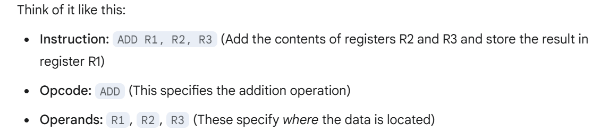
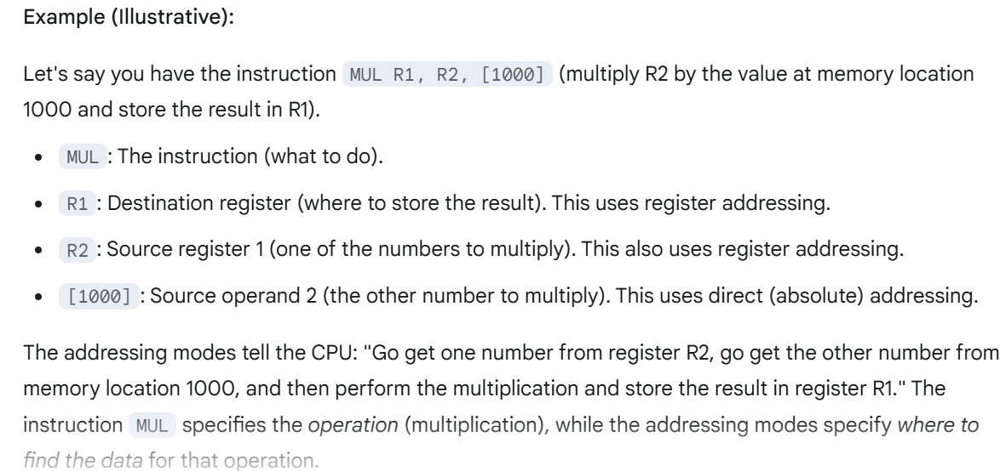
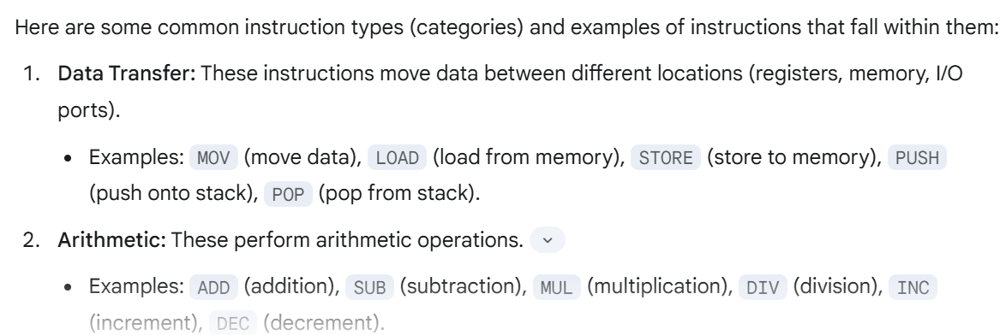
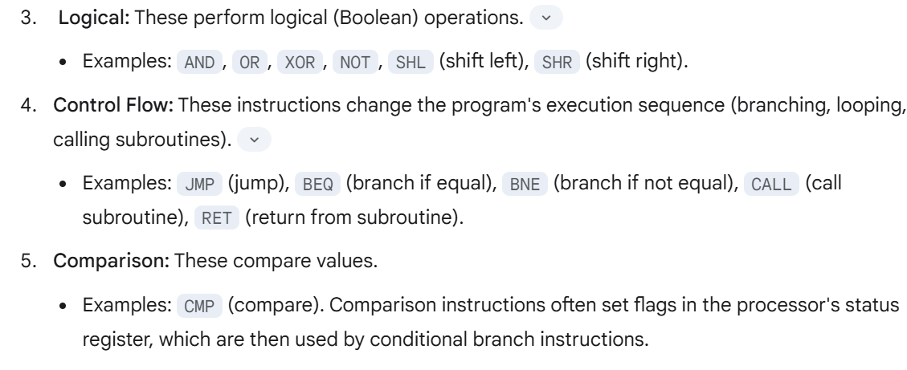
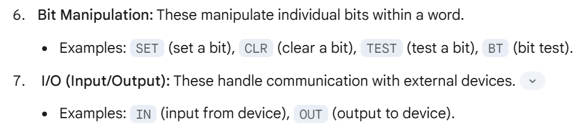

<h3>Instruction Set Architecture (ISA): Instruction formats, addressing modes, instruction types</h2>

##### Why we need to know about ISA

Learning and understanding ISA helps software engineers write highly efficient code 
because they gain insight into how code is translated into machine instructions and executed
by the processor. This knowledge enables them to write code optimized for specific processors,
taking advantage of their features and capabilities.  Furthermore, understanding ISA is 
crucial for adapting and optimizing existing software to leverage new hardware technologies
and instruction set extensions.

**1. Instruction formats**
An instruction format in ISA is a predefined 
structure that specifies how the different parts of a
machine instruction (opcode, operands, addressing 
modes) are organized. This structure enables the CPU
to correctly decode the instruction, identify the
operation to be performed (opcode), and locate the 
data (operands) using the specified addressing modes
for execution. 

**2. Addressing modes :**
Addressing modes specify how the CPU locates the operands (data) for an instruction, indicating where the data is stored (registers or memory) and how to calculate memory addresses. They do not instruct the CPU what operation to perform (like adding).  For example, an addressing mode might tell the CPU to fetch one operand from a register and another from a specific memory location, which the instruction (like ADD) will then use.

**3. Instruction types**
Instruction types in ISA categorize instructions based on their function (e.g., arithmetic, data transfer, logical, control flow).  These categories provide a structured way to understand the operations a processor can perform
