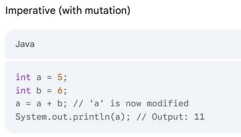
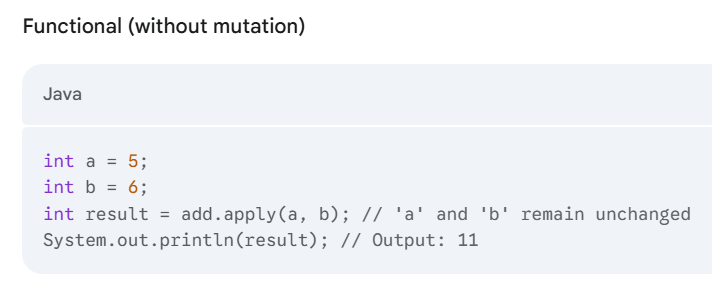
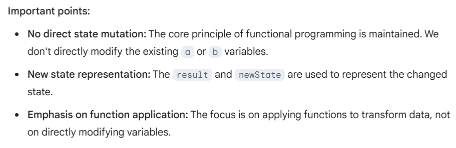

<h3>Key Features of Functional Programming</h2>

<ol>
  <li><b>First-Class Functions:</b> Functions are treated as "first-class citizens," meaning they can be assigned to variables, passed as arguments to other functions, and returned as values from functions. This enables higher-order functions and powerful abstractions.</li>
  <li><b>Higher-Order Functions:</b> Functions that take other functions as arguments or return functions as results. This allows for operations like map, filter, and reduce, which can process data in a declarative way.</li>
  <li><b>Immutability:</b> Data is immutable, meaning it cannot be changed after it's created. This eliminates side effects and makes code more predictable.(Read below example)</li>
  <li><b>Pure Functions:</b> Functions that always produce the same output for the same input and have no side effects. This makes them easy to test and reason about.</li>
  <li><b>Referential Transparency:</b> An expression can be replaced with its value without changing the program's behavior. This is a consequence of immutability and pure functions.</li>
  <li><b>Lazy Evaluation:</b> Expressions are evaluated only when their values are needed. This can improve performance and enable working with infinite data structures.</li>
  <li><b>Functional Composition:</b> Combining simple functions to build more complex ones. This can lead to more modular and reusable code.</li>
  <li><b>Recursion:</b> A function calling itself to solve a problem. This is a common technique in functional programming for tasks like traversing data structures.</li>
  <li><b>Pattern Matching:</b> A concise way to express conditional logic based on the structure of data. This can improve code readability and maintainability.</li>
  <li><b>Declarative Programming:</b> Focusing on what you want to achieve rather than how to achieve it. This leads to more concise and understandable code.</li>
</ol>

Read Immutability with example

