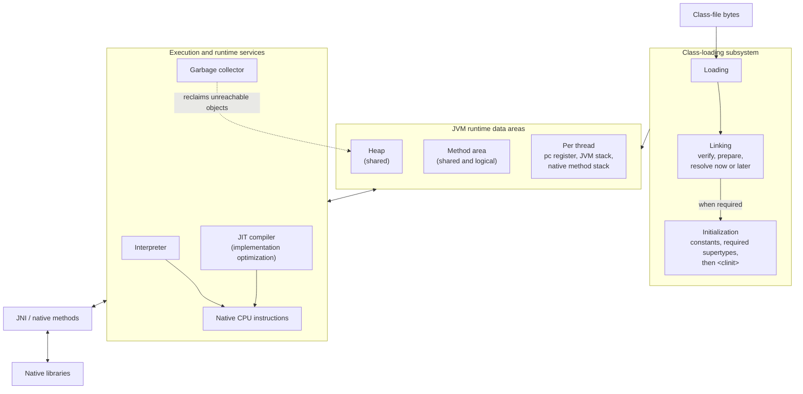
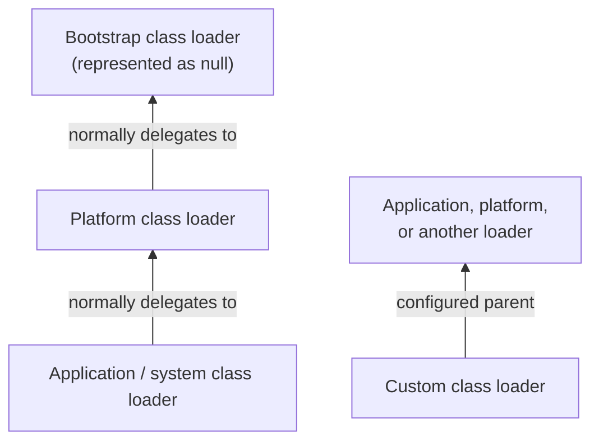
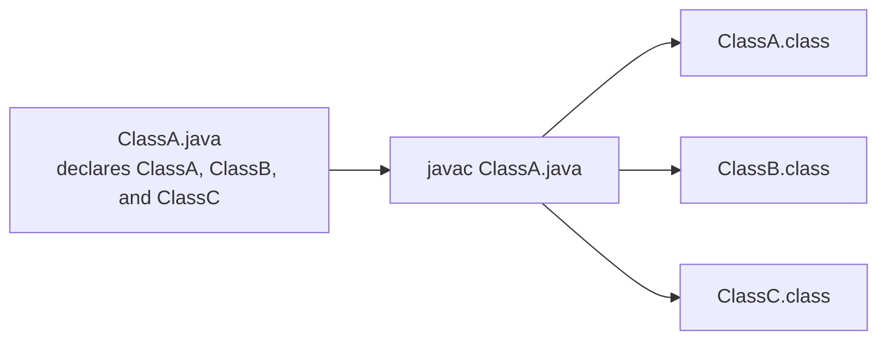
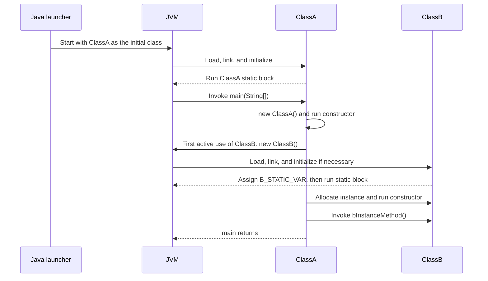
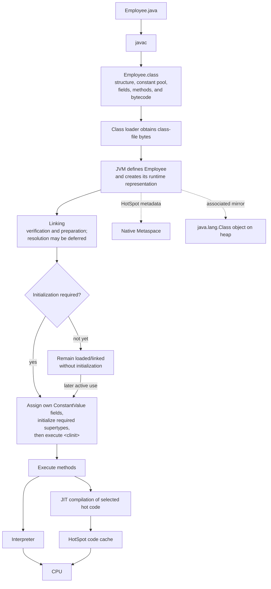

# JVM Internal Structure and Class Loading

**Before diving into JVM architecture, let's understand how some other programming languages are executed.**

1. C and C++ are normally compiled to native machine code for a particular processor architecture, operating system, and ABI. The resulting binary can run on compatible machines; it is not necessarily restricted to the exact machine on which it was compiled.
2. Java source is compiled to platform-neutral bytecode, which a platform-specific JVM executes. A JAR containing only Java bytecode can generally run on any compatible Java runtime, although native libraries, OS-specific behavior, and the required Java version can reduce that portability. Python and JavaScript obtain portability differently: their source or intermediate representation is executed by a platform-specific interpreter or runtime.

## JVM introduction and prerequisites

1. A JDK includes development tools and everything needed to run Java applications. Java 9 introduced modular runtime images and removed the old nested `jdk/jre` directory layout. JDK 9 and 10 still had separate JDK and JRE images, but JDK 11 and later no longer have a separate JRE image in the JDK distribution. A tailored runtime image can be built with `jlink`; vendor packaging may vary.
2. Running `java ClassName` normally starts an operating-system process containing a JVM instance. When that process terminates, the JVM instance terminates. Starting multiple `java` processes creates multiple JVM instances.
3. `javac FileName.java` compiles source into one or more `.class` files. `java ClassName` starts a JVM and asks it to run the specified class's `main` method; `ClassName` is a binary class name, not a filename. Java 11 and later can also launch a single source file directly with `java FileName.java`.

**A JVM implementation can be understood through three major areas:**

1. Class-loading subsystem
2. Runtime data areas
3. Execution engine



The method area in this diagram is the logical runtime area defined by the JVM specification. In HotSpot, much of the class metadata is held in native Metaspace, while associated `java.lang.Class` objects are on the heap. JIT compilation, the code cache, Metaspace, and a particular garbage collector are implementation choices rather than separately mandated JVM runtime data areas.

## Class-file and bytecode fundamentals

Java source is normally compiled into the JVM's platform-neutral class-file format:

```text
Java source -> javac -> .class file -> compatible JVM implementation
```

Useful inspection commands:

```text
javac Calculator.java
javap -c -p Calculator
javap -v Calculator
```

A class file contains structures such as:

```text
.class file
├── magic number and class-file version
├── constant_pool table
├── access flags
├── this class and superclass
├── implemented interfaces
├── field descriptions
├── method descriptions and bytecode
└── attributes
```

The class-file `constant_pool` table contains constants and symbolic information used by the class definition, including class, field, and method references. When the JVM creates the class/interface, it derives a per-class **runtime constant pool** from this table; symbolic references can later be resolved according to the linking rules.

JVM bytecode is primarily stack-oriented. Instructions commonly move values between a frame's local-variable array and operand stack:

```java
public int add(int a, int b) {
    return a + b;
}
```

Conceptually:

```text
iload_1
iload_2
iadd
ireturn
```

This instruction set does not expose one physical CPU register architecture. An interpreter or JIT compiler maps the specified bytecode behavior onto the actual machine while preserving JVM semantics.

## 1. Class-loading subsystem

The class-loading subsystem locates class definitions and makes them available to the JVM. A class goes through loading, linking, and initialization. Verification is part of linking, not something performed by a class loader before loading.

1. Loading
2. Linking
3. Initialization

### 1.1 Loading

During loading, the JVM obtains the binary representation of a class or interface and creates its runtime representation, including a corresponding `java.lang.Class` object.



The built-in class loaders normally use parent-first delegation. In simplified form, `ClassLoader.loadClass(name)`:

1. Checks whether this loader has already loaded the class.
2. Delegates to its parent. For the platform loader, delegation to its `null` parent means asking the bootstrap loader.
3. Calls its own class-finding logic only if the parent cannot find the class.

For an application class such as `com.example.MyClass`, the request commonly begins at the application class loader, delegates to the platform loader, and then to the bootstrap loader. If no parent defines it, the application loader searches the application class path or module path.

The three built-in loaders are:

1. **Bootstrap class loader:** Built into the JVM and represented as `null` in the `ClassLoader` API. It defines core classes, including classes in `java.base` such as `java.lang.String`. It is the parent of the platform class loader.
2. **Platform class loader:** Introduced in Java 9 as the successor to the Java 8 extension class loader. It defines selected Java platform modules. Not every `java.*` class is defined by this loader; many core classes are defined by the bootstrap loader.
3. **Application (system) class loader:** Normally defines application and third-party classes found on the class path or module path. Its parent is usually the platform class loader.

| Loader | Normal responsibility | Parent |
|---|---|---|
| Bootstrap | JVM-internal loader for core classes and other classes mapped to it by the runtime; for example, `java.lang.String` | None; represented as `null` |
| Platform | Java SE, JDK, and implementation classes defined to this loader | Bootstrap |
| Application/system | Application class path, application module path, and some JDK-specific tools | Normally platform |

This is the normal built-in hierarchy, not a guarantee that every delegation relationship is strictly hierarchical. With named modules, the platform loader may sometimes delegate to another loader to preserve module readability. The exact mapping of platform modules to built-in loaders is determined by the runtime.

#### Custom class loader

A custom class loader is useful when class bytes do not come from the normal class path—for example, when loading plug-ins, encrypted or generated classes, classes from a database, or isolated versions of the same library.

Usually, extend `ClassLoader` and override `findClass`, leaving `loadClass` unchanged so that the normal parent-first delegation rules remain intact:

```java
import java.io.IOException;
import java.nio.file.Files;
import java.nio.file.Path;

public final class DirectoryClassLoader extends ClassLoader {
    private final Path rootDirectory;

    public DirectoryClassLoader(Path rootDirectory, ClassLoader parent) {
        super(parent);
        this.rootDirectory = rootDirectory;
    }

    @Override
    protected Class<?> findClass(String binaryName) throws ClassNotFoundException {
        Path classFile = rootDirectory.resolve(
                binaryName.replace('.', '/') + ".class"
        );

        try {
            byte[] classBytes = Files.readAllBytes(classFile);
            return defineClass(binaryName, classBytes, 0, classBytes.length);
        } catch (IOException exception) {
            throw new ClassNotFoundException(binaryName, exception);
        }
    }
}
```

Example usage:

```java
Path classesDirectory = Path.of("plugins/classes");
ClassLoader loader = new DirectoryClassLoader(
        classesDirectory,
        ClassLoader.getSystemClassLoader()
);

Class<?> pluginClass = loader.loadClass("com.example.MyPlugin");
Object plugin = pluginClass.getDeclaredConstructor().newInstance();
```

Important points:

- `loadClass` coordinates delegation and caching; `findClass` supplies the custom byte source. Override `loadClass` only when a deliberate child-first policy is required, because doing so can break type compatibility or allow application classes to shadow platform classes.
- A runtime type is identified by both its binary name and its defining class loader. Therefore, two loaders can define `com.example.Widget` as two distinct, assignment-incompatible types.
- `defineClass` turns the byte array into a JVM class definition. The JVM still performs its normal format, verification, linking, and initialization rules.
- Calling `loadClass` loads the class but does not necessarily initialize it. Initialization can be requested with `Class.forName(name, true, loader)` or triggered by the class's first active use.
- Real plug-in systems normally share an API or interface through a common parent loader, then load each plug-in implementation through its own child loader. Package, module, sealing, resource-loading, and dependency-isolation rules also need consideration in production designs.

#### Reflection and dynamic class access

Reflection operates on runtime type information represented through objects such as `Class`, `Method`, `Field`, and `Constructor`:

```java
Class<?> type = Class.forName("com.example.Employee");
Object employee = type.getDeclaredConstructor().newInstance();
```

By default, `Class.forName(String)` loads, links, and initializes the named class through the caller's defining loader. The overload `Class.forName(name, initialize, loader)` controls initialization explicitly, while `ClassLoader.loadClass(name)` does not itself require initialization.

Reflective access still obeys Java access checks and module encapsulation unless access has been opened through an applicable supported mechanism. Frameworks may also use method handles, proxies, generated bytecode, or hidden classes; reflection is not the only form of dynamic invocation or runtime code generation.

### 1.2 Linking

After loading, the class is linked. Linking has three parts:

1. **Verification:** Checks that the class-file structure and bytecode satisfy JVM constraints and are type-safe enough to execute.
2. **Preparation:** Creates the class's static fields and assigns their JVM default values (`0`, `null`, `false`, and so on). Preparation does not execute Java bytecode.
3. **Resolution:** Replaces symbolic references in the runtime constant pool with concrete runtime references. The JVM may resolve references lazily or eagerly, provided errors occur at points allowed by the JVM specification; it is not guaranteed to happen only on first access.

Conceptually:

```text
Before resolution (symbolic references):
java/lang/String
java/lang/System.out:Ljava/io/PrintStream;

After resolution (runtime references):
Reference to the JVM's loaded String class representation
Reference to the resolved System.out field
```

### 1.3 Initialization

Initialization encompasses assigning values from any class-file `ConstantValue` attributes and executing the declared class or interface initialization method, named `<clinit>` in JVM terminology. The `<clinit>` method is generated from other executable static field initializers and `static` blocks. Therefore, both a constant variable such as `static final int LIMIT = 10` and an ordinary field such as `static int x = 10` receive their declared values as part of initialization, although the mechanisms differ.

As part of initializing a class, the JVM assigns that class's `ConstantValue` fields, then initializes its superclass and any superinterfaces that declare non-abstract, non-static methods, if necessary, before executing the class's own `<clinit>` method. Initialization occurs at most once per class or interface per defining class loader, and the JVM synchronizes it. If initialization fails, that class or interface is marked erroneous rather than retried normally.

## JVM class-loading example

1. A build does not necessarily compile every `.java` file in a project. `javac` compiles the explicitly supplied source files and may implicitly compile required source dependencies; IDEs and build tools commonly use incremental compilation.
2. At launch, the JVM does not scan for a class containing `main`. The launcher supplies the initial class; JVM startup loads, links, and initializes it, then invokes its entry-point method. In this conventional example, that entry point is `public static void main(String[] args)`.
3. Other classes are generally loaded when needed. Loading and initialization are distinct: a class may be loaded or linked without being initialized, while certain active uses—such as object creation, invoking a static method, or accessing a non-constant static field—trigger initialization.

```java
public class ClassA {

    // Executed during ClassA initialization, before main.
    static {
        System.out.println("ClassA: Static block executed.");
    }

    public String aInstanceVar = "A instance";

    public ClassA() {
        System.out.println("ClassA: Constructor executed.");
    }

    public static void main(String[] args) {
        System.out.println("--- Starting main method ---");

        // ClassA has already been initialized because the launcher designated it
        // as the initial class before invoking main.
        ClassA objA = new ClassA();
        System.out.println("ClassA instance variable: " + objA.aInstanceVar);

        System.out.println("\n--- Referencing ClassB ---");
        // Object creation is an active use, so ClassB must be initialized first.
        ClassB objB = new ClassB();
        objB.bInstanceMethod();

        System.out.println("\n--- ClassC is NOT actively used ---");
        // This program does not require ClassC to be initialized. In a normal run,
        // the application loader has no reason to load it either, although the JVM
        // specification does not require all loading and resolution to be lazy.

        System.out.println("\n--- Main method finished ---");
    }
}

class ClassB {
    public static String B_STATIC_VAR = "B static value";

    static {
        System.out.println("ClassB: Static block executed.");
        System.out.println("ClassB: Accessing static var: " + B_STATIC_VAR);
    }

    public int bInstanceVar;

    public ClassB() {
        System.out.println("ClassB: Constructor executed.");
        this.bInstanceVar = 10;
    }

    public void bInstanceMethod() {
        System.out.println("ClassB: bInstanceMethod called. Instance var: " + bInstanceVar);
    }
}

class ClassC {
    public static String C_STATIC_VAR = "C static value";
}
```

Because all three top-level classes are declared in `ClassA.java`, this particular compilation produces three class files:



That result is specific to this compilation unit; it does not mean `javac` or an IDE always compiles every source file in a project.

The high-level runtime sequence is:



Expected output:

```text
ClassA: Static block executed.
--- Starting main method ---
ClassA: Constructor executed.
ClassA instance variable: A instance

--- Referencing ClassB ---
ClassB: Static block executed.
ClassB: Accessing static var: B static value
ClassB: Constructor executed.
ClassB: bInstanceMethod called. Instance var: 10

--- ClassC is NOT actively used ---

--- Main method finished ---
```

This execution does not actively use or require initialization of `ClassC`. A typical JVM run will have no reason to load it, but the JVM specification permits loading and some linking work to occur eagerly. Initialization is more constrained and occurs only for reasons defined by the JVM specification.

## Java class-loading-to-execution flow



The class loader obtains `.class` bytes and supplies them to the JVM through class definition. The JVM parses those bytes and creates its internal runtime representation. A class is completely loaded before it is linked, and it is verified and prepared before it is initialized. The specification allows flexibility in the timing of loading, linking, and resolution; the diagram therefore shows the logical dependencies rather than a mandatory implementation timeline.

In HotSpot, class and method metadata is stored primarily in native Metaspace, while the associated `java.lang.Class` object lives on the Java heap. Metaspace and the code cache are HotSpot implementation details rather than JVM-specification runtime data areas. Threads execute methods through the interpreter and, for selected hot code, JIT-compiled native code.

## Authoritative references

- [JVM Specification, Chapter 4: class-file format](https://docs.oracle.com/javase/specs/jvms/se25/html/jvms-4.html)
- [JVM Specification, Chapter 2: JVM structure and runtime data areas](https://docs.oracle.com/javase/specs/jvms/se25/html/jvms-2.html)
- [JVM Specification, Chapter 5: loading, linking, and initialization](https://docs.oracle.com/javase/specs/jvms/se25/html/jvms-5.html)
- [`ClassLoader` API: delegation, built-in loaders, `findClass`, and `defineClass`](https://docs.oracle.com/en/java/javase/25/docs/api/java.base/java/lang/ClassLoader.html)
- [`Class` API: loading, initialization, and reflective type access](https://docs.oracle.com/en/java/javase/25/docs/api/java.base/java/lang/Class.html)
- [Oracle JDK Migration Guide: changes to installed JDK/JRE images](https://docs.oracle.com/en/java/javase/26/migrate/migrating-from-jdk-8-later-jdk-releases.html)
