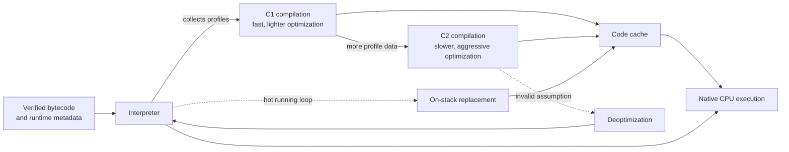

# Execution Engine and Garbage Collection

The execution engine runs the methods of loaded classes according to JVM bytecode semantics. The JVM specification defines what each bytecode instruction must do, but it does not require a particular interpreter, JIT compiler, garbage collector, or internal architecture. Interpreter tiers, C1/C2 compilers, the code cache, safepoints, and the collectors described below are primarily HotSpot implementation concepts.

The execution-related components are:

- **Interpreter:** Starts methods quickly by executing their bytecode without waiting for expensive optimization.
- **JIT (Just-In-Time) compilers:** Compile selected methods or loop bodies to native machine code at runtime.
- **Runtime services:** Support method calls, exceptions, synchronization, class initialization, safepoints, deoptimization, JNI/native calls, and other VM operations.
- **Garbage collector:** Reclaims heap space occupied by objects that are no longer reachable. GC cooperates closely with allocation and execution, although it is a memory-management subsystem rather than a bytecode executor.



This diagram is the usual high-level HotSpot flow. The VM's adaptive policy can skip stages, compile at different tiers, recompile code, or discard compiled code. There is no universal invocation count at which a method becomes "hot."

## Bytecode execution boundary

Frame layout, JVM stacks, the PC register, and the runtime constant pool are owned by [JVM Runtime Data Areas](ch1-jvm-runtime-data-areas-final.md#5-java-stack). For execution-engine purposes, remember that bytecode consumes and produces values through the current frame's local-variable array and operand stack:

```text
Java expression:       int result = a + b;

Conceptual bytecode:   iload a       local variable -> operand stack
                       iload b       local variable -> operand stack
                       iadd          pop two ints, push their sum
                       istore result operand stack -> local variable
```

Method invocation/return and exception unwinding update those per-thread frames while the interpreter or compiled code implements the bytecode semantics.

## Interpreter

The interpreter begins executing code with very little startup cost. Describing it as reading instructions "one by one" is a useful model, but the exact interpreter implementation is not specified and can be more sophisticated.

Interpreted execution is generally slower than optimized native code for repeatedly executed work. Its advantages are fast startup, low compilation cost, and the ability to collect runtime profiles such as branch frequencies, receiver types, and call-site behavior. Those profiles guide later compilation.

## JIT compilation and tiered compilation

HotSpot normally enables **tiered compilation**, combining the interpreter with two JIT compilers:

- **C1 (client compiler):** Compiles relatively quickly, with lighter optimization. Different C1 tiers may produce profiling or non-profiling code.
- **C2 (server compiler):** Spends more time producing aggressively optimized code for sufficiently important methods.

Compilation happens on compiler threads. The application can continue executing while compilation takes place. Completed native code is stored in the **code cache**, and later invocations can enter that code directly.

### On-stack replacement (OSR)

A method containing a long-running hot loop may still be active when the VM decides to compile it. OSR lets HotSpot transfer execution from an interpreted or lower-tier loop into compiled code without waiting for the whole method to return and be invoked again.

### Common JIT optimizations

- **Method inlining:** Replaces a call with the target method's body, enabling further optimization.
- **Devirtualization:** Converts a virtual/interface call into a more direct call when runtime profiles justify it.
- **Escape analysis:** Determines whether an object escapes a method or thread, enabling scalar replacement and sometimes allocation or lock elimination. It does not guarantee that every non-escaping object is physically stack-allocated.
- **Dead-code and redundant-check elimination:** Removes work proven unnecessary, including some repeated null, range, or type checks.
- **Loop optimizations:** Include loop unrolling, invariant-code motion, and vectorization where safe and profitable.
- **Intrinsics:** Replace selected library operations with highly optimized, sometimes hardware-specific code.

### Speculation, uncommon traps, and deoptimization

Many optimizations rely on observed behavior, such as a call site seeing only one receiver class. HotSpot must preserve Java semantics if an assumption later becomes false—for example, after another subclass is loaded. It can invalidate the compiled code and **deoptimize**, reconstructing interpreter-compatible frames and continuing at a less optimized tier. An **uncommon trap** is one mechanism for leaving speculative compiled code when a rare condition occurs.

### Safepoints

A safepoint is a state where HotSpot has enough information to perform certain coordinated VM operations safely. Global operations can require Java application threads to reach safepoints, including some GC phases, deoptimization, and particular stack or class-management operations. Safepoints are not synonymous with GC, and a concurrent collector does not run its entire collection at a stop-the-world safepoint.

## Native methods and JNI

Java code can call `native` methods through JNI or other runtime mechanisms. Native code executes outside JVM bytecode semantics and can allocate native memory or resources that GC does not manage directly. JNI transitions, pinning, callbacks, and blocking native calls can affect performance and GC coordination, so native time should not automatically be attributed to the interpreter or JIT.

## Garbage Collection

Garbage collection automatically reclaims storage for objects that are no longer reachable from any **GC root**. "Unreachable" is more accurate than "has no references": an isolated cycle of objects can still be collected because no path from a root reaches the cycle.

GC manages memory, not external resources. Files, sockets, database connections, and native handles still require deterministic cleanup, normally with `try`-with-resources or an explicit lifecycle.

## Why GC is important

- Automates reclamation of unreachable heap objects and removes the need for manual `free`/`delete` of Java objects.
- Prevents use-after-free and double-free errors for ordinary managed Java objects.
- Can compact or evacuate objects to reduce fragmentation, depending on the collector.
- Provides runtime trade-offs among throughput, pause latency, memory footprint, and CPU usage.

GC **does not** prevent logical memory leaks: reachable objects retained unintentionally cannot be collected. It also does not guarantee avoidance of `OutOfMemoryError`; the heap, Metaspace, direct/native memory, code cache, or other resources can still be exhausted.

## GC input model

Heap allocation, TLABs, GC roots, reference strengths, reachability, young/old layouts, promotion, and Minor/Major/Full terminology are explained once in [JVM Runtime Data Areas](ch1-jvm-runtime-data-areas-final.md#2-heap-memory). This chapter starts from that model and explains how collectors perform the work.

Two execution terms remain essential here:

- **Stop-the-world (STW):** Java mutator execution pauses for a coordinated VM phase. All production HotSpot collectors have some STW work.
- **Concurrent phase:** GC work runs while application threads continue mutating the object graph, requiring barriers and collector metadata to preserve correctness.

Finalization is deprecated for removal and is not a resource-management strategy. Prefer explicit cleanup, `try`-with-resources, and, only where appropriate, `Cleaner` as a safety net.

## Core GC mechanisms

Collectors combine several mechanisms rather than fitting into only one algorithm label:

1. **Marking:** Trace from GC roots to identify reachable objects.
2. **Sweeping:** Reclaim space occupied by unmarked objects without necessarily moving live objects.
3. **Copying/evacuation:** Move live objects out of selected memory areas and reclaim those areas as a whole.
4. **Compaction:** Move objects to consolidate free space and reduce fragmentation.
5. **Barriers:** Small pieces of code around reference loads or stores that maintain GC invariants while the application runs.
6. **Remembered sets/card tables:** Track cross-region or cross-generation references so the collector does not need to scan the entire heap for every young or regional collection.

## GC algorithms available in HotSpot/OpenJDK

Collector availability and exact behavior depend on the JDK build, vendor, version, operating system, and hardware. The following descriptions are high-level rather than guarantees.

### 1. Serial GC (`-XX:+UseSerialGC`)

- **How it works:** Uses a single GC worker for collection work and performs its collections during stop-the-world pauses.
- **Best starting point for:** Small heaps, constrained environments, and simple workloads where collector overhead matters more than pause latency.
- **Pros:**
  - Simple and low overhead.
  - Small auxiliary memory and CPU footprint.
- **Cons:**
  - Cannot parallelize GC work across multiple GC workers.
  - Pause time grows with the amount of collection work, making it unsuitable for many large or latency-sensitive applications.

### 2. Parallel GC (`-XX:+UseParallelGC`)

- **How it works:** A generational, stop-the-world collector that uses multiple GC workers for young and old-generation collection.
- **Best starting point for:** Throughput-oriented batch jobs and workloads where longer pauses are acceptable.
- **Pros:**
  - Strong throughput on multiprocessor systems.
  - Lower concurrent CPU interference because collection work is concentrated in pauses.
- **Cons:**
  - Still pauses application execution for collection.
  - Not usually the first choice for strict latency goals.

### 3. CMS — Concurrent Mark-Sweep (`-XX:+UseConcMarkSweepGC`)

CMS is retained here as a **historical topic**. It was deprecated in JDK 9 and removed in JDK 14, so the option is unavailable in current JDKs.

- **How it worked:** Performed much of old-generation marking and sweeping concurrently with the application, while still requiring some stop-the-world phases.
- **Former use case:** Lower-pause applications before G1 and newer low-latency collectors matured.
- **Pros at the time:** Reduced many old-generation pause times compared with fully stop-the-world collectors.
- **Cons:**
  - Did not normally compact, so fragmentation and promotion failures were concerns.
  - Consumed CPU concurrently with the application and had complex failure modes.
  - Must not be recommended for modern JDK deployments because it has been removed.

### 4. G1 GC — Garbage First (`-XX:+UseG1GC`)

- **How it works:** A generational, region-based, mostly concurrent collector. It performs stop-the-world young and mixed evacuations while doing marking concurrently. Mixed collections reclaim selected old regions along with young regions.
- **Default status:** G1 has been the default on most server-class HotSpot configurations since JDK 9; Serial can still be selected ergonomically on small configurations.
- **Best starting point for:** General-purpose server applications needing a balance of throughput and predictable pause behavior.
- **Pros:**
  - Compacts through evacuation and handles fragmented heaps better than CMS.
  - Attempts to meet a soft pause-time goal while maintaining reasonable throughput.
  - Usually needs little manual tuning beyond an appropriate heap size.
- **Cons:**
  - Concurrent work and remembered sets consume CPU and memory.
  - `-XX:MaxGCPauseMillis` is a goal, not a hard deadline or guarantee.
  - A Full GC or evacuation failure can still cause a long pause.

### 5. ZGC — Z Garbage Collector (`-XX:+UseZGC`)

- **How it works:** A scalable, generational, mostly concurrent collector that performs marking, relocation, and reference processing with very short stop-the-world phases. It uses colored pointers and load/store barriers in modern HotSpot implementations.
- **Version note:** ZGC first appeared experimentally in JDK 11. Generational ZGC became the default ZGC mode in JDK 23; this is separate from G1 remaining HotSpot's normal ergonomically selected collector.
- **Best starting point for:** Applications whose primary goal is very low GC pause latency, from moderate to very large heaps.
- **Pros:**
  - Pause times are designed to remain very small and largely independent of heap size and live-set size.
  - Performs relocation concurrently with application execution.
- **Cons:**
  - Concurrent barriers and GC work can reduce peak throughput and use additional memory.
  - It is not a hard real-time collector and does not guarantee a fixed pause bound.
  - Supported heap limits and platform availability depend on the JDK build and environment.

### 6. Shenandoah (`-XX:+UseShenandoahGC`)

- **How it works:** A low-pause collector that performs marking and object evacuation/compaction largely concurrently with application threads.
- **Version note:** Shenandoah is available in upstream OpenJDK and selected vendor builds, but it is not included on every platform or in every distribution. JDK 25 made its generational mode non-experimental; mode defaults and flags remain version-dependent.
- **Best starting point for:** Low-latency workloads on a build that supports Shenandoah, after measurement against alternatives such as ZGC.
- **Pros:**
  - Very short pauses relative to traditional stop-the-world collectors.
  - Concurrent compaction reduces fragmentation without placing the full relocation cost in one long pause.
- **Cons:**
  - Concurrent work and barriers consume CPU and memory bandwidth.
  - Availability and tuning behavior vary more by JDK distribution than G1.
  - It is not the standard ergonomically selected default collector in HotSpot.

## Choosing and tuning a collector

The main goals are:

- **Throughput:** Percentage of total time available to application work.
- **Latency:** Duration and frequency of pauses or other response-time disruptions.
- **Footprint:** Heap, native memory, metadata, and GC bookkeeping.
- **CPU budget:** Resources consumed by concurrent and parallel runtime work.

Start with JVM ergonomics unless service-level requirements show that the default is unsuitable. Measure under a representative allocation rate, live set, traffic pattern, heap size, CPU limit, and container limit. Change one important variable at a time and compare distributions such as p95/p99 latency, not only averages.

### Common JVM options

```text
-XX:+UseG1GC
-XX:+UseParallelGC
-XX:+UseSerialGC
-XX:+UseZGC
-XX:+UseShenandoahGC       # only when supported by the selected JDK build
-XX:MaxGCPauseMillis=200   # soft goal for collectors that honor it
-Xms<size>                 # initial/minimum heap setting
-Xmx<size>                 # maximum heap setting
-Xss<size>                 # stack size per Java thread; not a heap option
-Xlog:gc*,safepoint        # unified GC and safepoint logging
```

Options such as `-XX:SurvivorRatio` and `-XX:NewRatio` are collector-specific and may be ignored, constrained, or counterproductive with region-based or adaptive collectors. Prefer goal-oriented tuning and measurements over copying a fixed flag set between collectors or JDK versions.

`System.gc()` is only a request that the JVM expend effort toward collection; it is not a portable command guaranteeing an immediate full collection or reclamation of a particular object.

## Profiling and diagnostic tools

- **Java Flight Recorder (JFR):** Low-overhead runtime recording for CPU samples, allocations, locks, GC, compiler activity, and latency analysis.
- **JDK Mission Control (JMC):** Visualizes and analyzes JFR recordings; it is distributed separately from the regular JDK in current releases.
- **`jcmd`:** Preferred general diagnostic command interface; can inspect the heap, code cache, compiler queues, native memory, and control JFR.
- **`jstat`:** Samples VM and GC performance counters; useful for lightweight observation, but counter meanings can be collector-specific.
- **`jmap`:** Can request heap information or dumps on supported configurations; heap dumps may be disruptive, so use deliberately.
- **VisualVM (`jvisualvm` historically):** Useful GUI profiler/monitor, but modern VisualVM is generally obtained separately rather than assumed to be bundled with the JDK.
- **Unified GC logs:** For example, `-Xlog:gc*,safepoint:file=gc.log:time,uptime,level,tags`.
- **Native Memory Tracking:** Start with `-XX:NativeMemoryTracking=summary` or `detail`, then inspect with `jcmd <pid> VM.native_memory`; enabling it adds overhead.

Always identify the JDK vendor/version, collector, complete JVM flags, container limits, and workload phase when interpreting diagnostics.

## Execution and GC troubleshooting playbook

| Symptom | Evidence to collect | Questions to answer |
|---|---|---|
| High CPU | JFR CPU samples, OS per-thread CPU, repeated thread dumps, GC logs | Is CPU consumed by application code, GC workers, compiler threads, synchronization spin/retry, or native code? |
| Application appears hung | Several time-separated thread dumps and/or JFR lock/thread events | Is there a deadlock, monitor contention, parking, blocking I/O, native blocking, or simply no work? One thread dump is often insufficient. |
| Frequent collections | Unified GC logs, allocation-rate and after-GC occupancy data | Is the cause high allocation, a heap too small for the live set, humongous objects, promotion/evacuation pressure, or an explicit-GC source? |
| Long GC pauses | Detailed GC phase logs plus host CPU/memory metrics | Which phase dominates, how large is the live set, was CPU throttled, and did swapping or container pressure occur? |
| Unexplained pause not labeled GC | Safepoint logs and JFR | Was the delay a different VM safepoint, thread scheduling/CPU starvation, lock contention, I/O, or application work? |
| Compilation/code-cache concern | `jcmd <pid> Compiler.queue`, `Compiler.codecache`, and JFR compiler events | Is compilation backlogged, has code-cache pressure disabled/restricted compilation, or is warm-up still in progress? |

Correlate all evidence on one timeline. Do not label every high-CPU event as JIT activity, every pause as GC, or every large Heap as a memory leak.

## Memory sizing boundary

Heap capacity and live-set size strongly affect collector behavior, so `-Xms` and `-Xmx` remain relevant when evaluating GC. The ownership of Heap sizing, `-Xss`, native/non-heap memory, direct buffers, Metaspace, container headroom, and memory-failure diagnosis belongs to [JVM Runtime Data Areas](ch1-jvm-runtime-data-areas-final.md).

## Summary

- The interpreter gives fast startup; adaptive JIT compilation improves hot-code performance.
- HotSpot tiered compilation normally uses the interpreter, C1, C2, profiling, OSR, and a native code cache.
- Optimized code is speculative and may be deoptimized when assumptions become invalid.
- Safepoints coordinate multiple VM operations; they are not merely another name for GC pauses.
- GC reclaims unreachable managed objects but cannot prevent reachable-object leaks, resource leaks, or every `OutOfMemoryError`.
- Generational layouts and Minor/Major/Full GC terminology are collector-specific rather than universal JVM rules.
- Serial and Parallel emphasize simplicity or throughput; G1 balances throughput and latency; ZGC and Shenandoah prioritize very low pauses; CMS is historical and removed.
- Let ergonomics choose defaults first, then tune from production-like measurements and explicit service goals.
- Heap size is not total process memory, and `-Xss` configures thread stacks rather than the heap.

## Authoritative references

- [JVM Specification, Chapter 2: frames, stacks, heap, and instruction model](https://docs.oracle.com/javase/specs/jvms/se25/html/jvms-2.html)
- [JVM Specification, Chapter 6: JVM instruction semantics](https://docs.oracle.com/javase/specs/jvms/se25/html/jvms-6.html)
- [HotSpot VM technology overview: interpreter and adaptive compilation](https://docs.oracle.com/en/java/javase/25/vm/java-virtual-machine-technology-overview.html)
- [HotSpot ergonomics: default collector, heap sizing, and tiered C1/C2 compilation](https://docs.oracle.com/en/java/javase/25/gctuning/ergonomics.html)
- [HotSpot GC Tuning Guide: available collectors and selection](https://docs.oracle.com/en/java/javase/25/gctuning/available-collectors.html)
- [JDK 25 `java` command reference: compiler, code-cache, GC, and heap options](https://docs.oracle.com/en/java/javase/25/docs/specs/man/java.html)
- [JDK 25 troubleshooting guide: diagnostic tools](https://docs.oracle.com/en/java/javase/25/troubleshoot/diagnostic-tools.html)
- [OpenJDK JEP index: Generational ZGC and Generational Shenandoah](https://openjdk.org/jeps/0)
