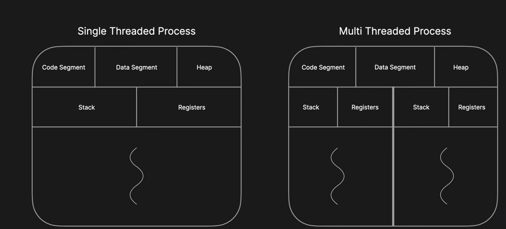

# Multithreading vs Concurrency
### 26-07-2025
---

### 🧠 First, understand: What is Multithreading and Concurrency?

---

## 🔹 What is a Thread?

Before jumping into multithreading, it's important to understand what a **thread** is.

A **thread** is the smallest unit of execution in a program.  
It doesn't run on its own — it runs **within a process**, and **shares memory** with other threads in the same process.

---

## 🔹 What is a Process?

Every time you run a program (like a browser or a Java app), the OS creates a **process** — an isolated execution environment.  
Each process has its **own memory space**, and **at least one thread** running inside it by default (called the main thread).

---

## 🧵 Multithreading

**Multithreading** is a **programming technique** where multiple threads run **in parallel** within the same process.

Why?  
To perform multiple tasks at the same time — for example:
- Handle multiple user requests on a server
- Download files in the background while the UI is active

So we use multithreading to improve:
- **CPU utilization**
- **Responsiveness**
- **Task efficiency**

It is a concept from both **Operating Systems** and **programming languages**.

> In short:  
> ✅ Multithreading = "We can run multiple tasks (threads) at the same time"

---

## ⚙️ Concurrency

**Concurrency** is a **broader programming concept** — it means handling **multiple tasks** at once, even if they're not running at the same exact time (i.e., they might take turns).
Also, It's built on top of Multithreading.

In Java, concurrency is implemented **on top of multithreading**, using powerful tools like:
- `ExecutorService`
- `ThreadPoolExecutor`
- `Callable`, `Future`, `CompletableFuture`
- Concurrent collections like `ConcurrentHashMap`, etc.

These concurrency utilities:
- Reduce manual thread management
- Prevent common multithreading errors (like deadlocks)
- Improve performance and scalability

> In short:  
> ✅ Concurrency = "We can **manage** multiple threads efficiently"

---

## ✅ Final Summary

| Concept        | Description |
|----------------|-------------|
| **Process**    | An instance of a running program, with its own memory |
| **Thread**     | A unit of execution inside a process (shares memory) |
| **Multithreading** | Technique to run multiple threads in one process |
| **Concurrency**    | Ability to manage and coordinate multiple tasks/threads effectively |

---

## 🧠 Learning Tip

Learn **Multithreading first**: how threads work, how to create them, how they share memory, and how they synchronize.  
Then go for **Concurrency**: how to optimize and control those threads using Java's advanced APIs.

In the image below 

- Each **process** has at least one thread.
- A **multithreaded** process has multiple threads sharing the same memory.

