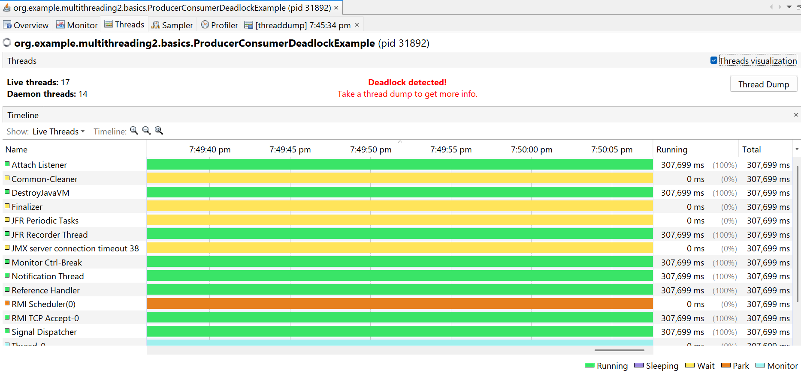

## ⚠️ List of Common Pitfalls in Multithreading

Below are common issues faced in multithreaded programming. These can lead to performance degradation, bugs, or application crashes.

### 1. Deadlock
Two or more threads are blocked forever, each waiting for the other to release a lock.

### 2. Starvation
A thread is unable to gain regular access to shared resources and is unable to make progress.

### 3. Race Condition
Two or more threads access shared data concurrently, and the outcome depends on the timing of thread execution.

### 4. Livelock
Threads are not blocked, but they keep changing state in response to each other without making progress (like politely stepping aside in a hallway but never moving forward).

### 5. Thread Interference
When multiple threads operate on the same object without proper synchronization, leading to corrupted data.

### 6. Memory Consistency Errors
Due to caching and compiler optimization, one thread might not see the most recent changes made by another thread to a shared variable (solved using `volatile`, synchronized blocks, or atomic classes).

### 7. Context Switching Overhead
Too many threads can lead to frequent context switching, which degrades performance rather than improving it.

### 8. Uncaught Exceptions in Threads
If an exception occurs in a thread and it’s not caught properly, it may silently terminate the thread.

### 9. Improper Use of `wait()`/`notify()`
If `wait()` or `notify()` is not used within synchronized blocks, or used incorrectly, it can lead to `IllegalMonitorStateException` or unexpected behavior.

### 10. Resource Leakage
Threads may acquire system resources (e.g., file handles, database connections) and fail to release them, especially if terminated improperly.

### 11. Thread Leaks
Threads that are created but never terminated or cleaned up. Over time, they can exhaust system resources.

### 12. Misuse of Thread Pools
Submitting long-running or blocking tasks to a limited thread pool can exhaust it and cause tasks to hang indefinitely.

---

### 📝 These issues can be mitigated by:
- Using high-level concurrency utilities from `java.util.concurrent`.
- Avoiding shared mutable state.
- Proper use of synchronization and locks.
- Using profilers or thread analyzers (like VisualVM or JFR) to detect problems.

---
### We have notes 4 important pitfalls below


# 🧵1. Deadlock 

## 🔍 What is Deadlock?

A **deadlock** is a situation that occurs **only in multi-threaded environments**, typically when multiple threads are waiting for each other to release resources (like locks), but none can proceed.

Deadlocks usually occur when working with **multithreading**, **concurrency**, or **parallelism**. It’s a serious issue because once a deadlock happens, the involved threads remain blocked **forever** unless externally interrupted.

---

## ⚠️ Deadlock Condition

A deadlock can occur when **four conditions** are simultaneously true (Coffman’s conditions):

1. **Mutual Exclusion**: At least one resource must be held in a non-shareable mode.
2. **Hold and Wait**: A thread holds at least one resource and is waiting to acquire additional ones.
3. **No Preemption**: Resources cannot be forcibly removed from threads holding them.
4. **Circular Wait**: A set of threads are waiting on each other in a circular chain.

---

## 🧪 Real-Time Deadlock Code Example

```java
public class ProducerConsumerDeadlockExample {
    static final Object lock1 = new Object();
    static final Object lock2 = new Object();

    public static void main(String[] args) {

        Runnable pickupRunnable = () -> {
            synchronized (lock1) {
                System.out.println("Pickup thread acquired lock1, trying to get lock2...");
                try {
                    Thread.sleep(100); // Give other thread a chance to acquire lock2
                } catch (InterruptedException e) {
                    throw new RuntimeException(e);
                }
                synchronized (lock2) {
                    System.out.println("Pickup thread acquired lock2");
                }
            }
        };

        Runnable foodRunnable = () -> {
            synchronized (lock2) {
                System.out.println("Restaurant thread acquired lock2, trying to get lock1...");
                try {
                    Thread.sleep(100); // Give other thread a chance to acquire lock1
                } catch (InterruptedException e) {
                    throw new RuntimeException(e);
                }
                synchronized (lock1) {
                    System.out.println("Restaurant thread acquired lock1");
                }
            }
        };

        new Thread(pickupRunnable).start();
        new Thread(foodRunnable).start();
    }
}

// OUTPUT:
// Pickup thread acquired lock 1, trying to get lock2
// Pickup thread acquired lock 1, trying to get lock2
```
## ☑️ Coffman's Four Conditions

| Condition            | Description                                                   | Present in Code? | Where It Occurs in Code |
|----------------------|---------------------------------------------------------------|------------------|--------------------------|
| **1. Mutual Exclusion** | Resources (locks) cannot be shared; only one thread at a time | ✅ Yes           | `synchronized(lock1)`, `synchronized(lock2)` |
| **2. Hold and Wait**    | Thread holds one lock while waiting for another             | ✅ Yes           | Thread A: holds `lock1`, waits for `lock2`<br>Thread B: holds `lock2`, waits for `lock1` |
| **3. No Preemption**    | Locks cannot be forcibly taken from a thread                | ✅ Yes           | Java intrinsic locks (monitor) have no preemption |
| **4. Circular Wait**    | Circular dependency: Thread A waits for B, B waits for A    | ✅ Yes           | Thread-1 → `lock1` → waiting on `lock2`<br>Thread-2 → `lock2` → waiting on `lock1` |

Break any one of the four conditions, and deadlock is impossible.

### 🧊 At This Point:
* pickupRunnable holds lock1 and is waiting for lock2
* foodRunnable holds lock2 and is waiting for lock1

This forms a circular wait, which is a textbook deadlock condition.
Both threads are now permanently blocked — this is a deadlock.

### ✅ Additional Notes

This issue won’t throw any exceptions, but your program will hang silently.

You can detect deadlocks using profiling tools


### 🔒 How to Avoid Deadlock

##### Some common strategies:

* Lock ordering: Always acquire locks in the same order.
* Try-lock with timeout (e.g. ReentrantLock.tryLock()).
* Use higher-level concurrency utilities (like ExecutorService, BlockingQueue).

# 2. Starvation

In general English, **starvation** means not getting enough food.  
In computer science, **starvation** means a **thread is unable to gain regular and fair access** to shared resources (CPU time, memory, locks, etc.) and therefore **makes little to no progress** in its execution.

👉 **Important**:  
Starvation is **not just when a thread gets no access** —  
Even if a thread gets **very little**, **delayed**, or **irregular access** to resources compared to other threads, it is still considered **starvation**.

### 🧠 Analogy:
Just like someone who eats once in 3 days isn’t completely without food but still **starving**,  
a thread that runs *very occasionally* while others keep running constantly is **starved** in computing terms.

---

## ⚠️ Causes of Starvation

1. **Improper thread priority allocation**
    - Higher-priority threads always run before lower ones.
2. **Aggressive or greedy threads**
    - Threads that don’t sleep or yield and keep grabbing the resource.
3. **Unfair locks (like `synchronized`)**
    - No guarantee of access order.
4. **Thread scheduling policies**
    - OS-level scheduler may favor some threads.

...

```java
public class StarvationRealWorld {

    static class SharedTask {
        public synchronized void perform(String name) {
            System.out.println(name + " is performing the task");
        }
    }

    public static void main(String[] args) {
        SharedTask task = new SharedTask();

        // Greedy thread (imagine a scheduled job running frequently)
        Thread greedyThread = new Thread(() -> {
            while (true) {
                task.perform("🔁 FrequentJob");
                try {
                    Thread.sleep(100); 
                } catch (InterruptedException e) {
                    e.printStackTrace();
                }
                
            }
        });

        // Normal user threads - simulate end users
        Runnable userTask = () -> {
            String name = Thread.currentThread().getName();
            while (true) {
                task.perform("User " + name);
                try {
                    Thread.sleep(1000); // Wait before trying again
                } catch (InterruptedException e) {
                    e.printStackTrace();
                }
            }
        };

        Thread user1 = new Thread(userTask, "User-1");
        Thread user2 = new Thread(userTask, "User-2");

        greedyThread.start();
        user1.start();
        user2.start();
    }
}
```

# 3. Race Condition

A **race condition** is a situation in multithreading where **two or more threads access shared data concurrently**, and **at least one thread modifies the data**.

This can lead to **unpredictable behavior**, **incorrect results**, or even application crashes — depending on the **order** in which the threads execute.

---

## 🔥 When does it happen?

- Multiple threads read and write shared variables.
- There's **no proper synchronization** (e.g., `synchronized`, `ReentrantLock`, etc.).
- Threads "race" to access and modify the variable — whoever gets CPU time first "wins".

---

## 🔁 Real-World Analogy

Imagine two people checking out the **last product** in an online store at the same time.  
They both see "1 item left" and proceed to buy it, but the system wasn't locked properly — both succeed, and **the stock becomes -1**, which is logically incorrect.

---

```java

public class RaceConditionExample {
   // static Object lock = new Object();
    static int availableQuantity = 1;

    static class UserA extends Thread {
        @Override
        public void run() {
            if (availableQuantity >= 1){
               // synchronized (lock) {
                System.out.println("Bought by userA, available quantity is - " + --availableQuantity); 
                //}
            }
        }
    }

    static class UserB implements Runnable {
        @Override
        public void run() {
            if (availableQuantity >= 1) {
                // synchronized (lock) {
                System.out.println("Bought by userB, available quantity is - " + --availableQuantity);
                //}
            }
        }
    }

    public static void main(String[] args) {
        Thread t1 = new UserA();          // Thread-1
        Thread t2 = new Thread(new UserB()); // Thread-2
        t1.start();
        t2.start();
    }
}
```

#### ✅ Corrected Version (Safe with Lock)

```java
static final Object lock = new Object();

synchronized (lock) {
    if (availableQuantity >= 1) {
        System.out.println("Bought, available quantity = " + --availableQuantity);
    }
}

```

#### 🛠️ Causes of Race Condition

* Missing synchronized blocks or locks.
* Shared mutable data.
* No atomic operations on shared data.
* Poor understanding of thread safety.

# 4. Livelock

Livelock is a concurrency problem where two or more threads are **actively executing (not blocked)** but are unable to make progress because they keep reacting to each other.

It's often caused by overly polite or reactive behavior between threads. Unlike **deadlock**, where threads are **stuck waiting**, in livelock they are **continuously running but achieving nothing**.

---

## 🧠 Key Characteristics

- Threads **are not blocked**, but they **keep changing state** (running).
- They **yield to each other** in a way that **prevents progress**.
- Often caused by **excessive retry logic** or **conditional yielding**.
- Very hard to detect, especially since it appears like everything is active.

---

## 🤝 Real-World Analogy (Polite Neighbors)

Two neighbors go to a restaurant. After eating, both offer to pay the bill out of politeness.  
Each insists the other pay first, and **as a result, neither pays the bill**.

---

## 🧪 Java Example: Polite Neighbor Livelock

```java
public class LivelockRestaurant {

    static class Bill {
        private volatile boolean isPaid = false;
    }

    static class Neighbor {
        private final String name;
        private boolean polite = true;

        public Neighbor(String name) {
            this.name = name;
        }

        public void payBill(Bill bill, Neighbor other) {
            while (!bill.isPaid) {
                if (polite) {
                    System.out.println(name + ": No no, " + other.name + " you go ahead and pay.");
                    try {
                        Thread.sleep(100); // Simulate hesitation
                    } catch (InterruptedException e) {
                        Thread.currentThread().interrupt();
                    }
                } else {
                    if (!bill.isPaid) {
                        System.out.println(name + ": Okay, I'm paying the bill now. 💳");
                        bill.isPaid = true;
                    }
                }

                // Mimic politeness based on the other thread
                polite = other.polite;
            }
        }
    }

    public static void main(String[] args) {
        final Bill bill = new Bill();

        final Neighbor neighborA = new Neighbor("NeighborA");
        final Neighbor neighborB = new Neighbor("NeighborB");

        Thread t1 = new Thread(() -> neighborA.payBill(bill, neighborB));
        Thread t2 = new Thread(() -> neighborB.payBill(bill, neighborA));

        t1.start();
        t2.start();
    }
}

// OUTPUT:

 // NeighborA: No no, NeighborB you go ahead and pay.
 // NeighborB: No no, NeighborA you go ahead and pay.
 // ... (repeats forever, no one pays)

```

#### ❗ Why This Is a Livelock

* Threads are running.
* Each politely defers to the other (polite = other.polite).
* As a result, they react endlessly, but the bill is never paid.
* No thread is waiting or blocked, yet no progress happens.

#### 🛠️ How to Fix Livelock

* Use random backoff or timeout-based logic.
* Set a fixed policy (e.g., one neighbor always pays if indecision continues).
* Use a shared decision lock or controller.

#### 📝 Summary

* Livelock is harder to detect than deadlock.
* Threads are stuck in a "reaction loop".
* Polite or retry logic often causes livelock.
* Use fairness strategies or timers to avoid it.
