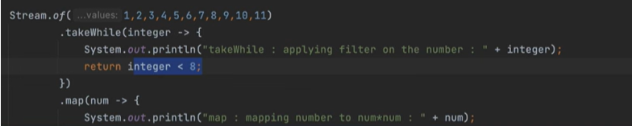

# Java 8 Stream API – Complete Notes

The **Stream API** is part of `java.util.stream` package and belongs to the `java.base` module (the core Java module).  
It provides a **functional and declarative** approach to process collections, arrays, or other data sources efficiently.

---

## **Definition**
Stream API is mainly used for **processing collections in a declarative and functional style** — enabling **transformation, filtering, aggregation, sorting, grouping, partitioning, and parallel processing** in a clean, readable pipeline.

**Key Benefits:**
- Reduces boilerplate code.
- Improves maintainability.
- Allows processing of large datasets efficiently.
- Does not modify the source data.
- Supports both **sequential** and **parallel** execution.

---

## **Important Points**
1. `Stream` extends `AutoCloseable` internally, so it can be used in **try-with-resources** for IO streams. For in-memory collections, closing is not required.
2. Stream processing has **3 stages**:  
   - **Creation**
   - **Intermediate Operations**
   - **Terminal Operations**
3. Intermediate operations are **lazy** — they are not executed until a terminal operation is called.
4. Streams do **not store** data; they carry elements from a source through a pipeline of operations.
5. After a terminal operation is executed, the stream is **closed**. Further usage throws:  
   `"stream has already been operated upon or closed"`.
6. Each operation in a stream pipeline processes **element-by-element** until the terminal operation triggers evaluation.

---

## **Stateful vs Stateless Operations**

- **Stateless Operations:** Process each element **independently**, without storing state between elements.
  - Examples: `filter`, `map`, `flatMap`
- **Stateful Operations:** Require storing elements to process the entire dataset before producing results.
  - Examples: `distinct`, `sorted`, `limit`

**Example of a Stateful Operation:**
```
List<String> list = Arrays.asList("sam", "anil", "sunil");
list.stream()
    .filter(name -> name.startsWith("s")) // Stateless
    .sorted() // Stateful
    .collect(Collectors.toList());
```
**Flow:**
1. `filter` passes matching elements immediately to the next stage.
2. `sorted` maintains a buffer **to store all incoming elements**, sorts them using Array.sort() - TimSort (algo might be changed in future JDK), then passes one by one element to Collection (as next step).
3. `collect` gathers results into a collection.

---

## **Spliterator in Streams**
Streams internally use `Spliterator` to traverse and split elements for sequential or parallel execution.

```java
default Stream<E> stream() {
    return StreamSupport.stream(spliterator(), false); // 2nd arg is a flag, false means sequential
}

default Stream<E> parallelStream() {
    return StreamSupport.stream(spliterator(), true); // true means parallel
}
```

**Key Methods:**
1. **`tryAdvance(Consumer<? super T> action)`**  
   Processes the next element if available and returns `true`. If we use Iterator, we need to use hasNext() then next() to check and get the element.
   ```
   List<Integer> numbers = Arrays.asList(1, 2, 3);
   Spliterator<Integer> sp = numbers.spliterator();
   sp.tryAdvance(System.out::println); // prints 1
   ```

2. **`forEachRemaining(Consumer<? super T> action)`**  
   Processes all remaining elements.
   ```
   sp.forEachRemaining(System.out::println); // prints 2, 3
   ```

3. **`trySplit()`**  
   Splits the elements into two parts (used for parallel processing).
   ```
   Spliterator<Integer> sp1 = numbers.spliterator();
   Spliterator<Integer> sp2 = sp1.trySplit();
   // sp2 contains first half
   sp1.forEachRemaining(System.out::println);
   // sp1 contains first half
   sp2.forEachRemaining(System.out::println);
   ```

---

## **Stream Pipeline Stages**

### 1. **Creation**
- Sources: `Collection.stream()`, `Arrays.stream()`, `Stream.of()`, `Stream.iterate()`, `Stream.generate()`, I/O channels.
```java
Stream<String> s1 = Stream.of("A", "B", "C");
Stream<Integer> s2 = Arrays.stream(new int[]{1, 2, 3}).boxed();
```

### 2. **Intermediate Operations** (lazy)
- **`filter(Predicate)`** → Filters elements.
- **`map(Function)`** → Transforms each element.
- **`flatMap(Function)`** → Maps each element to a stream, then flattens it.
- **`sorted()` / `sorted(Comparator)`** → Sorts elements.
- **`distinct()`** → Removes duplicates.
- **`limit(n)`** / **`skip(n)`** → Limit or skip elements.

**Example:**
```java
List<String> result = list.stream()
    .filter(s -> s.length() > 3)
    .map(String::toUpperCase)
    .sorted()
    .collect(Collectors.toList());
```

### 3. **Terminal Operations** (trigger execution)
- **`forEach`**: Performs an action on each element.
- **`collect`**: Gathers results into a collection or summary.
- **`reduce`**: Combines elements into a single result.
- **`min` / `max`**: Finds the smallest/largest element.
- **`anyMatch` / `allMatch` / `noneMatch`**: Boolean checks.
- **`findFirst` / `findAny`**: Returns an `Optional`.

**Example:**
```java
int sum = Arrays.asList(1, 2, 3).stream()
    .reduce(0, Integer::sum);
```

---

## **Grouping, Partitioning, Averaging**

**1. Grouping**
```
Map<String, List<String>> employeesByDept = employees.stream()
        .collect(Collectors.groupingBy(
                Employee::getDepartment,                // Group by department
                Collectors.mapping(Employee::getName,    // Extract only names
                        Collectors.toList()) // Collect into a List
        ));
```

**2. Partitioning**
```java
Map<Boolean, List<Integer>> partitioned =
    Stream.of(1, 2, 3, 4, 5)
          .collect(Collectors.partitioningBy(n -> n % 2 == 0));
// {false=[1, 3, 5], true=[2, 4]}
```

**3. Averaging**
```java
double avgLength =
    Stream.of("apple", "banana", "cherry")
          .collect(Collectors.averagingInt(String::length));
// 6.0
```

---

### Short Circuiting:

In the context of Java Streams refers to the ability of an operation to potentially terminate the stream processing early without examining all elements. This is crucial for performance optimization, especially when dealing with large or infinite streams.

* Limit (Short-Circuit Stateful Intermediate Operations)
* Skip (Stateful Intermediate Operations)
* takeWhile (similar to filter condition, but takeWhile will be terminate if the condition is not satisfied) (Short-Circuit Stateful Intermediate Operations)
   
* Distinct (Stateful Intermediate Operations)
* Sorted  (Stateful Intermediate Operations)

On the other hand, Sorted() is Stateful but not short circuited. So it will wait to acquire all data to proceed further.

✅ **Final Tip:** Streams are **single-use** — always create a new stream if you need to process the same source again.

