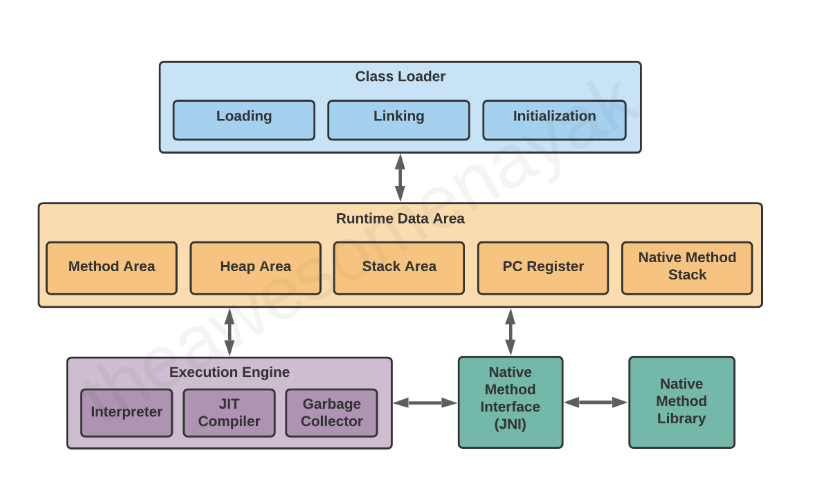
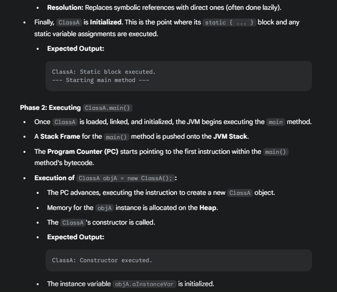

**Before diving into JVM architecture, lets understand how other programming languages are executed.**
1. If you consider C and C++, at the time of compilation the application will be converted into machine code directly. So we can easily understand, if its directly converting to machine code, the machine code should be converted based on the current environment (windows, linux, mac). So once the application is compiled for windows, the compiled app will be run only on windows machine.
2. Java, Python and Javascript languages are considered as platform independent. The compiler/interpreter is platform dependent. But after compilation let's say in Java - the .jar file is platform independent, we can build in once env and run in any env. Also python/JS codes is platform independent.

**JVM Introduction and things to know before start**
	
1. If you see any JDK version, only JRE will be present inside. When we start running a program, JVM instance will be created and it will destroyed once its executed.
2. If we run multiple programs, multiple JVM instance will be created.
3. If we run the program in command line, when we enter "javac filename.java", OS will trigger java compiler. It will convert the file into .class file. If we run "java filename", then OS will understand and create the JVM instance.

**For each JVM instance, there are 3 components exits.**

1. Class Loader
2. Runtime Memory/Data Area
3. Execution Engine



### **1. Class loader** 

Class loader is the first step in JVM, it helps to load the bytecode into memory area. But before that, it will verify the bytecode is ready for further execution, also it will use delegation model to load the respecive .class files from different components.
    Class loader has three components

1. Loading
2. Linking
3. Initialization


#### **1. Loading** : 
In this phase, its responsible to load the necessary .class files into the memory area.
   
   Loading has 3 components 


Loading following a delegation model. Let’s say your application needs to load a class named com.example.MyClass.

**Step 1: Request goes to Application ClassLoader.**
It doesn’t try loading it immediately.

**Step 2: It delegates to Platform ClassLoader.**
Platform ClassLoader checks if it's in one of the Java SE platform modules (like java.sql).

**Step 3: It further delegates to Bootstrap ClassLoader.**
Bootstrap checks if the class is part of java.base (like java.lang, java.util).

**Step 4: If none of the parents can load it,**
Then, the original ClassLoader (Application Loader in this case) will try to load it from the application’s classpath.

**1. Bootstrap class loader:** It is responsible to load the native classes such as java.base, java.lang and so on. It is parent of Platform/Extension class loader.

**2. Platform/Extension class loader:** Platform class loader introduced with the Java Platform Module System (JPMS). Loads classes from Java SE Platform modules such as java.sql.Driver, java.logging.Logger, java.management. It is the parent loader of application class loader.

**3. Application class loader :** It is responsible to load the application's own classes and third party JAR's specified in the classpath.


### 2. Linking:

**Verification:** Checks bytecode for structural correctness and safety.

**Preparation:** 
Allocates memory and sets default values for static fields.(e.g., 0 for int, null for objects, false for boolean)

**Resolution:** Replaces symbolic references with direct ones.

### 3. Initialization
Executes static initializers and static blocks, assigning actual values to static fields.
This is where static variables are assigned their actual declared values (e.g., static int x = 10;).

## JVM Internal Working

If we try to run a program, below is the order of processing by the JVM instance.
1. If we compile a application using compiler or IDE (IDE has on the fly compiler), during the compilation all the .java files converted into .class files even though few files not used/referred in code.
2. If we Start running the application, it will do following internal process.
    2.1 The JVM instance will find the class which has main method.
    2.2 Next, class loader will load the 
```java
public class ClassA {

    // Static block for ClassA - executed during ClassA's initialization
    static {
        System.out.println("ClassA: Static block executed.");
    }

    // Instance variable for ClassA
    public String aInstanceVar = "A instance";

    // Constructor for ClassA
    public ClassA() {
        System.out.println("ClassA: Constructor executed.");
    }

    public static void main(String[] args) {
        System.out.println("--- Starting main method ---");

        // --- Active use of ClassA ---
        // ClassA is already loaded, linked, and initialized because it contains main.
        // Its static block and static variables are handled.
        // Now, we are creating an instance of ClassA.
        ClassA objA = new ClassA();
        System.out.println("ClassA instance variable: " + objA.aInstanceVar);

        System.out.println("\n--- Referencing ClassB ---");
        // --- Active use of ClassB ---
        // This is the first time ClassB is actively used.
        // JVM will trigger ClassB's loading, linking, and initialization.
        ClassB objB = new ClassB();
        objB.bInstanceMethod();

        System.out.println("\n--- ClassC is NOT referenced ---");
        // ClassC is NOT used anywhere here.
        // Therefore, ClassC will NOT be loaded by the ClassLoader.

        System.out.println("\n--- Main method finished ---");
    }
}

// =========================================================
// ClassB: Defined within the same file, implicitly package-private
// =========================================================
class ClassB {
    // Static variable for ClassB
    public static String B_STATIC_VAR = "B static value";

    // Static block for ClassB - executed during ClassB's initialization
    static {
        System.out.println("ClassB: Static block executed.");
        System.out.println("ClassB: Accessing static var: " + B_STATIC_VAR);
    }

    // Instance variable for ClassB
    public int bInstanceVar;

    // Constructor for ClassB
    public ClassB() {
        System.out.println("ClassB: Constructor executed.");
        this.bInstanceVar = 10;
    }

    // Instance method for ClassB
    public void bInstanceMethod() {
        System.out.println("ClassB: bInstanceMethod called. Instance var: " + bInstanceVar);
    }
}

// =========================================================
// ClassC:  NOT USED ANYWHERE
// =========================================================
class ClassC {
    // Static variable for ClassC
    public static String C_STATIC_VAR = "C static value";
}
```





