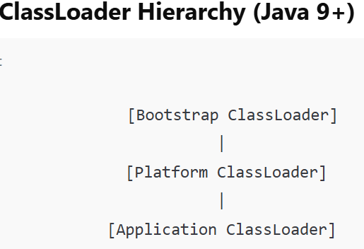
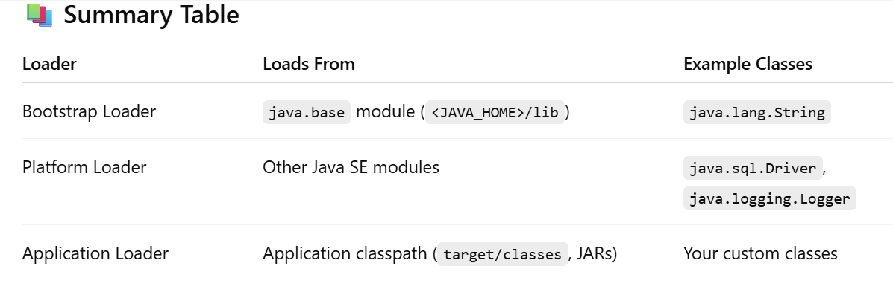
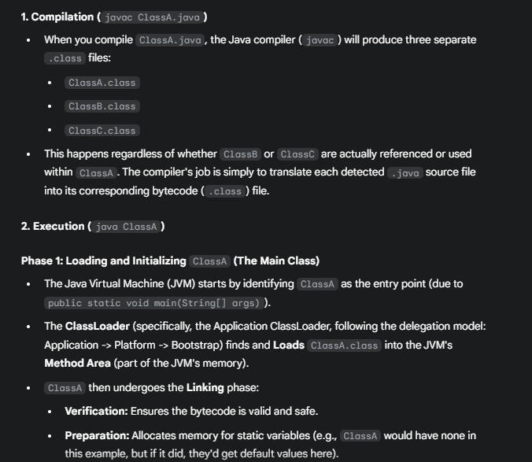
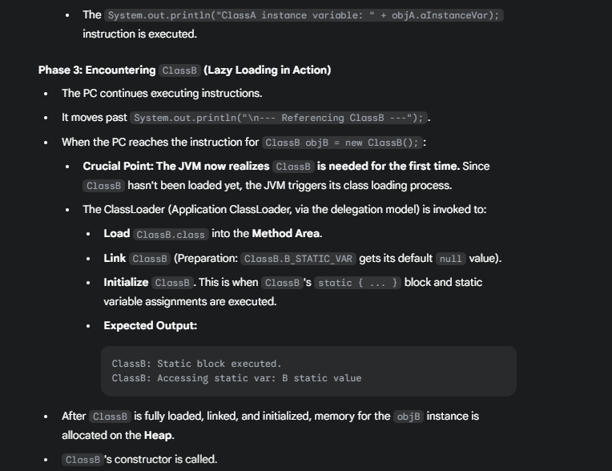
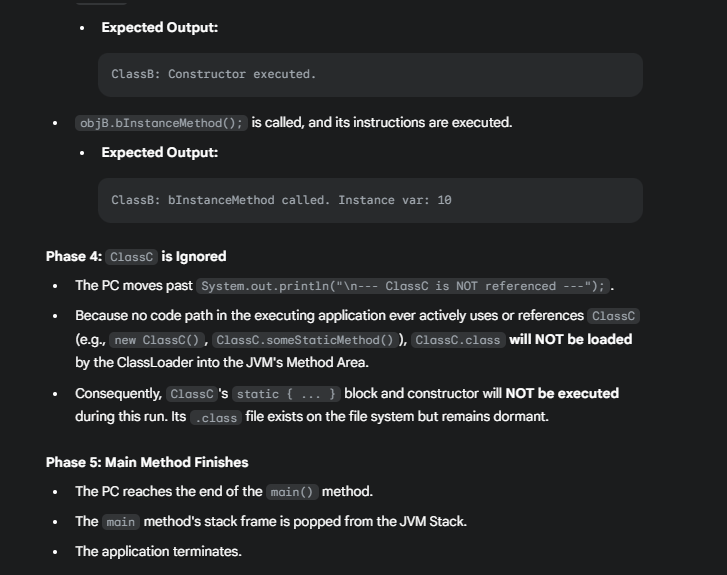
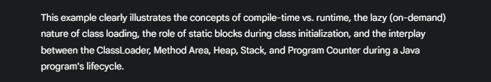
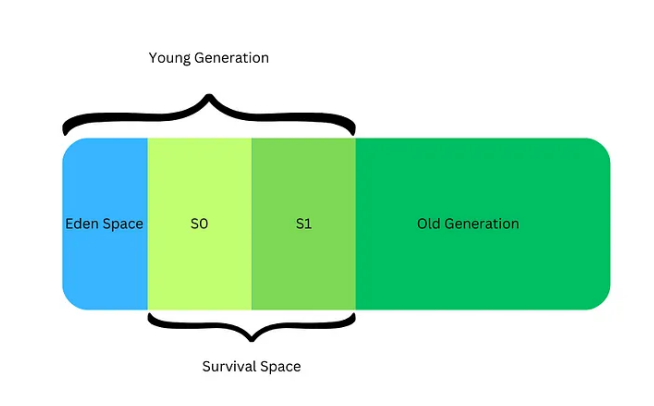
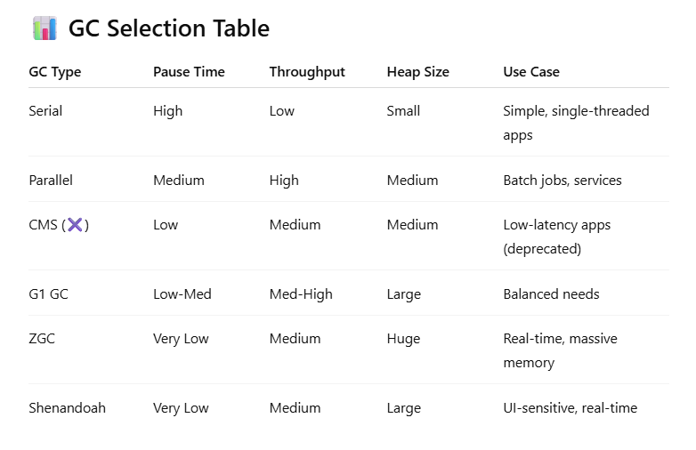

**Before diving into JVM architecture, lets understand how other programming languages are executed.**
1. If you consider C and C++, at the time of compilation the application will be converted into machine code directly. So we can easily understand, if its directly converting to machine code, the machine on which it compiles, the application will run only on that machine.
2. Java, Python and Javascript languages are considered as platform independent. The compiler/interpreter is platform dependent. But after compilation let's say in Java - the .jar file is platform independent. You can take the .jar file and run it in any supported OS with Java installed.

**JVM Introduction and things to know before start**

1. If you see any JDK version, only JRE will be present inside. When we start running a program, JVM instance will be created and it will destroyed once its executed.
2. If we run multiple programs, multiple JVM instance will be created.
3. If we run the program in command line, when we enter "javac filename.java", OS will trigger java compiler. It will convert the file into .class file. If we run "java filename", then OS will understand and create a JVM instance to execute the bytecode.

**For each JVM instance, there are 3 components exits.**

1. Class Loader
2. Runtime Memory/Data Area
3. Execution Engine


## **1. Class loader**

Class loader is the first step in JVM, it helps to load the bytecode into memory area. But before that, it will verify the bytecode is ready for further execution, also it will use delegation model to load classes.  
Class loader has three components

1. Loading
2. Linking
3. Initialization

#### **1. Loading** :
In this phase, its responsible to load the necessary .class files into the memory area.

Loading has 3 components


Loading follows a delegation model. Let’s say your application needs to load a class named com.example.MyClass.

**Step 1: Request goes to Application ClassLoader.**
It doesn’t try loading it immediately.

**Step 2: It delegates to Platform ClassLoader.**
Platform ClassLoader checks if it's in one of the Java SE platform modules (like java.sql).

**Step 3: It further delegates to Bootstrap ClassLoader.**
Bootstrap checks if the class is part of java.base (like java.lang, java.util).

**Step 4: If none of the parents can load it,**
Then, the original ClassLoader (Application Loader in this case) will try to load it from the application’s classpath.

**1. Bootstrap class loader:** It is responsible to load the native classes such as java.base, java.lang and so on. It is parent of Platform/Extension class loader.

**2. Platform/Extension class loader:** Platform class loader introduced with the Java Platform Module System (JPMS). Loads classes from Java SE Platform modules such as java.sql.Driver, java.logging, etc.

**3. Application class loader :** It is responsible to load the application's own classes and third party JAR's specified in the classpath.



### **2. Linking:**
After the bytecode is loaded into the memory area, in this phase it will check the structure and further allocating the values to static variables. It has 3 components:

**Verification:** Checks bytecode for structural correctness and safety.

**Preparation:** Allocates memory and sets default values for static fields (e.g., 0 for int, null for objects, false for boolean).

**Resolution: ** Replaces symbolic references with direct references (lazy resolution - happens when first accessed).

      Before Resolution (Symbolic References):
      java/lang/String (class reference)
      java/lang/System.out:Ljava/io/PrintStream; (field reference)

      After Resolution (Direct References):
      Direct pointer to String class metadata
      Direct memory offset to System.out field

### 3. Initialization
Executes static initializers and static blocks, assigning actual values to static fields.
This is where static variables are assigned their actual declared values (e.g., static int x = 10;).

## JVM Internal Working

If we try to run a program, below is the order of processing by the JVM instance.
1. If we compile a application using compiler or IDE (IDE has on the fly compiler), during the compilation all the .java files converted into .class files even though few files not used/referred in code.
2. If we Start running the application, it will do following internal process.
   2.1 The JVM instance will find the class which has main method.
   2.2 Next, class loader will load the
```java
public class ClassA {

    // Static block for ClassA - executed during ClassA's initialization
    static {
        System.out.println("ClassA: Static block executed.");
    }

    // Instance variable for ClassA
    public String aInstanceVar = "A instance";

    // Constructor for ClassA
    public ClassA() {
        System.out.println("ClassA: Constructor executed.");
    }

    public static void main(String[] args) {
        System.out.println("--- Starting main method ---");

        // --- Active use of ClassA ---
        // ClassA is already loaded, linked, and initialized because it contains main.
        // Its static block and static variables are handled.
        // Now, we are creating an instance of ClassA.
        ClassA objA = new ClassA();
        System.out.println("ClassA instance variable: " + objA.aInstanceVar);

        System.out.println("\n--- Referencing ClassB ---");
        // --- Active use of ClassB ---
        // This is the first time ClassB is actively used.
        // JVM will trigger ClassB's loading, linking, and initialization.
        ClassB objB = new ClassB();
        objB.bInstanceMethod();

        System.out.println("\n--- ClassC is NOT referenced ---");
        // ClassC is NOT used anywhere here.
        // Therefore, ClassC will NOT be loaded by the ClassLoader.

        System.out.println("\n--- Main method finished ---");
    }
}

// =========================================================
// ClassB: Defined within the same file, implicitly package-private
// =========================================================
class ClassB {
    // Static variable for ClassB
    public static String B_STATIC_VAR = "B static value";

    // Static block for ClassB - executed during ClassB's initialization
    static {
        System.out.println("ClassB: Static block executed.");
        System.out.println("ClassB: Accessing static var: " + B_STATIC_VAR);
    }

    // Instance variable for ClassB
    public int bInstanceVar;

    // Constructor for ClassB
    public ClassB() {
        System.out.println("ClassB: Constructor executed.");
        this.bInstanceVar = 10;
    }

    // Instance method for ClassB
    public void bInstanceMethod() {
        System.out.println("ClassB: bInstanceMethod called. Instance var: " + bInstanceVar);
    }
}

// =========================================================
// ClassC:  NOT USED ANYWHERE
// =========================================================
class ClassC {
    // Static variable for ClassC
    public static String C_STATIC_VAR = "C static value";
}
```








## **2. JVM Runtime Memory/Data Areas**

JVM divides memory into various runtime data areas, each with a specific function:

- **Method Area**:  
  Stores class structures like metadata, static variables, method bytecode, and constant pool. Shared among all threads.

# Heap Memory

Heap space is used for dynamic memory allocation of Java objects and classes at runtime. New objects are always created in the heap space, and references to these objects are typically stored in the stack memory for local variables, or in the method area for static variables. Native code may also access heap objects via JNI. The heap has global access, and objects can be referenced from anywhere in the application.

## Key Characteristics of Heap Memory

- **Dynamic Allocation**: Memory allocation on the heap is more flexible and doesn't follow strict LIFO ordering
- **Global Scope**: Objects on the heap are accessible from anywhere in the program
- **Larger Size**: The size of heap memory is large and determined by available system memory
- **Slower Access**: Accessing data on the heap is relatively slower compared to stack due to traversing references
- **Manual Management**: Memory is allocated and deallocated through Java's automatic garbage collection system

## Heap Memory Regions
Heap Memory is divided into several regions:

Whenever a new object is created, it is allocated in the Eden space of the Young Generation.

When Eden fills up, a Minor GC is triggered. During this GC:
- Unreferenced objects in Eden and the active Survivor space are removed.
- Surviving objects are copied to the other Survivor space (S0 or S1).

In subsequent Minor GCs:
- The roles of S0 and S1 alternate (from ↔ to).
- Objects that survive each GC have their **age incremented**.
- Once an object survives enough GC cycles, it is **promoted to the Old Generation**.
- Before Java 9, PermGen (Permanent Generation was exists but it's removed in new releases).

The Old Generation is cleaned up by **Major GC** (also called Full GC), which runs **less frequently** and may cause longer pauses.


## - **Stack**:

  Stack Memory is a special region where the JVM keeps track of method execution. It employs Static Memory Allocation and stores function calls, method-specific primitive data, and object references. The stack memory is dynamically allocated to each thread during runtime.

#### Key Characteristics of Stack Memory

**LIFO Operation:** Stack operates on a Last-In-First-Out (LIFO) principle, meaning the most recently called method is the first one to return
    
**Thread-Specific:** Each thread in the JVM has a dedicated stack, making it thread-safe as data can only be accessed by the owning thread
    
**Fast Access:** Accessing data on the stack is exceptionally fast because it involves simple pointer manipulation
    
**Fixed Size:** Stack has a finite size determined by the system or JVM configuration
    
**Automatic Management:** Memory is automatically managed by the JVM - when a method returns, its stack frame is immediately deallocated

### What Stack Memory Stores

**Method call frames:** Each method call gets its own stack frame

**Local variables:** Method-specific primitive values

**Method parameters:** Arguments passed to methods

**Return addresses:** Where control should return after method execution

**References to objects:** Pointers to objects stored in heap memory

##### Stack Frame Structure

When a method is called, a new block (called a stack frame) is added to the top of the stack. 

This stack frame contains:

* Local variables declared within the method
* Method parameters
* Return address for the calling method 
* Operand stack for intermediate calculations
    
##### Stack Memory Example

```java
public class StackExample {
    public static void main(String[] args) {
        int a = 10;        // Stored in stack
        int b = 20;        // Stored in stack
        int sum = add(a, b); // Method call creates new stack frame
    }
    
    public static int add(int x, int y) {
        int result = x + y;  // Local variables stored in stack
        return result;       // Stack frame removed after return
    }
}

```

#### StackOverflowError

When insufficient space exists to create new objects, the system raises a java.lang.StackOverFlowError. This typically occurs due to:

* Infinite recursion
* Deep method call chains
* Excessive local variable declarations

--------------------------- STACK ---------------------------

**Program Counter (PC) Register**:  
  Each thread has a PC register that contains the address of the current instruction being executed.

**Native Method Stack**:  
  Used for native methods (methods written in languages like C/C++ and called from Java code via JNI).

**Diagram for reference:**
```
        +----------------------+
        |      Method Area     | <--- Shared across threads
        +----------------------+
        |         Heap         | <--- Shared across threads
        +----------------------+
        |   Java Stacks        | <--- One per thread
        +----------------------+
        | Native Method Stacks | <--- One per thread
        +----------------------+
        |     PC Register      | <--- One per thread
        +----------------------+
```
---

---

## **3. Execution Engine**

The Execution Engine is responsible for executing the bytecode loaded by the class loader. It mainly consists of:

- **Interpreter**:  
  Reads and executes bytecode instructions one by one. This is simple but can be slow because it interprets repeatedly.

- **JIT (Just-In-Time) Compiler**:  
  To improve performance, the JVM uses a JIT compiler. When the JVM detects that certain code is run frequently ("hot spots"), it compiles those bytecode sections into native machine code at runtime. This compiled code is then executed directly, making execution much faster. The JIT compiler balances between startup speed (using interpreter) and long-term performance (compiling hot code).

## Garbage Collection

Garbage Collection (GC) in Java is the process of automatically identifying and removing objects that are no longer referenced, to reclaim memory. This ensures efficient memory management without requiring manual memory deallocation like in C/C++.


## 🎯 Why GC is Important

- Prevents memory leaks
- Avoids `OutOfMemoryError`
- Automates memory cleanup
- Improves performance when tuned correctly

---

## 🧱 Key Concepts

- **Heap**: Where all Java objects are stored.
- **Young Generation**: Where new objects are created (Eden + Survivor Spaces).
- **Old Generation**: Where long-lived objects are promoted.
- **Minor GC**: Cleans up the Young Generation.
- **Major/Full GC**: Cleans the entire heap (Old + Young).
- **Promotion**: Long-lived objects are moved from Young to Old Gen.
- **Stop-the-World**: All application threads pause during GC.

---

## 🧪 GC Algorithms in Java

### 1. 🚀 Serial GC (`-XX:+UseSerialGC`)
- **How it works**: Single-threaded GC for all generations.
- **Best for**: Small applications, embedded devices, low-memory environments.
- **Pros**:
    - Simple and low overhead.
    - Predictable behavior.
- **Cons**:
    - Pauses all threads.
    - Poor performance in multi-threaded or large applications.

---

### 2. ⚡ Parallel GC (`-XX:+UseParallelGC`)
- **How it works**: Uses multiple threads for Minor and Major GC.
- **Best for**: High-throughput apps, batch processing, backend systems.
- **Pros**:
    - High throughput.
    - Shorter GC time than Serial.
- **Cons**:
    - Still uses stop-the-world pauses.
    - Not ideal for latency-sensitive systems.

---

### 3. 🔄 CMS - Concurrent Mark-Sweep (`-XX:+UseConcMarkSweepGC`) *(Deprecated in Java 9, removed in Java 14)*
- **How it works**: Concurrently marks and sweeps unreferenced objects in Old Gen.
- **Best for**: Low-latency systems (e.g., UIs, trading systems).
- **Pros**:
    - Short pause times.
    - Runs concurrently with the app.
- **Cons**:
    - Fragmentation in Old Gen.
    - More CPU usage.
    - Deprecated — replaced by G1 and ZGC.

---

### 4. 🎯 G1 GC - Garbage First (`-XX:+UseG1GC`) *(Default from Java 9)*
- **How it works**: Divides heap into regions and collects garbage in parallel & incrementally.
- **Best for**: Large applications with moderate latency requirements.
- **Pros**:
    - Balanced throughput and pause time.
    - Compacts memory to avoid fragmentation.
    - Predictable pause time with `-XX:MaxGCPauseMillis`.
- **Cons**:
    - Slightly higher overhead than CMS/Parallel GC.
    - Complex tuning.

---

### 5. 🧊 ZGC - Z Garbage Collector (`-XX:+UseZGC`)
- **How it works**: Scalable, low-latency collector using region-based heap and colored pointers.
- **Best for**: Large memory, low-latency apps (e.g., real-time systems).
- **Pros**:
    - Pause times < 10ms, regardless of heap size.
    - Scales to multi-terabyte heaps.
- **Cons**:
    - Higher memory footprint.
    - Newer; not supported in older JVM versions (Java 11+).

---

### 6. ☄️ Shenandoah (`-XX:+UseShenandoahGC`)
- **How it works**: Concurrent compaction GC that reduces pause times.
- **Best for**: Ultra-low pause systems.
- **Pros**:
    - Very short pause times.
    - Concurrent defragmentation.
- **Cons**:
    - More CPU usage.
    - Newer GC; not yet default anywhere.

---

## 🧠 Things to Know

- **GC Tuning**: Choose GC type based on app needs (throughput vs latency).
- **JVM Options**:
  ```bash
  -XX:+UseG1GC
  -XX:+UseParallelGC
  -XX:+UseZGC
  -XX:MaxGCPauseMillis=200
  -Xms / -Xmx for heap sizing
  -XX:SurvivorRatio
  -XX:NewRatio

**Profiling Tools:**

* jvisualvm
* jstat, jmap, jcmd
* Java Flight Recorder (JFR)
* GC logs (-Xlog:gc*)



#### 📌 Summary

* GC is essential for automatic memory management in Java.
* Different GC algorithms suit different application types.
* You must select and tune GC before starting the JVM.
* G1 GC is the default from Java 9 onwards.
* For ultra-low latency, consider ZGC or Shenandoah.

### Heap Memory Configuration
Heap will be allocated based on CPU cores, available RAM and OS architecture.
You can configure heap memory size using JVM options:

- `-Xms`: Initial heap size
- `-Xmx`: Maximum heap size
- `-Xss`: Stack size per thread


---
