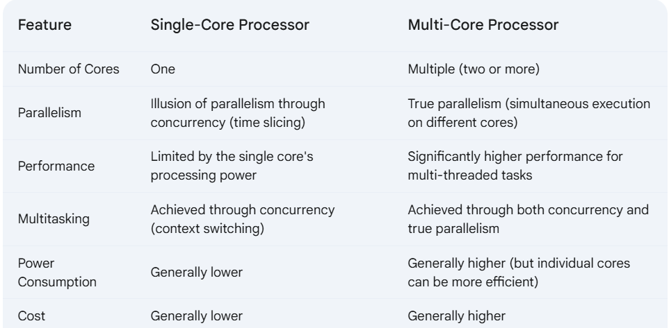

#### Process and Threads

Before understanding process and threads, we need to understand one thing.  
Whenever we run an application or execute a program such as MS word or Java code (Program). A process will be created for each program, similarly when we run a java application only one JVM instance will be created, and only one process will be created for one process also atleast one thread will be created also multiple threads might be possible (if we created or assigned the thread).

**Process :** 
* Instance of a program 
* A process is a fundamental unit of execution in an OS.  Think of it as a running instance of a program. When you launch an application, the OS creates a new process to run it.  A process has its own dedicated memory space, resources (like file handles), and execution context (the current state of the CPU registers).  Processes are independent of each other; if one process crashes, it generally doesn't affect other processes. 

**Threads :** 
* Threads is a small units of execution within the process.
* Threads are lightweight units of execution within a process.  A process can have multiple threads running concurrently.  Threads within the same process share the same memory space and resources of that process.  This allows threads to communicate and cooperate more easily than separate processes. 

Below is the exmaple image of single and multithreaded process, each process contains below things.

**Code segment** (to store the line by line instructions) 
**Data segment** (to store the global and static values) 
**Heap** (to store objects) 
**Stack** (to store local variables) 
**Program counter** (keeps track the instructions)

**Code segment, Data segment, Heap** are common for all threads
**Stack and Program counter** will be assigned for each thread.

**About single-core processor (time slicing and context switching)** 
**Analogy:** 
Imagine a single chef in a kitchen (the CPU core).  They can't cook multiple dishes simultaneously. However, they can rapidly switch between preparing different dishes. They might chop vegetables for one dish, then stir a sauce for another, then check the oven for a third.  By switching quickly, they give the impression of working on multiple dishes at once, even though they are only working on one at any given instant. 
**Purpose**
A single-core processor has only one execution unit, so it can execute one instruction at a time. However, it can manage multiple threads through concurrency. This creates the illusion of parallelism, as true parallelism requires multiple cores. The OS allocates CPU time slices to each thread. It performs context switching (saving the entire thread context, including registers) to switch between threads. Context switching can happen when a thread is waiting for something (like I/O) or when its allocated time slice expires.  When a paused thread is ready to run again, the OS restores its saved context and resumes its execution. 
**About multi-core processor** 
**Analogy:** 
Imagine a restaurant with multiple chefs (cores). Each chef has their own kitchen station and can prepare dishes independently.  If multiple customers place orders simultaneously (multiple threads), the chefs can work in parallel to prepare the orders much faster than if there were only one chef. 
**Purpose**
A multi-core processor is a CPU that contains multiple independent processing units (called "cores") within a single chip.  Each core can execute instructions independently and simultaneously. This means a multi-core processor can truly run multiple tasks (or threads) in parallel, significantly improving performance for multi-threaded applications. 

##### How the threads are created and who created and who managed those threads ?

When you use Java's multithreading mechanisms (e.g., Runnable, Thread, ForkJoinPool), you define tasks and their execution strategy. The JVM then creates and manages its own set of threads (JVM threads) based on your code. These JVM threads are subsequently mapped to native operating system (OS) threads. The OS scheduler then takes over, scheduling these OS threads onto the available CPU cores for execution.  The results are then passed back to the JVM, which makes them available to your Java application. 

**Example:** Consider Chrome browser
Each opened website in a tab is a process (if you've opened 4 websites, so 4 process will be executing).
Also, if you opened same website in 5 tabs (only one process will be used, becuase it consumes shared resources and styles and so on).
Maintaining each website in each process, if one website is crashed it won't impact other website (each will work independently).
This is reason, our system will be highly occupied if we opened lot of tabs in chrome.

**Example:** Consider Firefox
It also uses same strategy similar to chrome, it will consider each process for each tab. But it has some limit, if it crossed the limit multiple websites will be handled in same process.

Points to consider
A single-threaded application typically starts on one core. While it's running, the OS scheduler might move that single thread between cores for reasons like thermal balancing, load balancing, or power management. However, a single-threaded application cannot inherently use multiple cores simultaneously. It remains a single thread of execution.  Only multi-threaded applications can truly take advantage of multiple cores by running different threads concurrently on different cores. 
We can't achieve parallelism, if the application is single threaded. The OS might move the single thread between other cores for above reasons.
Modern web browsers such chrome, firefox are multi process architecture.