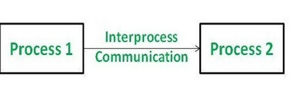

**_First understanding processes are important, because IPC's are required to connect processes or share the common data by two processes._** 
While processes are typically independent, each having its own storage space, resources, and execution context,
some processes require interdependency. This necessitates Inter-Process Communication (IPC), which provides 
various mechanisms like pipes, FIFOs, message queues, semaphores, mutexes, and sockets for communication. 
The primary purpose of IPC is to enable efficient communication between processes, minimizing overhead like 
deadlocks.

**Common IPC Mechanisms:**

**1. Pipes:** 
* Simple, unidirectional communication: Data flows in one direction, like water in a pipe. 
* Typically used between related processes (parent-child).  
**Example:** A command in a shell like ls | grep "file" uses a pipe to pass the output of ls to grep. 
**2. Named Pipes (FIFO):**
* Similar to pipes but with a name: Allows communication between unrelated processes.  
* Data still flows unidirectionally. 
**Example:** A server process might use a named pipe to receive requests from client processes.  
**3. Message Queues:** 
* Allow processes to exchange messages: Messages are stored in a queue until the receiving process retrieves them. 
* Can be used for both synchronous and asynchronous communication. 
**Example:** A print spooler might use a message queue to receive print jobs from different applications. 
**4. Shared Memory:** 
* Provides a shared region of memory that multiple processes can access. 
* Fastest form of IPC: Processes can directly read and write to the shared memory. 
* Requires synchronization mechanisms (like semaphores or mutexes) to prevent race conditions. 
**Example:** A large database might use shared memory to allow multiple processes to access the same data. 
**5. Semaphores:** 
* Synchronization primitives: Used to control access to shared resources and prevent race conditions. 
* Act as counters: Processes can increment or decrement the semaphore value. 
**Example:** A semaphore can be used to control the number of processes that can access a shared resource at the same time. 
**6. Mutexes (Mutual Exclusion):**
* Similar to semaphores but provide mutual exclusion: Only one process can acquire a mutex at a time. 
* Used to protect critical sections of code. 
**Example:** A mutex can be used to prevent multiple processes from modifying a shared variable simultaneously. 
**7. Sockets:** 
* Enable communication between processes on the same or different machines over a network. 
* Used for client-server communication. 
**Example:** A web browser uses sockets to communicate with a web server. 
**8. Signals:** 
* Software interrupts: Used to notify a process of an event. 
* Limited data transfer: Primarily used for signaling events, not for transferring large amounts of data. 
**Example:** A signal can be used to interrupt a process when a user presses Ctrl+C. 