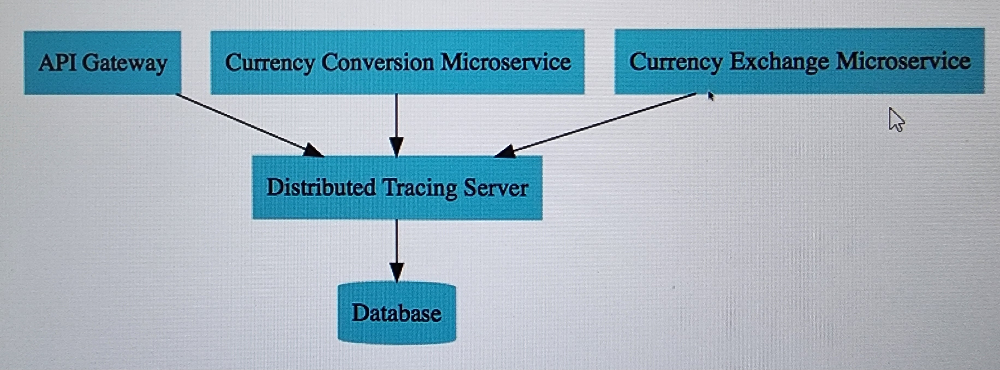

# Docker, Observability, OpenTelemetry, Micrometer, and Zipkin

> Migrated from the [Docker page in Madhav's Notion notes](https://app.notion.com/p/e0e86f61217942c28cb3221c09ef8309).
> The original section numbers are retained, including the jump from 196 to 198.

## Related resource

- [Original Google Sheet embedded in the Notion page](https://docs.google.com/spreadsheets/d/14Idx9kYJ6WUn2M9rUBzjRVNZTscoZyPlqn7Vp1wWDIg/edit#gid=0)

## 196. Observability and OpenTelemetry

### Monitoring

Monitoring is the process of collecting, tracking, and alerting on a system's health and performance. It commonly uses telemetry such as metrics, logs, and traces.

### Observability

Observability is the ability to understand a system's internal state by examining its outputs. It complements monitoring rather than simply being "one step above" it:

- Monitoring usually answers predefined questions such as, "Is the error rate above the threshold?"
- Observability helps investigate both known problems and previously unknown failure modes, including, "Why is this request slow only for some users?"
- An observable system is deliberately instrumented to emit useful telemetry.
- Observability platforms can combine OpenTelemetry data with data from other agents, cloud services, infrastructure, and application-specific sources.

### OpenTelemetry

OpenTelemetry (OTel) is an open-source, vendor-neutral observability framework and toolkit. It provides APIs, SDKs, semantic conventions, and tools for generating, collecting, processing, and exporting telemetry such as traces, metrics, and logs.

OpenTelemetry is **not** a storage or visualization backend. Telemetry is exported to a backend such as Zipkin, Jaeger, Prometheus, Grafana, or a commercial observability platform.

## 198. Micrometer, OpenTelemetry, and Zipkin

### Micrometer

Micrometer is a vendor-neutral instrumentation facade for JVM applications. Spring Boot uses Micrometer for application metrics and Micrometer Observation/Tracing for observations and distributed tracing.

For a Spring Boot application, start with Actuator and let Spring Boot's dependency management choose compatible library versions:

```xml
<dependency>
    <groupId>org.springframework.boot</groupId>
    <artifactId>spring-boot-starter-actuator</artifactId>
</dependency>

<dependency>
    <groupId>io.micrometer</groupId>
    <artifactId>micrometer-tracing-bridge-otel</artifactId>
</dependency>

<dependency>
    <groupId>io.opentelemetry</groupId>
    <artifactId>opentelemetry-exporter-zipkin</artifactId>
</dependency>
```

`micrometer-observation` is normally brought in transitively by Spring Boot Actuator. Add it directly only when building a non-Spring-Boot application or when there is a specific dependency-management reason.

If the application uses Spring Cloud OpenFeign and needs Feign observations, add:

```xml
<dependency>
    <groupId>io.github.openfeign</groupId>
    <artifactId>feign-micrometer</artifactId>
</dependency>
```

#### Instrumenting `RestTemplate`

Use the auto-configured `RestTemplateBuilder` so Spring Boot's observation customizers are applied. A manually constructed `new RestTemplate()` will not automatically receive that instrumentation.

```java
@Bean
RestTemplate restTemplate(RestTemplateBuilder builder) {
    return builder.build();
}
```

The same principle applies to the auto-configured `WebClient.Builder` and `RestClient.Builder`.

### OpenTelemetry tracing

`micrometer-tracing-bridge-otel` bridges Micrometer's Observation/Tracing APIs to OpenTelemetry. A separate exporter sends completed spans to a tracing backend. When Zipkin is the backend, `opentelemetry-exporter-zipkin` performs that export.

### Zipkin

Zipkin is a distributed tracing system used to collect, search, and visualize traces. Its UI helps analyze request paths, service dependencies, and latency in distributed or microservice-based systems.



Configure sampling and log correlation in `application.properties`:

```properties
# 1.0 samples all requests; 0.5 samples approximately half; 0.0 samples none.
# Use an appropriate value for the environment and traffic volume.
management.tracing.sampling.probability=1.0

# Include the application name, trace ID, and span ID in log lines.
logging.pattern.level=%5p [${spring.application.name:},%X{traceId:-},%X{spanId:-}]

# Zipkin's HTTP spans endpoint. The default host is overridden for Compose.
management.zipkin.tracing.endpoint=http://localhost:9411/api/v2/spans
```

Adding dependencies alone is not sufficient: the application must also be configured with a reachable exporter endpoint, and the traced work must pass through instrumented components. In production, sampling every request may be too expensive.

## Ways to build Docker images

Image references use this general form:

```text
[HOST[:PORT]/]NAMESPACE/REPOSITORY[:TAG]
```

Use unique, meaningful tags for releases. Updating the Maven project version before every push is not a Docker requirement, but publishing immutable version tags is safer than repeatedly overwriting the same tag.

### 1. Build an OCI image with the Spring Boot Maven plugin

Spring Boot can build an OCI image using Cloud Native Buildpacks, without requiring a handwritten Dockerfile.

```xml
<build>
    <plugins>
        <plugin>
            <groupId>org.springframework.boot</groupId>
            <artifactId>spring-boot-maven-plugin</artifactId>
            <configuration>
                <image>
                    <name>madhavsdocker/${project.artifactId}:${project.version}</name>
                    <pullPolicy>IF_NOT_PRESENT</pullPolicy>
                </image>
            </configuration>
        </plugin>
    </plugins>
</build>
```

Build the image:

```shell
mvn spring-boot:build-image -DskipTests
```

Push the generated image to Docker Hub:

```shell
docker push madhavsdocker/mobile-ms-1:0.0.11-SNAPSHOT
```

Before pushing, authenticate with `docker login` and ensure the repository namespace and tag match the locally built image.

### 2. Build with a Dockerfile

The file must be named `Dockerfile` unless another filename is supplied with `docker build --file`.

For a prebuilt Spring Boot JAR, a minimal Dockerfile is:

```dockerfile
FROM eclipse-temurin:17-jre-jammy

WORKDIR /app
COPY target/hello-world-0.0.1-SNAPSHOT.jar app.jar

ENTRYPOINT ["java", "-jar", "/app/app.jar"]
```

`eclipse-temurin` is used here because it is a maintained Docker Official Image for OpenJDK binaries. Pin a more specific tag or image digest when reproducibility is required.

Build the image from the directory containing the Dockerfile:

```shell
docker build -t IMAGE_NAME:TAG_NAME .
```

Run it and map a host port to the application's container port:

```shell
docker run --name CONTAINER_NAME -p HOST_PORT:CONTAINER_PORT IMAGE_NAME:TAG_NAME
```

Example:

```shell
docker run --name hello-world -p 8080:8080 hello-world:1.0.0
```

Push it to Docker Hub:

```shell
docker tag IMAGE_NAME:TAG_NAME DOCKER_HUB_USERNAME/IMAGE_NAME:TAG_NAME
docker push DOCKER_HUB_USERNAME/IMAGE_NAME:TAG_NAME
```

## Docker Compose — 11 May 2024

Docker Compose defines and manages multi-container applications in a YAML file. It is commonly used for local development and testing, and can start the application's services with a single command.

If an image is not present locally, Compose normally pulls it from its configured registry. When no registry hostname is specified, Docker uses Docker Hub by default.

Modern Compose follows the Compose Specification. The top-level `version` field is obsolete and can be omitted.

```yaml
services:
  application:
    image: madhavsdocker/mobile-ms-1:0.0.11-SNAPSHOT
    ports:
      - "9093:8081"
    environment:
      SPRING_PROFILES_ACTIVE: local

      # Containers reach one another through Compose service names, not localhost.
      EUREKA_CLIENT_SERVICEURL_DEFAULTZONE: http://discovery-services:8761/eureka

      # Spring Boot 3 / Micrometer Tracing property for Zipkin export.
      MANAGEMENT_ZIPKIN_TRACING_ENDPOINT: http://zipkin-server:9411/api/v2/spans
    depends_on:
      - discovery-services
      - zipkin-server

  discovery-services:
    image: eureka-server:latest
    ports:
      - "8761:8761"
    restart: always

  zipkin-server:
    image: openzipkin/zipkin:latest
    ports:
      - "9411:9411"
```

Important details:

- Compose creates a default network, and each service is discoverable by its service name. For example, the application reaches Zipkin at `http://zipkin-server:9411`, not `http://localhost:9411`.
- Spring Boot supports relaxed binding, so uppercase underscore-separated environment variables can map to application properties.
- Short-form `depends_on` controls startup order, but it does **not** wait for the dependency to become healthy or ready. Add health checks and long-form `depends_on` conditions when readiness matters, and make clients tolerate retries.
- Pin production images to a concrete version or digest instead of `latest`.

Start the application:

```shell
docker compose up
```

Start it in detached mode:

```shell
docker compose up -d
```

Stop and remove the Compose containers and default network:

```shell
docker compose down
```

## References

- [OpenTelemetry: What is OpenTelemetry?](https://opentelemetry.io/docs/what-is-opentelemetry/)
- [OpenTelemetry: Observability primer](https://opentelemetry.io/docs/concepts/observability-primer/)
- [Spring Boot: Observability](https://docs.spring.io/spring-boot/reference/actuator/observability.html)
- [Spring Boot: Metrics and HTTP client instrumentation](https://docs.spring.io/spring-boot/reference/actuator/metrics.html)
- [Spring Boot Maven Plugin: Packaging OCI images](https://docs.spring.io/spring-boot/maven-plugin/build-image.html)
- [Docker Docs: Image tag syntax](https://docs.docker.com/reference/cli/docker/image/tag/)
- [Docker Docs: Port publishing and mapping](https://docs.docker.com/engine/network/port-publishing/)
- [Docker Docs: Compose services and environment variables](https://docs.docker.com/reference/compose-file/services/)
- [Docker Docs: Compose `version` field](https://docs.docker.com/reference/compose-file/version-and-name/)
- [Docker Docs: Compose startup order](https://docs.docker.com/compose/how-tos/startup-order/)
