# Kubernetes

> Migrated from the [Kubernetes page in Madhav's Notion notes](https://app.notion.com/p/8b46c2b86fc34f1b9315d6a745df46e2).
> The source was an index with 19 linked pages. Their material has been combined here into one continuous set of study notes.

## Related resource

- [Original Google Sheet embedded in the Notion page](https://docs.google.com/spreadsheets/d/14Idx9kYJ6WUn2M9rUBzjRVNZTscoZyPlqn7Vp1wWDIg/edit#gid=5752778)

## The basic idea

Kubernetes, usually shortened to **K8s**, is a platform for managing containerized applications. It helps us describe the state we want—such as three application instances—and continuously works to keep the actual state close to it.

Container orchestration includes:

- scheduling containers onto machines;
- restarting failed workloads;
- scaling workloads up or down;
- rolling out new versions;
- service discovery and load balancing;
- configuration and secret management;
- health checking; and
- operational visibility through logs and metrics.

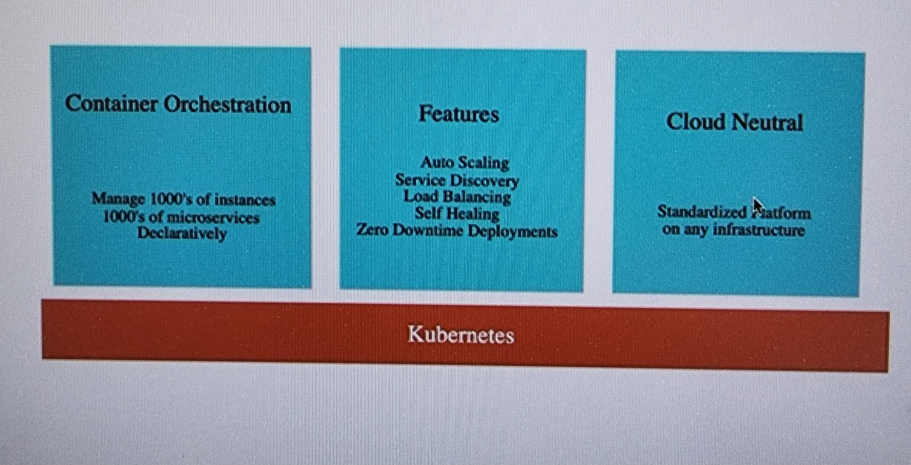

## Kubernetes cluster

A Kubernetes cluster consists of a **control plane** and one or more **worker nodes**:

- Worker nodes run the application's Pods.
- The control plane manages the cluster's desired state, scheduling, and reconciliation.
- Production clusters normally use a highly available control plane and multiple worker nodes.

The older term **master node** appears in the original notes. Current Kubernetes documentation uses **control plane**.

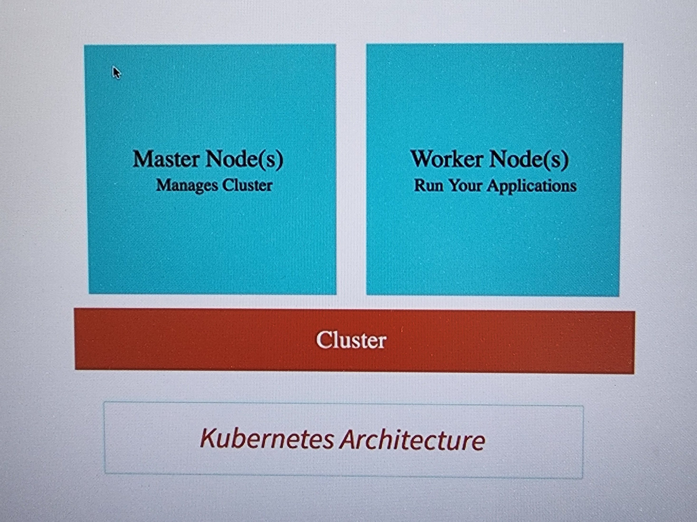

### A useful correction about control-plane failure

If the control plane becomes unavailable, containers that are already running on healthy worker nodes may continue serving traffic. However, cluster management is impaired: new Pods cannot be scheduled normally, failed workloads might not be replaced, configuration changes cannot be applied, and controllers cannot reconcile state. This is why production control planes are made highly available.

## Control-plane components

### kube-apiserver

The API server exposes the Kubernetes HTTP API. Tools such as `kubectl`, controllers, schedulers, and other clients communicate with the cluster through this API.

The API server validates requests and persists cluster state in etcd. Clients do not normally write directly to etcd.

### etcd

`etcd` is a consistent, highly available key-value store used for Kubernetes API data. It stores objects that describe both desired and observed cluster state.

It is not itself responsible for scaling or creating Pods. Controllers read desired state through the API server and make changes that move the cluster toward that state.

### kube-scheduler

The scheduler watches for Pods that have not yet been assigned to a node. It selects suitable nodes using factors such as:

- resource requests and availability;
- node selectors and affinity rules;
- taints and tolerations;
- topology constraints; and
- scheduling policies.

### kube-controller-manager

The controller manager runs control loops that compare desired state with current state and attempt to reconcile any difference. Examples include Deployment, ReplicaSet, Node, and Job controllers.

### cloud-controller-manager

In supported cloud environments, the optional cloud controller manager integrates Kubernetes with the provider's load balancers, routes, nodes, and related infrastructure.

## Worker-node components

### kubelet

The kubelet is the main agent on each worker node. It:

- watches Pod specifications assigned to its node;
- asks the container runtime to start or stop containers;
- executes configured health probes; and
- reports node and Pod status through the API server.

The kubelet communicates with the API server—not directly with the controller manager as a normal command channel.

### kube-proxy

`kube-proxy` is an optional node component that implements part of the Kubernetes Service abstraction using network rules. Some networking plugins implement equivalent Service routing without kube-proxy.

Creating a Deployment does not itself expose an application. A Service, Ingress, or Gateway resource provides network access.

### Container runtime

The container runtime pulls images and manages container execution through the Kubernetes Container Runtime Interface (CRI).

Modern Kubernetes commonly uses **containerd** or **CRI-O**. Docker Engine is not a CRI runtime by itself, and GKE nodes use containerd rather than the old Docker-based runtime.

### Pods

A Pod is Kubernetes' smallest deployable compute object. It can contain one or more tightly coupled containers that share:

- a network namespace and IP address;
- the same port space; and
- any volumes declared in the Pod specification.

In normal application deployments, we usually create Pods through a higher-level controller such as a Deployment rather than creating them directly.

## Core Kubernetes objects

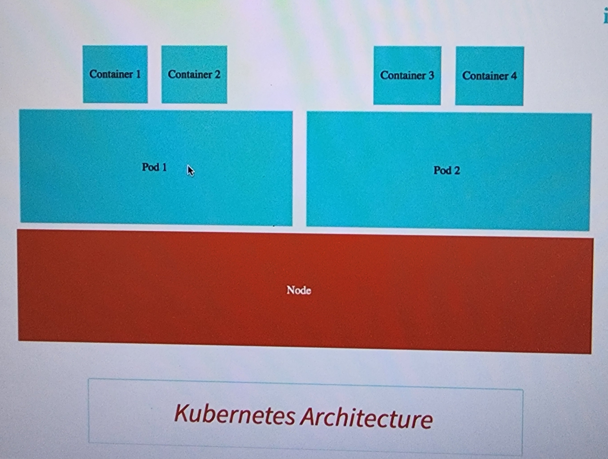

### Pod

A Pod represents one running instance of an application workload.

```shell
kubectl explain pods
```

### ReplicaSet

A ReplicaSet maintains a specified number of matching Pod replicas.

```shell
kubectl explain rs
```

Deployments normally create and manage ReplicaSets for us, so directly editing or deleting a Deployment-owned ReplicaSet is rarely the right operational action.

### Node

A node is a physical or virtual worker machine. GKE Standard nodes are usually Compute Engine VMs. GKE schedules Pods across eligible nodes based on the Pods' requirements and cluster state.

```shell
kubectl explain nodes
```

### Service

A Service gives a changing group of Pods a stable network identity. A selector commonly chooses the backend Pods, and the Service maps its `port` to a container's `targetPort`.

```shell
kubectl explain services
```

Common Service types include `ClusterIP`, `NodePort`, and `LoadBalancer`.

### Deployment

A Deployment declaratively manages stateless application Pods through ReplicaSets. It supports scaling, controlled rollouts, rollout history, and rollback.

A rolling update can support zero-downtime releases when readiness probes, replica counts, rollout settings, capacity, and application behavior are configured correctly. A Deployment alone does not guarantee zero downtime.

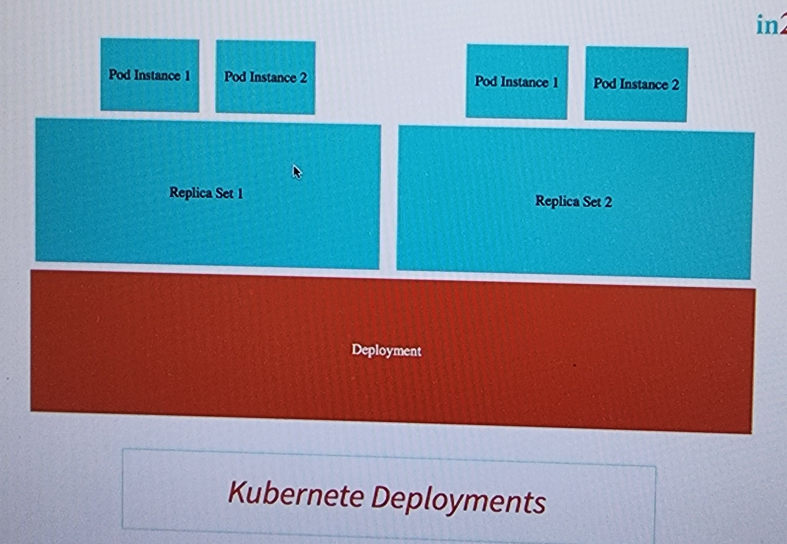

## Ways to interact with a Kubernetes cluster

There are several common options:

1. Use the Google Cloud Console for supported GKE operations.
2. Use **Google Cloud Shell**, a browser-based shell that already includes tools such as `gcloud` and `kubectl`.
3. Install the Google Cloud CLI and `kubectl` locally.
4. Use the Kubernetes API through client libraries or automation tools.

For local access to GKE:

```shell
gcloud auth login
gcloud config set project ow-stu-us-ce1-preprod
gcloud container clusters get-credentials ow-stu-preprod-app-cluster \
  --region us-central1 \
  --project ow-stu-us-ce1-preprod
```

After credentials are configured, verify the connection:

```shell
kubectl cluster-info
kubectl get nodes
```

### Small points to remember

- `kubectl` is commonly pronounced “kube control,” “kube cuddle,” or “kube cuttle.” It is the Kubernetes command-line tool, not “Kube Controller.”
- Kubernetes resources have focused responsibilities: Deployments manage rollouts, Pods run containers, and Services provide stable networking.
- Deployments default to the `RollingUpdate` strategy, but updates are controlled by `maxSurge`, `maxUnavailable`, readiness, and available capacity.

## A practical deployment workflow

A production-oriented workflow usually looks like this:

1. Build and test the application.
2. Build a container image and publish it to a registry.
3. Create or choose a Kubernetes cluster and namespace.
4. Apply a Deployment and Service.
5. Add resource requests and limits.
6. Add startup, readiness, and liveness probes.
7. Externalize non-sensitive configuration with ConfigMaps and sensitive values with Secrets.
8. Configure autoscaling if required.
9. Enable logging, metrics, tracing, alerting, and rollout monitoring.
10. Add security controls, disruption handling, backups, and recovery plans as needed.

### Imperative learning example

The following commands are useful for learning and quick experiments:

```shell
kubectl create deployment hello-world-rest-api \
  --image=in28min/hello-world-rest-api:0.0.1.RELEASE

kubectl expose deployment hello-world-rest-api \
  --type=LoadBalancer \
  --port=8080 \
  --target-port=8080
```

The Deployment appears as a workload. The second command creates a `LoadBalancer` Service. Its external address is stable for the lifetime of that Service, while the backend Pods may be replaced at any time.

```shell
kubectl get services
kubectl get svc
```

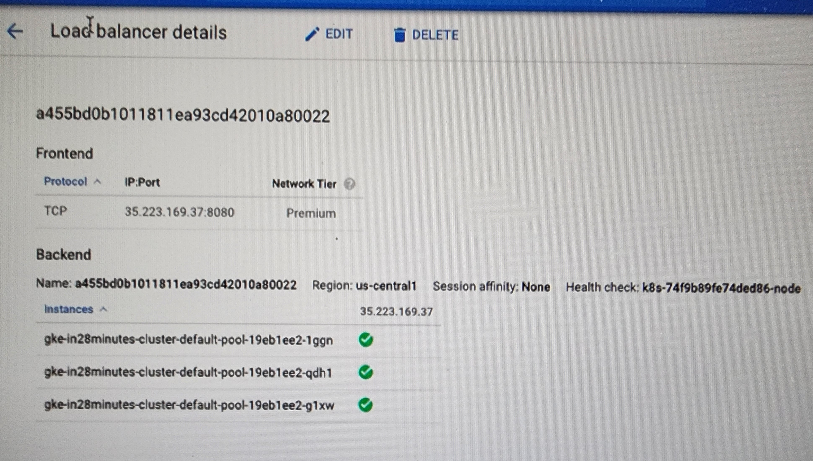

Scale the Deployment manually:

```shell
kubectl scale deployment hello-world-rest-api --replicas=3
```

Delete resources when they are no longer required:

```shell
kubectl delete pod POD_NAME
kubectl delete replicaset REPLICASET_NAME
kubectl delete deployment DEPLOYMENT_NAME
```

Deleting a Pod managed by a ReplicaSet or Deployment causes the controller to create a replacement. Deleting the Deployment removes its managed ReplicaSets and Pods unless orphaning behavior is explicitly requested.

For repeatable environments, prefer version-controlled YAML, Kustomize, Helm, GitOps, or another declarative workflow over a sequence of imperative commands.

## Build and push an application image

The original example identifies a Spring Boot service in `pom.xml`:

```xml
<groupId>com.mobile</groupId>
<artifactId>mobile-ms-1</artifactId>
<version>0.0.11-SNAPSHOT</version>
<name>mobile-ms-1-kubernetes</name>
<description>Demo project for Spring Boot</description>
```

Changing the Maven version or artifact name is not required specifically because the application will run on Kubernetes. The important part is to build the correct image and use a clear, preferably immutable, tag.

For example:

```shell
docker build -t madhavsdocker/mobile-ms-1:0.0.11-SNAPSHOT .
docker push madhavsdocker/mobile-ms-1:0.0.11-SNAPSHOT
```

Then reference the same image and tag in the Deployment.

The original learning reference was **Master Microservices with Spring Boot and Spring Cloud**, video 232, for deploying multiple applications and connecting them with a Feign client.

## Declarative Deployment and Service YAML

You can inspect a live Deployment:

```shell
kubectl get deployment mobile-api -o yaml
```

That output includes server-managed fields such as `uid`, `resourceVersion`, timestamps, GKE annotations, allocated IP addresses, and `status`. It is useful for inspection, but should be cleaned before being stored as a reusable manifest.

The Deployment selector and Pod-template labels must match. A Service's selector must also match the labels of the Pods it should route to.

```yaml
apiVersion: apps/v1
kind: Deployment
metadata:
  name: mobile-api
  labels:
    app: mobile-api
spec:
  replicas: 2
  revisionHistoryLimit: 10
  progressDeadlineSeconds: 600
  selector:
    matchLabels:
      app: mobile-api
  strategy:
    type: RollingUpdate
    rollingUpdate:
      maxSurge: 25%
      maxUnavailable: 25%
  template:
    metadata:
      labels:
        app: mobile-api
    spec:
      containers:
        - name: mobile-ms-1
          image: madhavsdocker/mobile-ms-1:0.0.11-SNAPSHOT
          imagePullPolicy: IfNotPresent
          ports:
            - name: http
              containerPort: 8080
          resources:
            requests:
              cpu: 250m
              memory: 512Mi
            limits:
              cpu: 500m
              memory: 2Gi
          securityContext:
            capabilities:
              drop:
                - NET_RAW
          envFrom:
            - configMapRef:
                name: mobile-api-config
          startupProbe:
            httpGet:
              path: /actuator/health/liveness
              port: http
            periodSeconds: 10
            failureThreshold: 30
          livenessProbe:
            httpGet:
              path: /actuator/health/liveness
              port: http
            periodSeconds: 10
            failureThreshold: 3
          readinessProbe:
            httpGet:
              path: /actuator/health/readiness
              port: http
            periodSeconds: 5
            failureThreshold: 3
      securityContext:
        seccompProfile:
          type: RuntimeDefault
      terminationGracePeriodSeconds: 30
---
apiVersion: v1
kind: Service
metadata:
  name: mobile-api
  labels:
    app: mobile-api
spec:
  type: LoadBalancer
  selector:
    app: mobile-api
  ports:
    - name: http
      port: 8080
      targetPort: http
```

Apply and inspect the resources:

```shell
kubectl apply -f deployment.yaml
kubectl get deployment,pods,service
kubectl describe deployment mobile-api
```

## Centralized configuration with ConfigMaps

A ConfigMap stores **non-confidential** configuration separately from the image. The original ConfigMap was named `mobile-api-secrets`, but that name is misleading because ConfigMaps do not provide secrecy.

Also remember that `localhost` inside a container refers to that same Pod. To call another Kubernetes workload, use its Service DNS name.

```shell
kubectl create configmap mobile-api-config \
  --from-literal=AMAZON_API_URL=http://amazon-api:8082
```

Inspect or export it:

```shell
kubectl get configmap mobile-api-config -o yaml
```

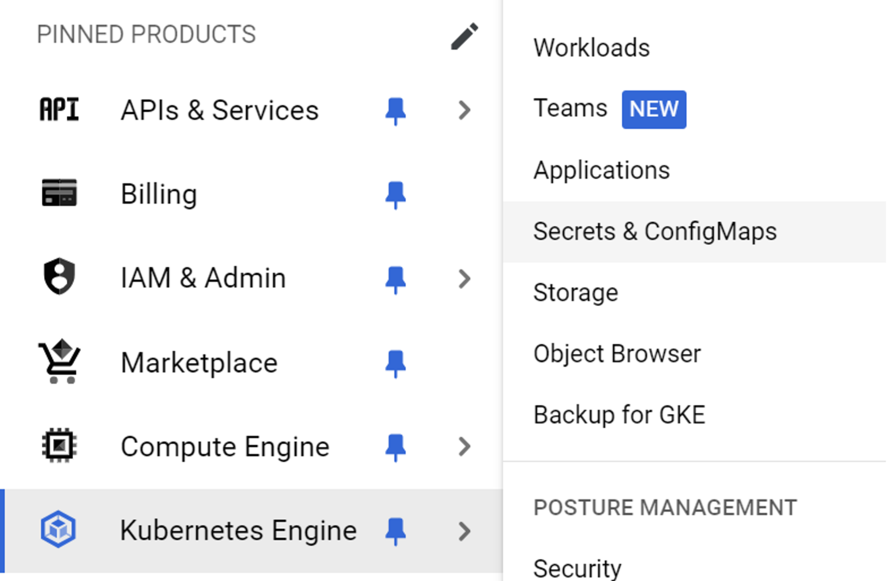

Import every valid key as an environment variable:

```yaml
spec:
  template:
    spec:
      containers:
        - name: mobile-ms-1
          image: madhavsdocker/mobile-ms-1:0.0.11-SNAPSHOT
          envFrom:
            - configMapRef:
                name: mobile-api-config
```

Or map one key to a specific environment variable:

```yaml
env:
  - name: AMAZON_API_URL
    valueFrom:
      configMapKeyRef:
        name: mobile-api-config
        key: AMAZON_API_URL
```

Spring Boot can bind `AMAZON_API_URL` to a compatible property or read it with `@Value`.

Passwords, API tokens, and other confidential values belong in a Kubernetes Secret or an external secret manager—not in a ConfigMap. Kubernetes Secrets also require appropriate encryption-at-rest and RBAC configuration because they are not automatically safe merely because the object kind is `Secret`.

## Rolling updates, history, and rollback

During a rolling update, a Deployment gradually creates a new ReplicaSet and scales down the old one according to `maxSurge` and `maxUnavailable`.

If the new image cannot be pulled or the new Pods never become Ready, the rollout can stall while available old Pods remain. Exact behavior depends on replica count, rollout strategy, readiness, and capacity.

View rollout progress:

```shell
kubectl rollout status deployment/DEPLOYMENT_NAME
```

View revision history:

```shell
kubectl rollout history deployment/DEPLOYMENT_NAME
```


In this example, the new Pod failed while an older Pod remained Running:

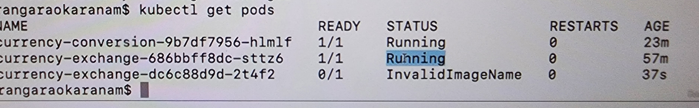

Undo the latest rollout:

```shell
kubectl rollout undo deployment/DEPLOYMENT_NAME
```

Roll back to a specific revision:

```shell
kubectl rollout undo deployment/DEPLOYMENT_NAME --to-revision=1
```

## Liveness, readiness, and startup probes

The source contained two pages with overlapping probe notes. Both sets of examples and screenshots are consolidated here.

The probes have different jobs:

- **Startup probe:** protects a slow-starting application. Liveness and readiness checks wait until startup succeeds.
- **Liveness probe:** answers, “Is this container stuck in a state from which it cannot recover?” Repeated failure causes the kubelet to restart the container.
- **Readiness probe:** answers, “Can this Pod serve traffic right now?” A failing Pod remains running but is removed from matching Service endpoints.

Readiness is what stops traffic from reaching a new Pod before it is ready. Liveness is not a rollout gate and should not be used to check external dependencies that could cause every replica to restart together.

For Spring Boot, include Actuator:

```xml
<dependency>
    <groupId>org.springframework.boot</groupId>
    <artifactId>spring-boot-starter-actuator</artifactId>
</dependency>
```

Spring Boot exposes:

- `/actuator/health/liveness`
- `/actuator/health/readiness`

These probe groups are automatically available in a Kubernetes environment in supported Spring Boot versions. They can also be explicitly enabled when needed:

```properties
management.endpoint.health.probes.enabled=true
```

Example Pod configuration:

```yaml
containers:
  - name: studio-server-app
    image: gcr.io/ow-devops/studio-server:latest
    ports:
      - name: http
        containerPort: 8080
    volumeMounts:
      - name: gcs-bucket-key
        mountPath: /var/secrets/google
        readOnly: true
    startupProbe:
      httpGet:
        path: /actuator/health/liveness
        port: http
      periodSeconds: 10
      failureThreshold: 30
    livenessProbe:
      httpGet:
        path: /actuator/health/liveness
        port: http
      periodSeconds: 10
      failureThreshold: 3
    readinessProbe:
      httpGet:
        path: /actuator/health/readiness
        port: http
      periodSeconds: 5
      failureThreshold: 3
```

The original screenshots from both probe pages are preserved below:

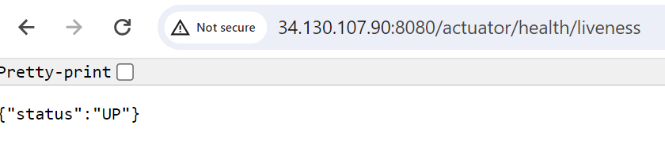

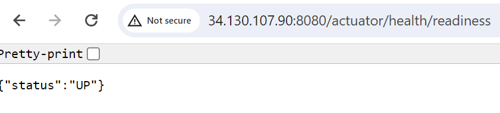

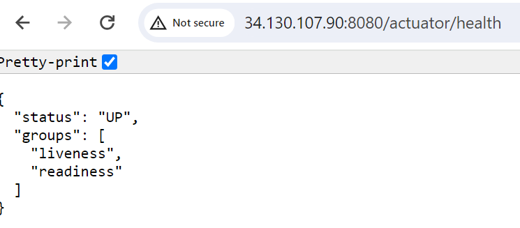

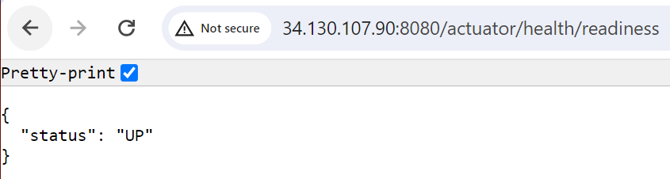

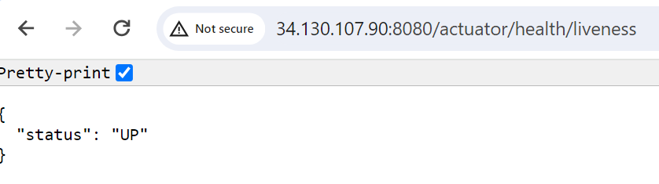

During a healthy V1-to-V2 rolling update, V1 replicas can continue serving while V2 starts. V2 only receives Service traffic after it becomes Ready, and the Deployment reduces old replicas within its availability rules.

## Horizontal Pod Autoscaling

A HorizontalPodAutoscaler (HPA) changes the desired replica count of a scalable workload, such as a Deployment, based on observed metrics.

For CPU-utilization-based scaling:

- the resource metrics API must be available, usually through Metrics Server or the cloud provider's metrics pipeline;
- containers need CPU requests, because utilization is calculated relative to requested CPU; and
- minimum, maximum, and target utilization values must be configured.

Current `kubectl` syntax:

```shell
kubectl autoscale deployment mobile-api --min=1 --max=3 --cpu=75%
```

Older `kubectl` versions used `--cpu-percent=75`. Use `kubectl autoscale --help` for the installed version. The command is `autoscale`, not `autoscaling`.

Inspect the autoscaler:

```shell
kubectl get hpa
kubectl describe hpa mobile-api
```

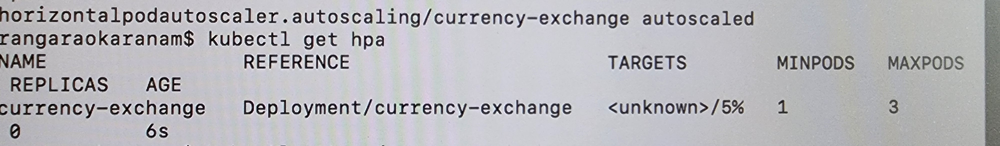

When average CPU utilization rises above the target, the HPA can increase replicas up to the configured maximum. When demand drops and stabilization rules allow it, the HPA can scale back down.

```shell
kubectl get pods
```

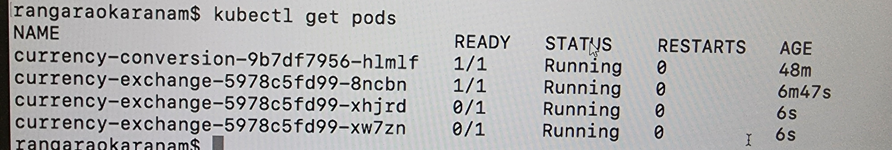

## Logging, monitoring, and tracing in GKE

GKE integrates with Google Cloud Observability:

- system, audit, and application logs can be sent to **Cloud Logging**;
- system and workload metrics can be sent to **Cloud Monitoring**; and
- managed Prometheus collection can be enabled for Prometheus-format metrics.

New GKE clusters normally have Cloud Logging and Cloud Monitoring integrations enabled by default, with options depending on Standard or Autopilot mode. **Stackdriver** is the former product name and should not be treated as a separate API that every modern cluster must enable manually.

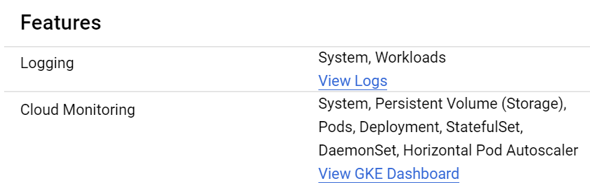

### Application logging

Applications should normally write logs to standard output or standard error. GKE's logging agent can collect those container logs and attach Kubernetes resource metadata.

For Spring Boot 3, Micrometer Observation and Micrometer Tracing replace the old Spring Cloud Sleuth integration:

```xml
<dependency>
    <groupId>org.springframework.boot</groupId>
    <artifactId>spring-boot-starter-actuator</artifactId>
</dependency>

<dependency>
    <groupId>io.micrometer</groupId>
    <artifactId>micrometer-tracing-bridge-otel</artifactId>
</dependency>
```

An exporter is still required if completed traces must be sent to a tracing backend. Trace and span IDs in logs provide correlation, but logs alone are not a complete distributed trace.

Example correlated log entry, cleaned of the original terminal color codes:

```text
2024-05-28T17:39:45.755+05:30 INFO
[mobile-ms-3,3a2c9eefe5572011c37cfa11b5a0d395,ab9b82034305602e]
```

Here the fields represent the application name, trace ID, and span ID. The trace ID can be used to find related entries when the logging and tracing pipeline carries that correlation data.

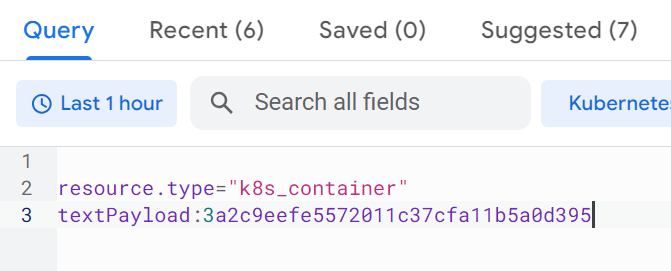

### Monitoring

Monitoring helps track health and resource usage across:

- clusters and namespaces;
- nodes;
- workloads and Services;
- Pods and containers; and
- application-specific metrics and alerts.

Infrastructure metrics alone do not explain every failure. Combine metrics with logs, traces, Kubernetes events, rollout status, and application health signals.

## Quick command reference

```shell
# Cluster access
kubectl cluster-info
kubectl get nodes

# Workloads
kubectl get deployments
kubectl get replicasets
kubectl get pods
kubectl describe pod POD_NAME
kubectl logs POD_NAME

# Networking
kubectl get services

# Configuration
kubectl get configmaps
kubectl get secrets

# Rollouts
kubectl rollout status deployment/DEPLOYMENT_NAME
kubectl rollout history deployment/DEPLOYMENT_NAME
kubectl rollout undo deployment/DEPLOYMENT_NAME

# Scaling
kubectl scale deployment DEPLOYMENT_NAME --replicas=3
kubectl get hpa

# Apply declarative configuration
kubectl apply -f deployment.yaml
```

## Points to remember

- The API server is the entry point to the control plane.
- etcd stores Kubernetes API data; controllers perform reconciliation.
- Existing workloads may survive a temporary control-plane outage, but the cluster cannot manage them normally.
- A Pod is replaceable. Do not depend on a Pod name or Pod IP remaining stable.
- A Service gives a changing set of Pods a stable network endpoint.
- A ReplicaSet maintains replicas; a Deployment manages ReplicaSets and rollouts.
- Readiness controls traffic, liveness controls restart behavior, and startup protects slow initialization.
- Rolling updates reduce risk but do not automatically guarantee zero downtime.
- ConfigMaps are for non-sensitive configuration. Use Secrets or an external secret manager for confidential data.
- HPA CPU percentages depend on resource requests and an available metrics API.
- Modern GKE uses containerd, not the old Docker runtime.
- Prefer declarative, version-controlled manifests for repeatable deployments.

## Original Notion sources

- [Kubernetes index](https://app.notion.com/p/8b46c2b86fc34f1b9315d6a745df46e2)
- [Container Orchestration](https://app.notion.com/p/c54a16ef07ca41c1b68aca3d97dda869)
- [Kubernetes Cluster](https://app.notion.com/p/993a8cebf4a14f3a8bf96cceb5e386c3)
- [More about Master Node and Worker Node](https://app.notion.com/p/afb8ab7a60a943f4b449f53e2fe3cf33)
- [Master Node](https://app.notion.com/p/b7da7dc4a7c54057a0a4059abddca50c)
- [Worker Node](https://app.notion.com/p/a0edc6d858f74d5b82f25d060feff6b9)
- [Number of ways to interact with Kubernetes](https://app.notion.com/p/37672d65e6fb4061be12cef6b8aef490)
- [About Pods, RS, Nodes, Services and Deployments](https://app.notion.com/p/e57ba7548cba432ea082937310ee155c)
- [Steps to Deploy a Production-Ready Application](https://app.notion.com/p/569c75ecaa434a148da6ac1eeccab090)
- [Steps to convert the application into Image and push into Kubernetes](https://app.notion.com/p/ba8ddce3e9044ffdacc7456360703152)
- [About Deployment.YAML](https://app.notion.com/p/84d1e751ff034fa1ac61d516f1ad2c17)
- [Logging and Monitoring](https://app.notion.com/p/80b5620fd4cb474c87522a9669cfec08)
- [Centralized Logging and Monitoring](https://app.notion.com/p/0bdfc45a9e7b48a1ab6c98371b2a7c37)
- [Logging](https://app.notion.com/p/44d249467c3443399c3512afcf3a8732)
- [Monitoring](https://app.notion.com/p/dc9f6af5004a499da3d8a764f0132336)
- [Centralized Configuration in Kubernetes](https://app.notion.com/p/36908aa978074030a97988d6f6002996)
- [Rolling Out the Deployment](https://app.notion.com/p/b0920542b4df4f1d9dcdecb4a8b285c5)
- [Liveness and Readiness probe—rollout child page](https://app.notion.com/p/51291bddfe834e43af0aa57f742629ef)
- [Liveness and Readiness probe—main child page](https://app.notion.com/p/9d47777ca58a4bfda8dae00cf316b7fa)
- [Auto Scaling](https://app.notion.com/p/cd925181fb53485b90b2b35f9e615823)

## Technical references

- [Kubernetes components](https://kubernetes.io/docs/concepts/overview/components/)
- [Kubernetes cluster architecture](https://kubernetes.io/docs/concepts/architecture/)
- [Deployments](https://kubernetes.io/docs/concepts/workloads/controllers/deployment/)
- [Services](https://kubernetes.io/docs/concepts/services-networking/service/)
- [ConfigMaps](https://kubernetes.io/docs/concepts/configuration/configmap/)
- [Secrets](https://kubernetes.io/docs/concepts/configuration/secret/)
- [Liveness, readiness, and startup probes](https://kubernetes.io/docs/tasks/configure-pod-container/configure-liveness-readiness-probes/)
- [Horizontal Pod Autoscaling](https://kubernetes.io/docs/concepts/workloads/autoscaling/horizontal-pod-autoscale/)
- [kubectl autoscale](https://kubernetes.io/docs/reference/kubectl/generated/kubectl_autoscale/)
- [GKE observability](https://cloud.google.com/kubernetes-engine/docs/concepts/observability)
- [Spring Boot application availability and Kubernetes probes](https://docs.spring.io/spring-boot/reference/features/spring-application.html#features.spring-application.application-availability)
