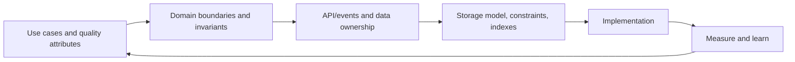

# Application Design and Performance Practices

## Design from requirements, not from a database table alone

Data is central, but “design tables first, then build the application” is not a universal process. Begin with use cases, domain invariants, data ownership, access patterns, consistency, scale, security, and operational requirements. Then co-design the domain/API and storage model.

For relational data, define primary keys, foreign keys, nullability, unique/check constraints, transaction boundaries, and indexes. For document stores, design aggregates from read/write patterns and bounded document growth.

## Performance method

1. Define a measurable objective: latency percentile, throughput, memory, CPU, allocation rate, or cost.
2. Reproduce with production-like data, traffic shape, JVM, database, and network behavior. A convenient dev environment is not automatically representative.
3. Observe end-to-end metrics and traces; locate the limiting resource.
4. Profile the correct dimension: CPU profile, allocation profile, heap dump, thread dump, JFR, database plan, I/O, or connection-pool metrics.
5. Change one meaningful factor, load test, and compare against the baseline.
6. Preserve correctness and add a regression test/monitor.

Logging request start/end timestamps alone is not sufficient observability. Use structured logs with correlation IDs plus metrics and distributed tracing. Never log secrets or sensitive payloads.

## Corrected performance heuristics

| Claim to avoid | Better rule |
|---|---|
| “Always use a declarative approach” | Prefer clear intent; use imperative code when stateful/control-flow logic is clearer or faster. |
| “Loops, recursion, and many `if`s are slow” | Algorithmic complexity, work per iteration, allocation, I/O, and branch predictability matter; measure before rewriting. |
| “Reuse the maximum number of objects” | Prefer simple short-lived objects unless profiling proves allocation pressure; unsafe pooling creates state/concurrency bugs. |
| “Always use primitives” | Avoid accidental boxing in hot/high-volume paths, but use wrappers for nullability, generics, and domain meaning. |
| “Limit synchronization” | Minimize contention and scope, but never trade away thread safety. Prefer ownership, immutability, concurrent structures, or higher-level coordination. |
| “Cache frequently used values” | Cache expensive, repeatable reads only with explicit key, TTL, size, eviction, invalidation, consistency, and stampede policy. |
| “StringBuffer is preferable” | Use `StringBuilder` locally; `StringBuffer` is synchronized legacy-compatible behavior. Modern `+` is fine for a few expressions. |
| “Avoid creating objects without references” | Temporary objects are normal and often optimized; clarity first, profile allocations before changing design. |
| “Do not catch/throw exceptions inside loops” | Avoid exceptions as normal control flow in hot loops, but catch where recovery/context belongs and preserve correctness. |

## Data structures

- Choose from required operations, ordering, duplicates, concurrency, memory, and worst-case needs.
- `ArrayList.contains` is linear; `HashSet.contains` is expected constant time; `TreeSet.contains` is logarithmic.
- A list index gives constant-time access for array-backed lists, but insertion/removal and linked-list behavior differ.
- Understand `equals`/`hashCode`, mutable keys, collision behavior, and concurrent compound operations.

## Timeouts and resilience

Configure connection, request/write, response/read, pool-acquisition, and overall operation deadlines where applicable. A timeout bounds waiting; it does not guarantee the remote operation stopped. Combine deadlines with bounded retries, exponential backoff/jitter, idempotency, circuit breaking where justified, and cancellation propagation.

## Production-quality checklist

- Clear domain and transaction boundaries.
- Input validation plus database constraints.
- Authentication, authorization, least privilege, secret management, encryption, and sensitive-data handling.
- Bounded queries, payloads, queues, concurrency, and memory.
- Failure handling, idempotency, retry ownership, and graceful degradation.
- Structured observability and actionable alerts.
- Schema/API compatibility during rolling deployment.
- Automated unit, integration, contract, security, performance, and migration tests.
- Dependency/SBOM/vulnerability management and reproducible artifact publishing.
- Runbooks, rollback/roll-forward plan, backups, and restore testing.

