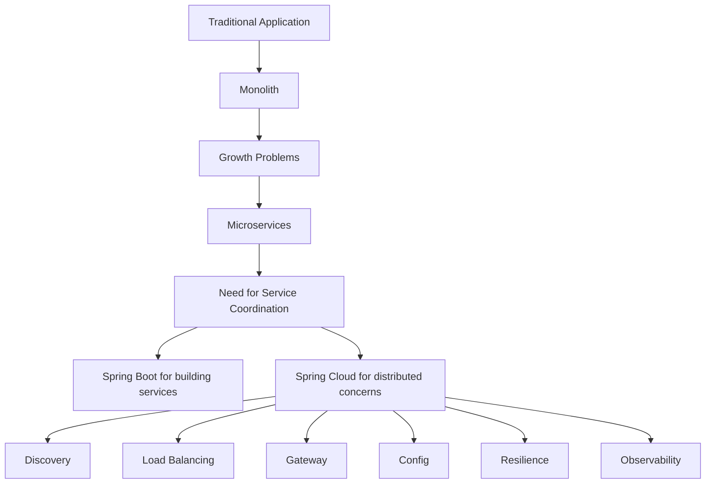

# 0 - Learning Path: Microservices and Spring Cloud

This note set is written in **foundation → advanced** order so the topic stays in memory more naturally.

The goal is **not** to cover every possible buzzword. The goal is to understand the **important concepts strongly**, with the right mental model for interviews and for real projects.

---

## What this note set tries to do

These notes are designed to answer questions like:

- What was there **before** microservices?
- Why did people move from **monolith → microservices**?
- Why did some teams later move from **microservices → modular monolith**?
- Where does **Spring Boot** fit?
- Where does **Spring Cloud** fit?
- What problem does each Spring Cloud component solve?
- What is the **modern** approach, and what is now considered **legacy/outdated**?

---

## Recommended reading order

1. **1_evolution_monolith_to_microservices.md**  
   Start here. Understand the history and why microservices were invented.

2. **2_microservice_fundamentals.md**  
   Learn what a microservice actually is and the principles behind it.

3. **3_inter_service_communication.md**  
   Learn how services talk to each other.

4. **4_service_discovery_and_load_balancing.md**  
   Learn how one service finds another and how traffic is distributed.

5. **5_api_gateway_and_external_traffic.md**  
   Learn why an API Gateway exists.

6. **6_configuration_observability_and_operations.md**  
   Learn config, health checks, actuator, tracing, and operational concerns.

7. **7_resilience_and_fault_tolerance.md**  
   Learn retries, circuit breaker, timeout, fallback, rate limiting, bulkhead.

8. **8_data_consistency_and_transactions.md**  
   Learn distributed transaction challenges and how to think about data in microservices.

9. **9_spring_cloud_in_practice.md**  
   Learn how Spring Cloud components come together in a real system.

10. **10_interview_revision.md**  
   Quick revision file for interviews.

---

## One-line mental summary

> **Monolith** made development simpler in the beginning.  
> **Microservices** improved scalability, team autonomy, and independent deployment—but increased distributed-system complexity.  
> **Spring Boot** makes services easy to build.  
> **Spring Cloud** helps solve the common distributed-system problems around those services.

---

## Big picture diagram

---

## Important mindset before you begin

Do **not** memorize microservices as just:

- Eureka
- Gateway
- Config Server
- Feign
- Circuit Breaker

That approach is weak.

Instead, always think like this:

1. **What problem exists?**  
2. **Why does that problem appear in distributed systems?**  
3. **What pattern solves it?**  
4. **Which Spring component implements that pattern?**

If you think this way, you will remember the topic for a long time and you can explain it naturally in interviews.
