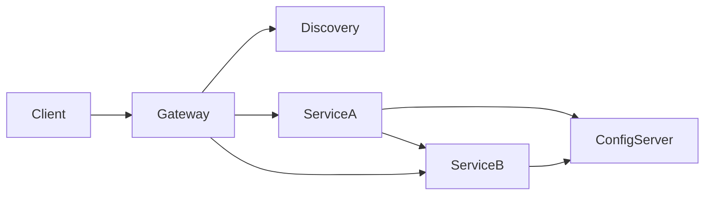

# 10 - Interview Revision: Microservices and Spring Cloud

## 1. Quick definitions

### What is a microservice?
A small, independently deployable service built around a business capability.

### Why microservices?
To improve independent deployment, team autonomy, scaling flexibility, and modular evolution.

### Why not always microservices?
Because they increase distributed-system complexity, operational cost, and debugging difficulty.

### What is Spring Boot?
A framework that simplifies creating production-ready Spring applications using auto-configuration, starter dependencies, and embedded servers.

### What is Spring Cloud?
A set of tools to solve distributed-system problems in Spring-based microservices.

---

## 2. Quick compare

### Monolith vs Microservices
- Monolith: simpler initially, harder at scale
- Microservices: more scalable organizationally and operationally, but more complex

### RestTemplate vs WebClient
- RestTemplate: blocking, older
- WebClient: non-blocking/reactive, modern

### Ribbon vs Spring Cloud LoadBalancer
- Ribbon: older/legacy
- Spring Cloud LoadBalancer: preferred

### Zuul vs Spring Cloud Gateway
- Zuul: older
- Spring Cloud Gateway: preferred

### Hystrix vs Resilience4j
- Hystrix: older
- Resilience4j: preferred

---

## 3. Short conceptual answers

### Why do we need service discovery?
Because in microservices, service instances may scale dynamically and use different host/port combinations. Hardcoding endpoints is not practical.

### Why load balancing?
Because one service may have multiple instances, and requests need to be distributed among them.

### Why API Gateway?
To provide a single entry point and centralize routing, security, filtering, and other edge concerns.

### Why config server?
To centralize configuration and manage environment-specific properties cleanly.

### Why actuator?
To expose health, metrics, and operational endpoints.

### Why circuit breaker?
To stop repeated calls to a failing downstream service and protect the system.

### Why saga?
Because distributed transactions across service-specific databases are difficult; sagas coordinate local transactions to achieve business consistency.

---

## 4. Very common interview question

### Q: Why did some companies move from microservices back to monolith/modular monolith?

Because microservices added too much operational and distributed-system complexity for their use case, and the benefits did not justify the cost.

---

## 5. High-quality interview statement

> Microservices are useful when domain boundaries are clear, teams need autonomy, and services need independent deployment and scaling. But they are not free. They introduce distributed-system concerns like service discovery, retries, circuit breakers, tracing, and eventual consistency. Spring Boot helps build services, while Spring Cloud helps solve those distributed concerns.

---

## 6. Minimal architecture summary

---

## 7. Topics you should be able to explain confidently

- monolith vs microservices
- why microservices evolved
- independent deployment
- service discovery
- client-side load balancing
- API Gateway
- blocking vs non-blocking calls
- WebClient vs RestTemplate
- config server
- actuator
- circuit breaker
- rate limiting
- fallback
- retries and timeouts
- eventual consistency
- saga
- observability

---

## 8. Final memory trick

Think in this sequence:

1. We split the app.  
2. Now services must talk.  
3. They must find each other.  
4. Traffic must be balanced.  
5. Clients need one entrance.  
6. Config must be centralized.  
7. Failures must be handled.  
8. Health and metrics must be visible.  
9. Data consistency must still be maintained.

That is the entire story of microservices and Spring Cloud in one flow.
