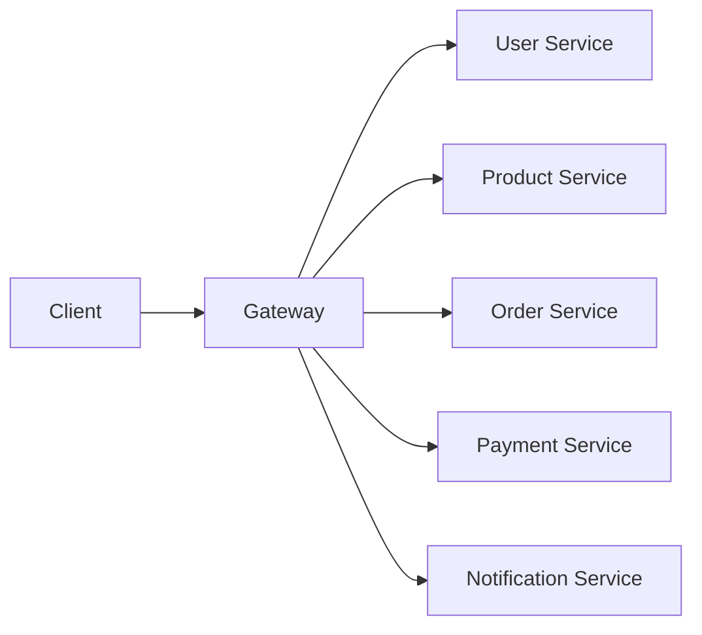

# 1 - Evolution: From Monolith to Microservices

## 1. What was there before microservices?

Before microservices became popular, most enterprise applications were built as **monoliths**.

A **monolith** means:

- the application is developed as **one deployable unit**
- UI, business logic, and data access often live in one codebase
- usually one build artifact is deployed
- very often it uses one main database

### Example
An e-commerce application may contain:

- user management
- catalog
- cart
- order management
- payment
- notification
- reporting

All inside one application.

---

## 2. Why monolith was good initially

Monoliths became popular for good reasons.

### Advantages of a monolith

- easier to start
- easy local development
- one codebase
- one deployment unit
- simpler debugging in early stage
- easier transactions within one database
- fewer network calls between modules

For small teams or early-stage products, a monolith is often a **very good choice**.

---

## 3. Then why did people move away from monolith?

As the system and team grew, monoliths started showing pain points.

### Common monolith problems

1. **Large codebase**  
   Over time the code becomes difficult to understand.

2. **Tight coupling**  
   A change in one area can unexpectedly affect another area.

3. **Slow deployments**  
   Even a small fix may require redeploying the entire application.

4. **Scaling limitation**  
   If only one module needs more scale, often the whole application is scaled.

5. **Technology lock-in**  
   It becomes hard to adopt a better technology for only one part.

6. **Team coordination pain**  
   Many teams working in one codebase can create merge conflicts, release coordination issues, and ownership confusion.

---

## 4. Why microservices were invented

Microservices emerged to solve the pain of **growing systems** and **growing teams**.

A microservices architecture breaks the application into **small, independently deployable services**, each usually focused on one business capability.

### Core goals

- independent deployment
- independent scaling
- better team ownership
- faster delivery
- fault isolation
- ability to evolve different modules independently

### Example split

---

## 5. Why microservices felt like a big evolution

Microservices matched the needs of modern platforms where:

- products grew very fast
- traffic increased a lot
- teams became larger
- CI/CD became common
- cloud infrastructure made independent deployment easier
- containers and orchestration tools became popular

Microservices are not just a coding style. They are also an **organizational and operational style**.

---

## 6. But why did some companies move back from microservices?

This is one of the most important interview discussions.

Some companies later moved from **microservices back to a modular monolith** or reduced the number of services.

### Why?

Because microservices solve one set of problems, but create another set of problems.

### New complexity introduced by microservices

- network latency
- distributed debugging
- service discovery
- load balancing
- retries and timeouts
- circuit breaker and fallback
- distributed tracing
- eventual consistency
- harder testing
- DevOps complexity
- more infrastructure cost

So some teams realized:

> “We split too early” or “We created too many services for a system that did not need that level of distribution.”

---

## 7. When monolith is better

Monolith is often better when:

- product is small or early-stage
- team is small
- domain boundaries are not clear yet
- release coordination is simple
- scale is not huge
- operational maturity is low

A **modular monolith** is often an excellent middle path.

---

## 8. When microservices make sense

Microservices make more sense when:

- domain boundaries are clear
- different modules scale differently
- independent releases are valuable
- many teams need autonomy
- reliability and isolation are important
- the organization has strong DevOps and observability maturity

---

## 9. Best mental model

### Monolith
One house with many rooms.

### Microservices
A set of smaller houses in the same town.

Each house is easier to manage independently, but now you need:

- roads
- addresses
- transport
- security
- communication rules
- monitoring

That extra “town management” is exactly where **Spring Cloud** enters.

---

## 10. Foundation takeaway

> Microservices were not invented because monolith is “bad.”  
> They were invented because, at scale, monolith can become hard to evolve.  
> But microservices are only worth it when the business and team complexity truly justify the distributed-system overhead.
