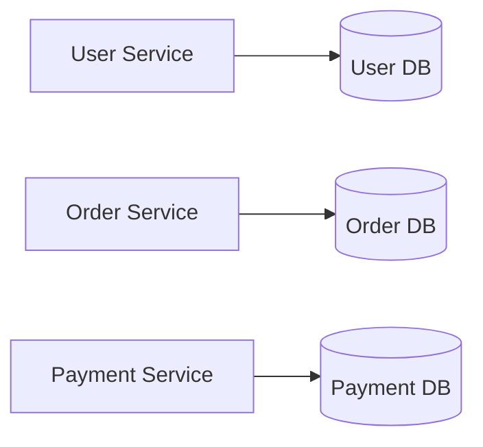
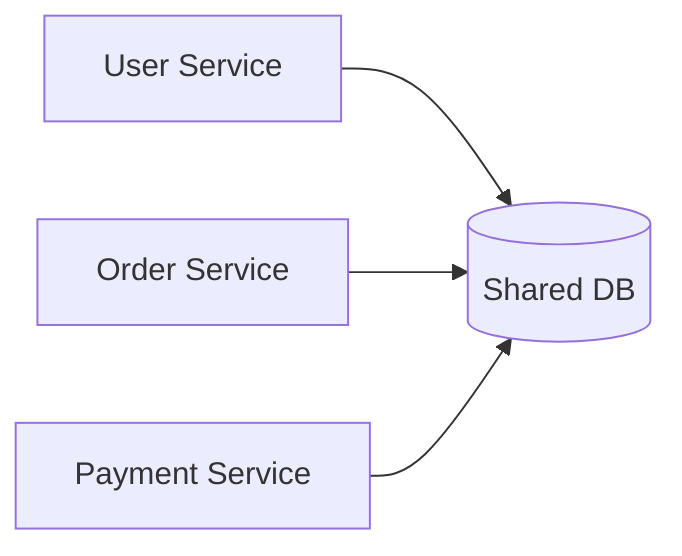

# 2 - Microservice Fundamentals

## 1. What is a microservice?

A microservice is a **small, independently deployable service** built around a **business capability**.

It is usually:

- focused on one clear responsibility
- independently deployable
- independently scalable
- loosely coupled with other services
- owned by a small team

### Important note
“Micro” does **not** mainly mean “tiny code size.”  
It means **small enough to own, understand, change, and deploy independently**.

---

## 2. Characteristics of a good microservice

1. **Single business responsibility**  
   Example: Order Service, Payment Service, Inventory Service.

2. **Loose coupling**  
   Services should minimize dependency on each other’s internals.

3. **Independent deployment**  
   One service can be deployed without deploying all services.

4. **Independent scaling**  
   Hot services can scale without scaling everything.

5. **Own data where possible**  
   Prefer database-per-service.

6. **Clear API contract**  
   Other services interact through APIs/events, not through direct database access.

---

## 3. Microservice vs monolith

| Aspect | Monolith | Microservices |
|---|---|---|
| Codebase | One large codebase | Many smaller services |
| Deployment | One unit | Many independent units |
| Scaling | Usually whole app | Per service |
| Data | Often one DB | Prefer DB per service |
| Communication | In-process method calls | Network calls |
| Complexity | Lower initially | Higher overall |
| Team autonomy | Lower at scale | Higher |

---

## 4. Why Spring Boot became important for microservices

Microservices need many small services. If creating one service is heavy, the architecture becomes painful.

Spring Boot became popular because it makes service creation fast.

### Spring Boot advantages

- embedded server (Tomcat / Jetty / Netty)
- auto-configuration
- starter dependencies
- production-friendly defaults
- easy externalized configuration
- easy actuator integration
- minimal setup code

### Mental summary
> **Spring Framework** gives flexibility.  
> **Spring Boot** removes boilerplate and speeds up service development.

---

## 5. Independent deployment does not always mean different physical servers

A common beginner thought is:

> “Every microservice must run on a completely separate server.”

Not necessarily.

What matters more is **independent deployability and runtime isolation**.

They may run on:

- different VMs
- different containers
- different pods
- sometimes same machine but different ports/processes in lower environments

Production often uses stronger isolation, but the architectural principle is **independence**, not just “different server.”

---

## 6. Important design rule: business capability over technical layer

Bad split:

- User Controller Service
- User Repository Service
- User DTO Service

Good split:

- User Service
- Order Service
- Payment Service
- Inventory Service

A service should be built around a **business capability**, not a technical layer.

---

## 7. Database-per-service principle

This is a major concept.

Each service should ideally own its own data.

### Why?

If many services directly share one database:

- coupling becomes high
- schema changes become risky
- services are not truly independent
- hidden integration appears at DB level

### Preferred approach

### Avoid

---

## 8. Trade-off: calls are now over network

Inside a monolith, modules call each other by method invocation.

In microservices, communication often happens through:

- HTTP/REST
- gRPC
- messaging (Kafka, RabbitMQ, etc.)

That means:

- serialization/deserialization
- network latency
- timeout possibility
- partial failure possibility

This is why distributed-system patterns become important.

---

## 9. Core microservice concerns you must remember

Once we split services, the application now needs solutions for:

- service discovery
- load balancing
- routing
- resilience
- configuration management
- monitoring and tracing
- security
- data consistency

These are the exact areas Spring Cloud helps with.

---

## 10. Foundation takeaway

> A microservice is not “just a small Spring Boot project.”  
> It is a service with clear business responsibility, independent deployability, loose coupling, and participation in a distributed system.
