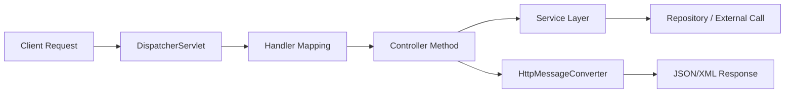
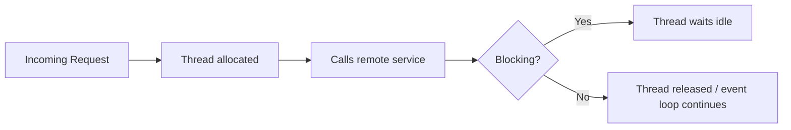

# 3 - Inter-Service Communication

## 1. Why communication becomes important

In a monolith, internal modules usually call each other in-memory.

In microservices, one service may need data or an action from another service. Now communication happens **over a network**.

This immediately raises questions:

- How do services call each other?
- What format is exchanged?
- What if the target service is slow or down?
- Should communication be synchronous or asynchronous?

---

## 2. Communication prerequisites

Whenever two applications communicate, we need clarity on:

1. **Request/response format**  
2. **Exchange format** like JSON or XML  
3. **Transport protocol** like HTTP, HTTPS, messaging  
4. **Contract/API definition**  
5. **Error handling**

---

## 3. Common communication styles

### A. Synchronous communication
Caller waits for response.

Examples:

- REST over HTTP
- gRPC
- GraphQL query to another service

Use when:

- immediate response is needed
- request/response model fits

### B. Asynchronous communication
Caller does not wait immediately.

Examples:

- Kafka
- RabbitMQ
- event-driven communication

Use when:

- loose coupling is needed
- eventual consistency is acceptable
- retry/decoupling is valuable

---

## 4. REST and JSON became common

Historically, SOAP/XML was widely used in enterprise integration.

### SOAP
- XML-based
- heavier
- strict standards
- good for some enterprise integration use cases

### REST
- architectural style
- commonly uses HTTP
- usually JSON payloads
- simpler and lighter for most web/mobile systems

### Why REST became popular
- easier to understand
- lightweight
- widely supported
- better fit for web and microservices in many cases

---

## 5. How Spring Boot handles a request internally (high level)

This is important for understanding controllers and request flow.

### Key components

- **DispatcherServlet**: front controller
- **HandlerMapping**: finds matching endpoint
- **Controller**: handles request
- **HttpMessageConverter**: converts Java objects to/from JSON/XML

---

## 6. `@PathVariable` and `@RequestParam`

### `@PathVariable`
Used to capture values from the URL path.

Example style:
`/orders/101`

### `@RequestParam`
Used for query parameters.

Example style:
`/orders?page=1&size=20`

---

## 7. Calling another service from a Spring application

Historically and currently, a few options exist:

### A. RestTemplate
Older blocking client.

- easy to start with
- synchronous
- now considered legacy for new development

### B. WebClient
Modern reactive/non-blocking client.

- part of Spring WebFlux
- supports asynchronous and reactive style
- better when you want non-blocking I/O

### C. OpenFeign
Declarative HTTP client.

- write interface-based clients
- simpler developer experience
- popular in Spring Cloud environments

---

## 8. Blocking vs non-blocking

This was also present in your notes.

### Blocking call
Caller thread waits until response comes back.

### Non-blocking call
Caller thread can continue or hand over control while waiting for response.

### Why it matters
When many requests come in, blocking I/O can consume many threads and reduce scalability for I/O-heavy workloads.

### Important clarification
Non-blocking is useful, but it also increases conceptual complexity. Use it when it brings clear value.

---

## 9. Which one should you choose?

### Use REST + JSON when:
- standard app-to-app HTTP communication is enough
- team wants simplicity

### Use messaging when:
- loose coupling is needed
- producer and consumer should be decoupled in time
- eventual consistency is acceptable

### Use WebClient when:
- you need reactive/non-blocking behavior
- service is I/O heavy

### Use Feign when:
- you want clean declarative service-to-service clients

---

## 10. Communication takeaway

> Splitting into microservices makes communication a first-class concern.  
> This is where contracts, protocols, blocking vs non-blocking behavior, and error handling become critical.
