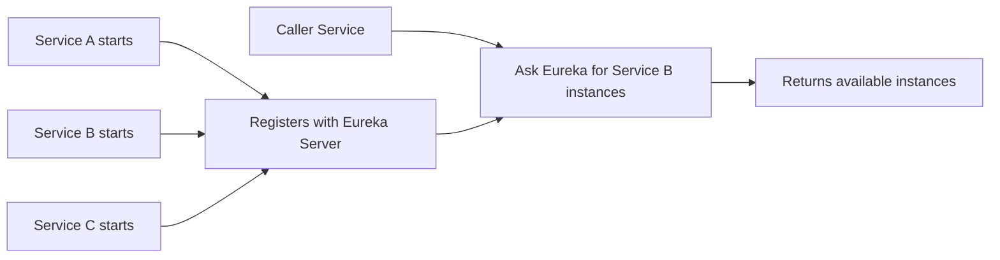
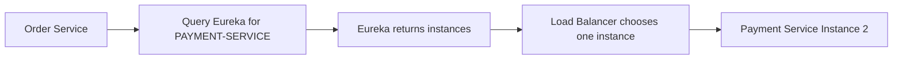

# 4 - Service Discovery and Load Balancing

## 1. The problem after splitting services

Suppose `Order Service` wants to call `Payment Service`.

Question:

- What URL should it call?
- What if Payment Service has 3 instances?
- What if one instance goes down?
- What if ports are dynamic?

Hardcoding IPs and ports does not scale.

That is why we need:

- **service discovery**
- **load balancing**

---

## 2. Service discovery

Service discovery means a mechanism by which services can **register themselves** and other services can **find them dynamically**.

### Eureka in simple words
Eureka is a **service registry**.

It stores information like:

- service name
- host/IP
- port
- status
- health/lease updates

### Basic flow

---

## 3. Eureka Server vs Eureka Client

### Eureka Server
- runs registry
- stores service instance information
- default port often `8761`

### Eureka Client
- a service that registers itself
- can also fetch registry information
- sends heartbeats periodically

---

## 4. Heartbeat / lease renewal

A registered service should prove it is alive.

It sends heartbeat/lease renewal periodically to Eureka.

If heartbeats stop for long enough, Eureka may remove or mark the instance unavailable.

### Mental model
It is like saying:
> “I am still alive. Keep me in the registry.”

---

## 5. Client-side load balancing

Once the caller gets multiple instances from discovery, it must choose one.

Example:

- `PAYMENT-SERVICE` instance 1
- `PAYMENT-SERVICE` instance 2
- `PAYMENT-SERVICE` instance 3

The client picks one instance based on a strategy.

### Common strategies
- round robin
- random
- weighted
- zone-aware (less common in simple setups)

---

## 6. Ribbon vs Spring Cloud LoadBalancer

This is very important for interviews.

### Older approach
- Netflix Ribbon

### Modern approach
- Spring Cloud LoadBalancer

Ribbon is considered legacy. For new Spring Cloud projects, prefer **Spring Cloud LoadBalancer**.

---

## 7. Flow: discovery + load balancing

---

## 8. Discovery by server-side vs client-side load balancing

### Client-side load balancing
Caller gets instance list and chooses one.

### Server-side load balancing
A dedicated proxy/load balancer (like Nginx, cloud LB) chooses the target.

Both are valid. In Spring Cloud, a common pattern is client-side discovery plus load balancing.

---

## 9. Important operational note

Eureka is popular for learning and many internal enterprise systems.
But in modern cloud-native setups, many teams use:

- Kubernetes service discovery
- DNS-based discovery
- cloud provider registries/load balancers

So in interviews, say this naturally:

> Eureka is a classic Spring Cloud discovery solution. In container-orchestrated environments, native platform discovery may replace it.

---

## 10. Main takeaway

> Service discovery solves “How do I find service instances dynamically?”  
> Load balancing solves “Which instance should I send the request to?”
