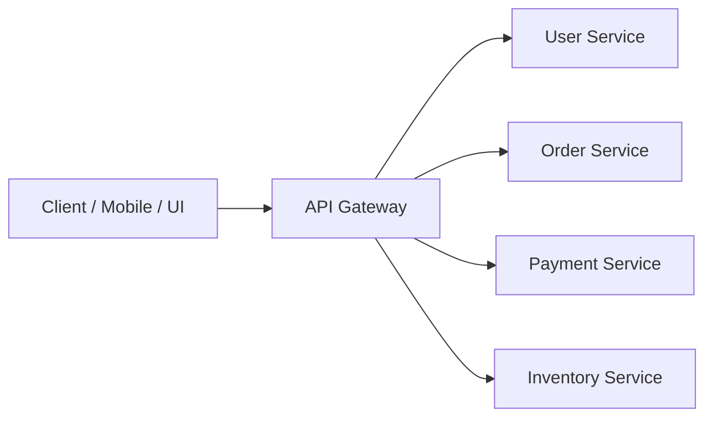
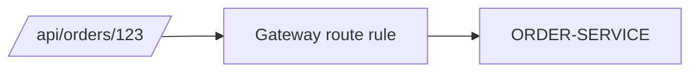
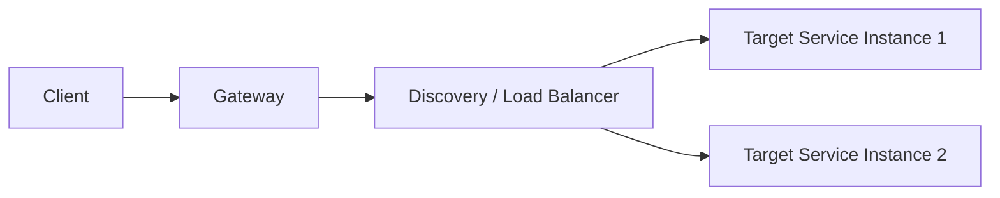

# 5 - API Gateway and External Traffic

## 1. Why an API Gateway is needed

When the system has many microservices, exposing all services directly to clients creates problems.

### Problems without a gateway
- clients must know many service URLs
- authentication logic gets duplicated
- routing becomes messy
- cross-cutting concerns repeat everywhere
- internal services become too exposed

That is why an **API Gateway** is introduced.

---

## 2. What an API Gateway does

An API Gateway acts as a **single entry point** for client requests.

### Common responsibilities
- routing request to correct service
- request filtering
- authentication / authorization integration
- rate limiting
- logging
- header manipulation
- CORS handling
- sometimes response transformation

---

## 3. Zuul vs Spring Cloud Gateway

### Older Netflix approach
- Zuul

### Modern Spring approach
- Spring Cloud Gateway

For modern projects, prefer **Spring Cloud Gateway**.

It is built on **Spring WebFlux** and supports powerful route and filter capabilities.

---

## 4. Routing

Routing means forwarding the request to the right service based on rules.

Example:

- `/api/users/**` → User Service
- `/api/orders/**` → Order Service
- `/api/payments/**` → Payment Service

### Conceptual flow

---

## 5. Predicates and filters

In Spring Cloud Gateway, routes are often configured using:

### Predicates
Conditions to match a request.

Examples:
- path matches `/api/orders/**`
- method is GET
- header exists

### Filters
Logic applied before or after routing.

Examples:
- add/remove header
- rewrite path
- logging
- authentication
- rate limiting

---

## 6. Path rewriting

Sometimes external URL and internal URL differ.

Example:

Client calls:
`/api/amazon/products/1`

Gateway rewrites and forwards internally:
`/products/1`

This is useful to hide internal service structure from the client.

---

## 7. Discovery-aware gateway

A gateway can route using service discovery.

Instead of hardcoded host/port, it can route using service name such as:

- `lb://ORDER-SERVICE`
- `lb://PAYMENT-SERVICE`

Here `lb://` indicates load-balanced resolution.

---

## 8. Why gateway is powerful

Because it centralizes cross-cutting behavior.

Instead of adding the same logic in every service, you put some edge concerns at the gateway level.

### But don’t overdo it
Business logic should **not** be moved into the gateway.

Gateway is for **edge concerns**, not as a replacement for domain services.

---

## 9. Typical production flow

---

## 10. Main takeaway

> API Gateway gives one clean entrance to the microservice ecosystem and centralizes routing and edge concerns.
