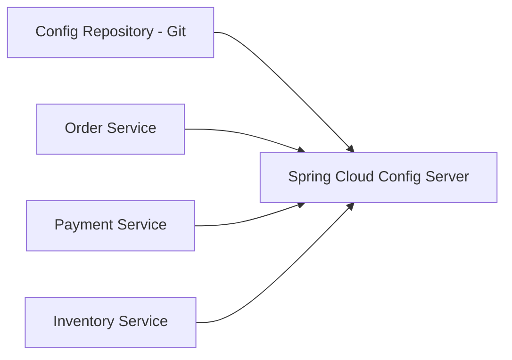
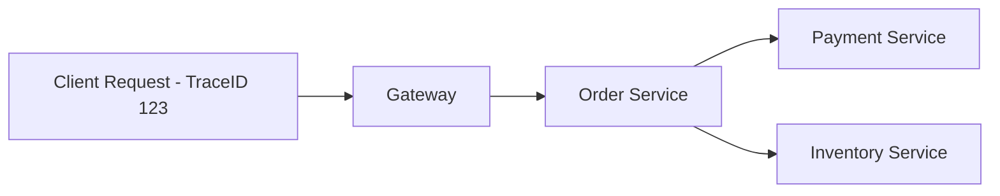

# 6 - Configuration, Observability, and Operations

## 1. Why configuration becomes a serious problem

In monolith, configuration management is easier because there is usually one application.

In microservices, there may be many services and multiple environments:

- dev
- qa
- staging
- prod

Each one may need different values:

- database URLs
- credentials
- feature flags
- timeouts
- retry limits
- service URLs

Managing these separately in every application becomes painful.

---

## 2. Spring Cloud Config

Spring Cloud Config helps **centralize external configuration**.

### What it does
- stores configuration in one central place
- services fetch configuration from config server
- often backed by Git
- supports environment-specific and application-specific properties

### Typical flow

### Benefits
- centralized config
- easier environment management
- version-controlled configuration
- less duplication

---

## 3. Profiles and environment-specific config

Spring profiles help separate values by environment.

Example:
- `application-dev.yml`
- `application-qa.yml`
- `application-prod.yml`

This allows the same application to behave differently per environment without changing code.

---

## 4. Actuator

Spring Boot Actuator exposes production-ready endpoints.

This was also in your notes and is very important.

### Why it matters
Microservices are harder to operate. We need visibility into health and runtime information.

### Common actuator endpoints
- `/actuator/health`
- `/actuator/info`
- `/actuator/metrics`
- `/actuator/env`
- `/actuator/prometheus` (when configured)

### Use cases
- health checks
- readiness/liveness style monitoring
- metrics collection
- operational debugging

---

## 5. Health checks and service registration

In discovery-based systems, health status matters.

If a service is unhealthy, we do not want traffic to continue going there.

Actuator helps expose health. Discovery/load-balancing layers can use that information.

---

## 6. Logging

In microservices, logs are spread across many services.

Without centralized logging, debugging becomes painful.

### Good practice
- structured logs
- correlation ID / trace ID
- centralized log aggregation

---

## 7. Metrics and monitoring

You should be able to observe:

- request count
- error count
- latency
- CPU/memory
- thread pool utilization
- circuit breaker state
- queue lag (if async)

### Common stack
- Micrometer
- Prometheus
- Grafana

---

## 8. Distributed tracing

In a monolith, one request stays in one app.
In microservices, one business request may cross many services.

Example:

Client → Gateway → Order Service → Payment Service → Inventory Service

If something is slow, where exactly did time go?

That is why we need distributed tracing.

### Typical tools/concepts
- trace ID
- span ID
- OpenTelemetry
- Zipkin / Jaeger / vendor tools

Every service should propagate the trace context.

---

## 9. Config takeaway

> Building services is only half the job.  
> Running them safely across environments is the other half.

That is why config, health, metrics, logs, and tracing are not “extra topics.” They are part of core microservice architecture.
