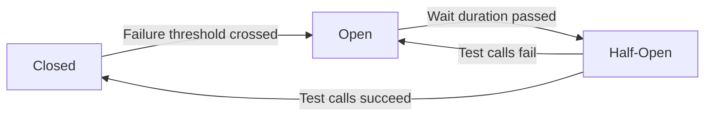
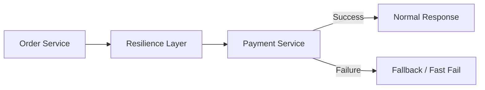

# 7 - Resilience and Fault Tolerance

## 1. Why resilience matters

In distributed systems, failures are normal.

Possible failures:
- downstream service is slow
- service is down
- network is unstable
- too many requests
- temporary timeout

If one service calls another service directly with no protection, a small failure can cascade across the system.

That is why resilience patterns exist.

---

## 2. Timeout

A caller should not wait forever.

A timeout defines the maximum time the caller will wait.

### Why important?
Without timeouts, threads/resources may remain blocked for too long.

---

## 3. Retry

Retry means trying the request again when failure might be temporary.

### Good for
- transient network issues
- temporary downstream unavailability

### Dangerous when overused
Too many retries can worsen an already overloaded system.

So retries must be used carefully.

---

## 4. Circuit Breaker

This was present in your notes and is a very important concept.

A circuit breaker prevents continuously calling a failing downstream service.

### Goal
- avoid wasting resources
- fail fast
- protect the caller
- improve overall system stability

### States

1. **Closed**  
   Normal state. Calls are allowed.

2. **Open**  
   Failures crossed threshold. Calls are blocked or failed fast; fallback may run.

3. **Half-open**  
   After wait period, a small number of test calls are allowed.

If they succeed, it goes back to closed; otherwise open again.

---

## 5. Fallback

Fallback is an alternate response or behavior when downstream call fails.

Examples:
- default response
- cached value
- partial response
- graceful error message

Important: fallback should be meaningful. Don’t hide critical failures incorrectly.

---

## 6. Bulkhead

Bulkhead isolates resources so one failing or heavy component does not consume everything.

### Example
Separate thread pools or resource limits for different remote calls.

This prevents one dependency from taking down the whole service.

---

## 7. Rate limiting

Rate limiting controls how many requests are allowed in a period.

### Why?
- protect system from overload
- protect downstream services
- control abusive traffic

This is often applied at the API Gateway layer.

---

## 8. Resilience4j vs Hystrix

### Older approach
- Netflix Hystrix

### Modern approach
- Resilience4j

Hystrix is no longer actively developed. Prefer **Resilience4j** for modern Spring applications.

### Common Resilience4j modules
- circuit breaker
- retry
- rate limiter
- bulkhead
- time limiter

---

## 9. Example protection flow

---

## 10. Main takeaway

> In microservices, the question is not “Will failures happen?”  
> The question is “How gracefully will we handle them?”
