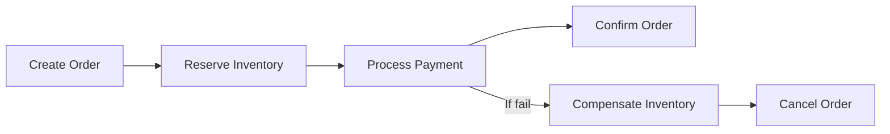

# 8 - Data Consistency and Transactions in Microservices

## 1. Why data becomes harder in microservices

In a monolith, multiple operations often happen inside one database transaction.

Example:
- create order
- reserve inventory
- create payment record

All can be handled with one local transaction in one DB.

In microservices, those actions may belong to **different services with different databases**.

Now distributed consistency becomes harder.

---

## 2. Why shared DB is not the real solution

A shared DB may look easy, but it damages service autonomy.

Problems:
- high coupling
- schema conflicts
- hard independent deployment
- hidden dependencies
- change risk increases

That is why microservices prefer **database-per-service**.

But once each service owns its own DB, distributed transactions become challenging.

---

## 3. Two consistency models

### Strong consistency
All parts reflect the change immediately.

### Eventual consistency
Different services become consistent over time.

Microservices often use **eventual consistency** because distributed strong consistency is expensive and complex.

---

## 4. Saga pattern

Saga is a common solution for multi-service business transactions.

A saga breaks one big business transaction into a sequence of local transactions.

If one step fails, compensating actions are triggered.

### Example: order placement

### Two common styles
1. **Choreography** – services react to events  
2. **Orchestration** – one coordinator controls the flow

---

## 5. Idempotency

Idempotency means repeating the same request should not create unintended duplicate effects.

Very important for:
- payment APIs
- retries
- event consumers

### Example
If `Create Payment` is retried, it should not charge the customer twice.

---

## 6. Outbox pattern

A service may update its DB and publish an event.
If these are not coordinated carefully, inconsistency can happen.

Outbox pattern helps ensure reliable event publishing along with DB changes.

---

## 7. What to say in interviews

If asked “How do transactions work in microservices?” say naturally:

- local ACID transaction is easy within one service DB
- distributed transaction across services is hard
- avoid XA/2PC for many practical systems unless absolutely necessary
- prefer saga/event-driven approaches and eventual consistency where suitable

---

## 8. Main takeaway

> Microservices make deployment and scaling easier, but data consistency harder.  
> That is why transaction thinking in microservices is about **business consistency**, not only DB-level ACID.
