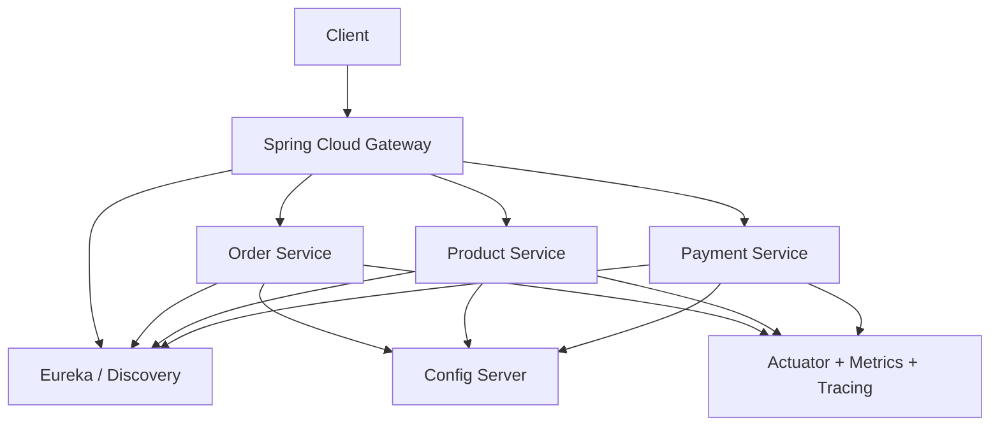
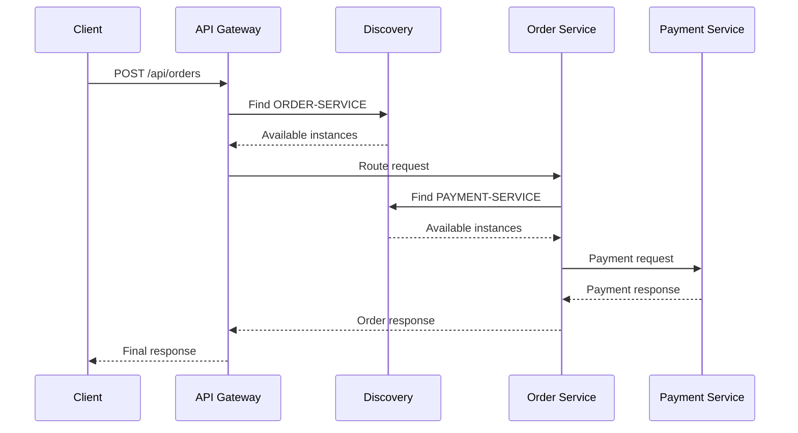

# 9 - Spring Cloud in Practice

## 1. What Spring Cloud really is

Spring Cloud is not one single framework feature.
It is a collection of tools/pattern implementations that help solve common distributed-system problems in a Spring ecosystem.

### Think of it this way
- **Spring Boot** helps build services quickly.
- **Spring Cloud** helps those services work together reliably.

---

## 2. Important Spring Cloud areas to know

### Core topics you should know well
1. Service Discovery  
2. Client-side Load Balancing  
3. API Gateway  
4. Centralized Configuration  
5. Declarative HTTP Clients  
6. Resilience Patterns  
7. Observability / health integration

---

## 3. Spring Cloud components: older vs modern view

| Concern | Older / Legacy | Modern / Preferred |
|---|---|---|
| Discovery | Netflix Eureka | Eureka or platform-native discovery |
| Load Balancing | Ribbon | Spring Cloud LoadBalancer |
| Gateway | Zuul | Spring Cloud Gateway |
| Fault Tolerance | Hystrix | Resilience4j |
| HTTP Client | RestTemplate | WebClient / OpenFeign |
| Config | Spring Cloud Config | Spring Cloud Config or platform-native secret/config solutions |

This table is extremely useful in interviews.

---

## 4. Typical architecture using Spring Cloud

---

## 5. Example startup flow

### Step 1
Start Config Server (if used).

### Step 2
Start Discovery Server.

### Step 3
Start microservices. They:
- fetch configuration
- register with discovery
- expose actuator endpoints

### Step 4
Start API Gateway.

### Step 5
Clients call Gateway, which routes requests to services.

---

## 6. Example request flow

---

## 7. Implementation guidance: best practical way

If you want a strong mental model, implement in this order:

1. simple Spring Boot service  
2. multiple services communicating by REST  
3. service discovery  
4. load balancing  
5. API gateway  
6. config server  
7. actuator + metrics  
8. resilience with circuit breaker/retry  
9. distributed tracing  
10. async communication if needed

This order helps build understanding layer by layer.

---

## 8. What not to do

- Don’t start with 15 microservices for a basic learning project.
- Don’t use every Spring Cloud component just because it exists.
- Don’t say “microservices means Eureka + Gateway.”
- Don’t ignore operations, metrics, and failure handling.

---

## 9. Modern reality

In many real projects today:

- Kubernetes may replace some discovery concerns
- cloud-native config/secret stores may replace config server in some environments
- service mesh may handle some traffic/resilience concerns

Still, learning Spring Cloud is extremely valuable because it teaches the **core distributed-system patterns** clearly.

---

## 10. Final practical takeaway

> Spring Cloud is best understood as a toolkit for common distributed-system patterns in the Spring ecosystem.
