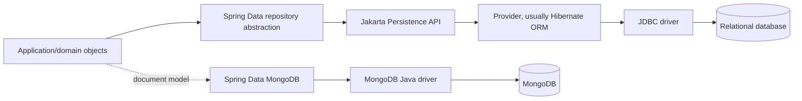

# Java Persistence: JPA, Hibernate, Spring Data JPA, and MongoDB

These notes replace and expand `../JPA.pdf`. The PDF's useful ideas are preserved, technical errors are corrected, screenshots are rewritten as code/tables, and diagrams are represented with Mermaid.

## The 30-second mental model

- **JDBC** is the low-level Java API for SQL, connections, statements, result sets, and transactions.
- **Jakarta Persistence (JPA)** is the standard ORM specification. It is an API and contract, not the ORM engine.
- **Hibernate ORM**, EclipseLink, and OpenJPA are JPA providers. Hibernate is commonly selected by Spring Boot.
- **Spring Data JPA** builds repository, pagination, auditing, and query conveniences on top of JPA. It is not a JPA provider.
- **Spring Data MongoDB** maps Java objects to BSON documents. It is commonly described as an ODM, although Spring calls the component an object-document mapper/mapping framework. It does not implement JPA.

## Why persistence abstractions appeared

| Era/layer | Problem it addresses | Cost/trade-off |
|---|---|---|
| Raw JDBC | Gives Java a standard database API | Repetitive mapping, resource handling, SQL, and change tracking |
| Spring JDBC / `JdbcTemplate` | Removes connection/statement/result-set boilerplate and translates exceptions | SQL and row mapping remain explicit |
| JPA + ORM provider | Maps object state and relationships to relational tables; adds unit-of-work and dirty checking | Hidden SQL, object/relational mismatch, and performance traps |
| Spring Data JPA | Removes repetitive repository implementations | Derived methods and abstractions can hide query cost |
| jOOQ / MyBatis / Spring Data JDBC | Prefer explicit SQL or a simpler aggregate model | Less transparent object graph persistence than a full ORM |
| Spring Data MongoDB | Maps aggregates to BSON documents and exposes Mongo-native queries/aggregations | No joins/constraints/unit-of-work semantics equivalent to JPA |

## Study order

1. [Foundations](01_Persistence-Foundations.md) - why ORM, where every layer fits, and setup.
2. [Entity mapping and lifecycle](02_Entity-Mapping-and-Lifecycle.md) - mappings, identifiers, persistence context, and dirty checking.
3. [Relationships and inheritance](03_Relationships-and-Inheritance.md) - ownership, cascades, fetching, and schema trade-offs.
4. [Querying](04_Querying-JPQL-Criteria-and-Locking.md) - JPQL, Criteria, native SQL, projections, and locking.
5. [Transactions](05_Transactions-and-Concurrency.md) - ACID, isolation, propagation, and rollback.
6. [Spring Data JPA](06_Spring-Data-JPA.md) - repositories, derived queries, paging, auditing, and REST cautions.
7. [Performance](07_Performance-Fetching-and-Caching.md) - N+1, fetching, batching, caches, and measurement.
8. [Advanced practices](08_Advanced-Production-Practices.md) - migrations, testing, bulk work, auditing, and production rules.
9. [Spring Data MongoDB](09_Spring-Data-MongoDB-ODM.md) - document modeling, repositories, aggregation, and transactions.
10. [Mapping ecosystem](10_Famous-Persistence-and-Mapping-Frameworks.md) - famous ORM, SQL mapper, ODM, and DTO mapper choices.
11. [Interview guide](11_Senior-Interview-Guide.md) - concise answers and scenario questions for an experienced Java engineer.

## Corrections made from the source PDF

- JPA is a **specification**, not “the standard ORM framework implementation.”
- A Java class is a type; an object is an instance. ORM maps object state/types and associations to a relational model.
- `@Transactional` defines a transaction boundary. Hibernate dirty checking updates a changed **managed entity** during flush; the annotation itself does not detect changes.
- `flush()` synchronizes pending changes with the database but does not commit. `detach()` can be used without `flush()`, but unflushed changes to that entity may be lost.
- `refresh()` overwrites managed state with database state; it is not the normal way to fetch an entity.
- `clear()` detaches all managed entities; it does not erase already committed database data.
- `mappedBy` names the owning-side **Java field/property**, not a foreign-key column.
- A bidirectional many-to-many uses one join table, not two, when mapped correctly.
- `JpaRepository` is an interface that your repository **extends**, not implements.
- `@CreationTimestamp` and `@UpdateTimestamp` are the correct Hibernate annotation names. Spring Data auditing offers portable alternatives.
- `@SQLSelect` is not the ordinary counterpart shown in the PDF. Hibernate has specific custom SQL annotations whose availability/signatures vary by version; prefer supported modern features such as `@SoftDelete` where applicable.
- `javax.persistence` is legacy. Jakarta Persistence 3+ uses `jakarta.persistence`.
- Old `net.sf.ehcache.hibernate.EhCacheRegionFactory` examples target obsolete Hibernate/Ehcache integration. Modern Hibernate commonly integrates second-level caching through JCache and a supported provider.

## Version note (September 2026)

Learn concepts independently of a version, then follow the versions managed by your Spring Boot release. As of this note, Hibernate ORM 7.4 is the latest stable Hibernate line and Hibernate 8 is still in development. Many production applications remain on Spring Boot 3.x/Hibernate 6.x. Do not copy configuration from a different major line without checking its documentation.

## Primary references

- [Jakarta Persistence 3.2 specification](https://jakarta.ee/specifications/persistence/3.2/jakarta-persistence-spec-3.2)
- [Hibernate ORM User Guide](https://docs.jboss.org/hibernate/orm/current/userguide/html_single/Hibernate_User_Guide.html)
- [Spring Data JPA reference](https://docs.spring.io/spring-data/jpa/reference/)
- [Spring Data MongoDB reference](https://docs.spring.io/spring-data/mongodb/reference/)
