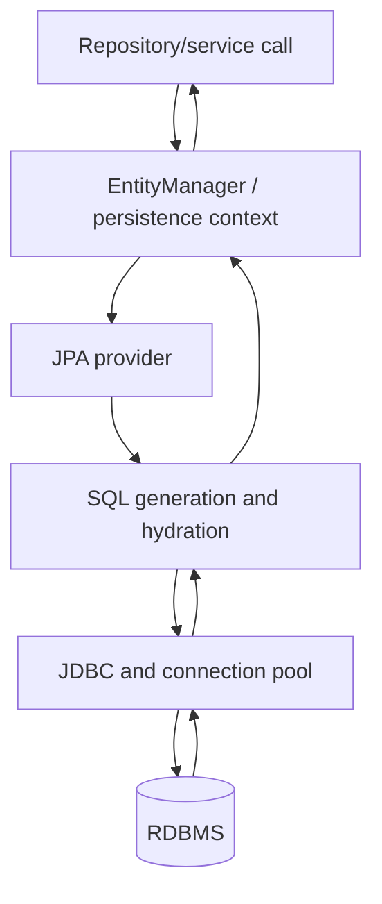

# Persistence Foundations: JDBC to ORM

## The original problem

An object model uses identity, references, inheritance, collections, and behavior. A relational database uses tables, rows, foreign keys, joins, and set-based operations. The mismatch is called the **object-relational impedance mismatch**.

With raw JDBC, an application must:

1. obtain and release connections safely;
2. bind statement parameters;
3. execute SQL;
4. translate every result row into objects;
5. coordinate transactions and exceptions;
6. decide when inserts/updates/deletes occur;
7. reconstruct associations without producing excessive queries.

Spring JDBC removes resource-management boilerplate but intentionally keeps SQL explicit. JPA adds mapping metadata, identity, a persistence context, dirty checking, cascades, and an object-oriented query language.

## Responsibilities by layer



| Component | Owns |
|---|---|
| Application | transaction use case, aggregate rules, query intent |
| Spring Data JPA | repository proxy, query derivation, paging, auditing integration |
| JPA | portable annotations/APIs and lifecycle semantics |
| Hibernate | implementation, SQL generation, dirty checking, proxies, optional caches |
| JDBC driver | protocol between Java and database |
| Connection pool (usually HikariCP) | reusable physical connections |
| Database | constraints, indexes, optimizer, locking, durability |

## ORM is useful when

- The domain is entity-centric with common CRUD and associations.
- You need a unit of work and automatic change tracking.
- Portability and a standard Java API matter.
- Most work operates on aggregates rather than huge set-based transformations.

Prefer SQL-centric tools when SQL shape is the primary design, reporting is complex, vendor features dominate, or very high-volume batch work matters. ORM and explicit SQL can coexist in one system.

## Minimal Spring Boot setup

Typical dependencies are `spring-boot-starter-data-jpa`, a database driver, a migration tool, and test dependencies. H2 is an **embedded relational database**, not merely a console dependency. The H2 console is a development UI and should not be enabled in production.

```properties
spring.datasource.url=jdbc:postgresql://localhost:5432/app
spring.datasource.username=app
spring.datasource.password=${DB_PASSWORD}

# Validate mappings against a migration-managed schema.
spring.jpa.hibernate.ddl-auto=validate
spring.jpa.open-in-view=false

# Development diagnostics; SQL bind logging can expose secrets/PII.
spring.jpa.show-sql=false
spring.jpa.properties.hibernate.format_sql=true
```

`schema.sql` initializes schema and `data.sql` initializes data when Spring's SQL initializer is enabled and ordered correctly. This is not JPA “creating a database.” For real applications use Flyway or Liquibase migrations.

## Why `javax` changed to `jakarta`

Oracle transferred Java EE to the Eclipse Foundation, where it became **Jakarta EE**. The specifications could evolve there, but the `javax.*` namespace could not continue for the new Jakarta EE APIs. Jakarta EE 9 therefore made a breaking namespace change from `javax.*` to `jakarta.*`. This is mostly a package/ecosystem migration, not a completely new persistence programming model.

For persistence code, the common change is:

```java
// Older JPA / Java EE
import javax.persistence.Entity;
import javax.persistence.Id;

// Jakarta Persistence 3+
import jakarta.persistence.Entity;
import jakarta.persistence.Id;
```

When migrating an application:

1. Upgrade the platform as one compatible set. Spring Boot 2-era libraries generally use `javax`; Spring Boot 3+ uses Jakarta APIs and requires Java 17+.
2. Replace relevant imports such as `javax.persistence`, `javax.validation`, `javax.servlet`, and `javax.transaction` with their `jakarta.*` equivalents. Java SE packages such as `javax.sql`, `javax.crypto`, and `javax.xml` do **not** all move.
3. Upgrade providers and integrations: Hibernate, validation provider, servlet container, security libraries, test utilities, and third-party starters must support the same Jakarta generation.
4. Update XML namespaces/schema versions (`persistence.xml`, `orm.xml`, web descriptors) and renamed configuration keys such as `javax.persistence.*` to `jakarta.persistence.*` where applicable.
5. Recompile, run migrations/tests, and check reflection strings, generated sources, serialized class names, and libraries that expose old `javax` types in public signatures.

Do not mix an old `javax.persistence.Entity` with a Jakarta provider and expect it to be recognized. Automated tools such as OpenRewrite or Eclipse Transformer can accelerate migration, but tests must verify behavior.

## Schema generation policy

| Setting | Appropriate use |
|---|---|
| `create` / `create-drop` | disposable demos/tests only |
| `update` | local experimentation; unsafe as a production migration strategy |
| `validate` | good production choice with Flyway/Liquibase |
| `none` | schema is managed completely outside Hibernate |

## Terms interviewers expect

- **Entity:** domain object with persistent identity.
- **Value object/embeddable:** value defined by attributes, normally without independent identity.
- **Persistence unit:** related entity mappings and provider configuration, normally for one database.
- **Persistence context:** identity map plus unit of work; one managed Java instance per entity identity.
- **EntityManager:** API used to interact with a persistence context.
- **ORM:** mapping and runtime behavior between objects and a relational database.

## Common misconception

ORM does not eliminate SQL knowledge. A senior engineer must still reason about query plans, cardinality, constraints, indexes, locking, transaction boundaries, round trips, and database-specific behavior.
