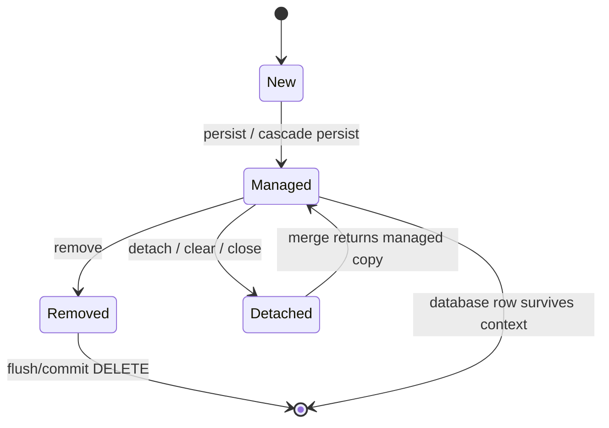

# Entity Mapping, Identity, and Lifecycle

## Basic entity

```java
@Entity
@Table(name = "customer", indexes = @Index(name = "ix_customer_email", columnList = "email"))
public class Customer {
    @Id
    @GeneratedValue(strategy = GenerationType.IDENTITY)
    private Long id;

    @Version
    private long version;

    @Column(nullable = false, unique = true, length = 320)
    private String email;

    @Embedded
    private Address address;

    protected Customer() {} // provider constructor
}

@Embeddable
public class Address {
    private String line1;
    private String city;
    private String postcode;
}
```

Use `jakarta.persistence.*` in modern applications. `javax.persistence.*` belongs to the pre-Jakarta namespace and is legacy for new development.

## Entity design rules

- Provide a public/protected no-argument constructor as required by the JPA version/provider in use.
- Avoid final entity classes/methods when proxies are used.
- Put annotations consistently on fields or getters; placement selects field or property access.
- Keep invariants in methods/constructors; avoid public setters for everything.
- Do not use database-generated IDs blindly in `equals()`/`hashCode()`. A mutable hash code breaks hash collections.
- Prefer wrapper IDs such as `Long` because `null` clearly represents an unsaved entity.
- Use `BigDecimal` with explicit precision/scale for money; store currency separately.

## Identifier strategies

| Strategy | Notes |
|---|---|
| `IDENTITY` | Database generates on insert; simple, but can restrict insert batching |
| `SEQUENCE` | Efficient with allocation/pooling on sequence-capable databases |
| `TABLE` | Portable but introduces a contention table; rarely preferred |
| UUID | Useful across services/offline creation; consider index locality/storage form |
| Composite ID | Use `@EmbeddedId` or `@IdClass`; adds query and association complexity |

`@GeneratedValue` does not always execute `call next value`. SQL depends on the selected strategy, dialect, allocation size, and database.

## Value mapping

```java
@Enumerated(EnumType.STRING) // stable against enum reordering
private Status status;

@Convert(converter = EmailAddressConverter.class)
private EmailAddress email;

@ElementCollection
@CollectionTable(name = "customer_tag", joinColumns = @JoinColumn(name = "customer_id"))
@Column(name = "tag")
private Set<String> tags = new HashSet<>();
```

Avoid the default `EnumType.ORDINAL` for long-lived schemas: inserting/reordering enum constants changes meaning. Use an `AttributeConverter` when the persisted representation needs a stable code.

## Entity states



- **New/transient:** no persistence-context identity.
- **Managed/persistent:** tracked in the persistence context; changes can be detected.
- **Detached:** has identity but is no longer tracked.
- **Removed:** scheduled for deletion.

Important: `merge(detached)` returns a managed copy. The passed detached object does not become managed.

## Persistence context and dirty checking

```java
@Transactional
public void rename(long id, String newName) {
    Customer customer = entityManager.find(Customer.class, id);
    customer.renameTo(newName);
    // No explicit update. On flush, Hibernate detects the managed-state change.
}
```

The transaction makes a reliable flush/commit boundary; dirty checking belongs to the provider and applies to managed entities.

### Operations

| Operation | Meaning |
|---|---|
| `persist(x)` | make a new instance managed; insert may be deferred |
| `find(T,id)` | obtain entity by primary key; may use first-level cache |
| `getReference(T,id)` | obtain a reference, often without immediate row access |
| `remove(x)` | schedule managed entity deletion |
| `merge(x)` | copy state to and return a managed instance |
| `flush()` | synchronize pending SQL; **not a commit** |
| `refresh(x)` | overwrite managed state from the database |
| `detach(x)` | stop tracking one instance |
| `clear()` | detach everything in the context |

Flush can occur before transaction commit and before queries under `AUTO` flush mode. Database constraint violations can therefore surface before commit.

## Lifecycle callbacks and auditing

JPA callbacks are `@PrePersist`, `@PostPersist`, `@PreUpdate`, `@PostUpdate`, `@PreRemove`, `@PostRemove`, and `@PostLoad`. Keep callbacks small and deterministic; avoid remote calls.

Hibernate provides `@CreationTimestamp` and `@UpdateTimestamp`. Spring Data JPA auditing (`@CreatedDate`, `@LastModifiedDate`, `@CreatedBy`, `@LastModifiedBy`) is often preferable when auditor identity and framework portability matter. Database defaults/triggers are best when the database must be the ultimate source of truth.
