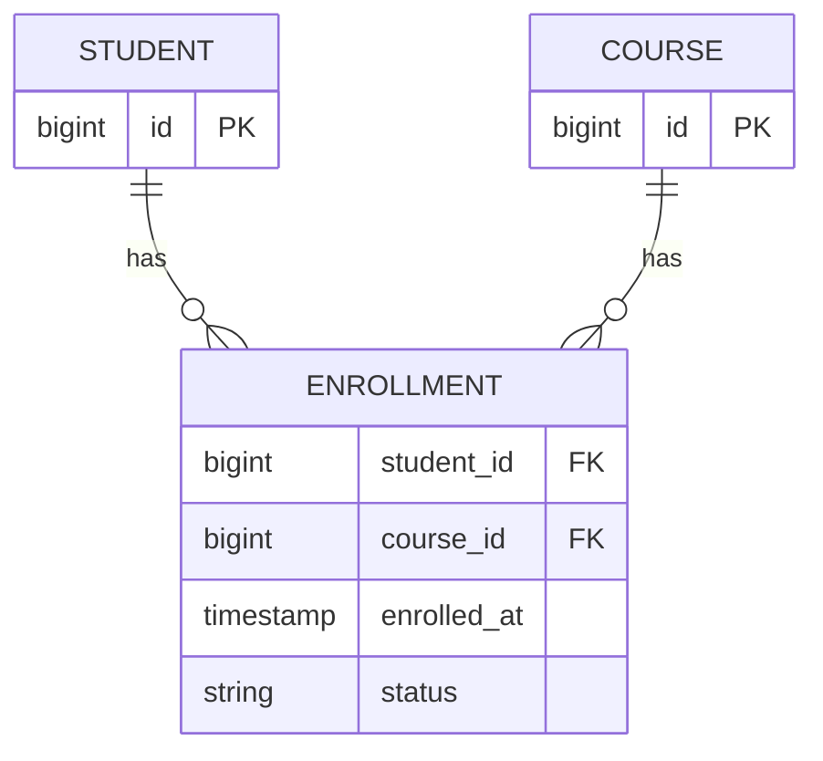
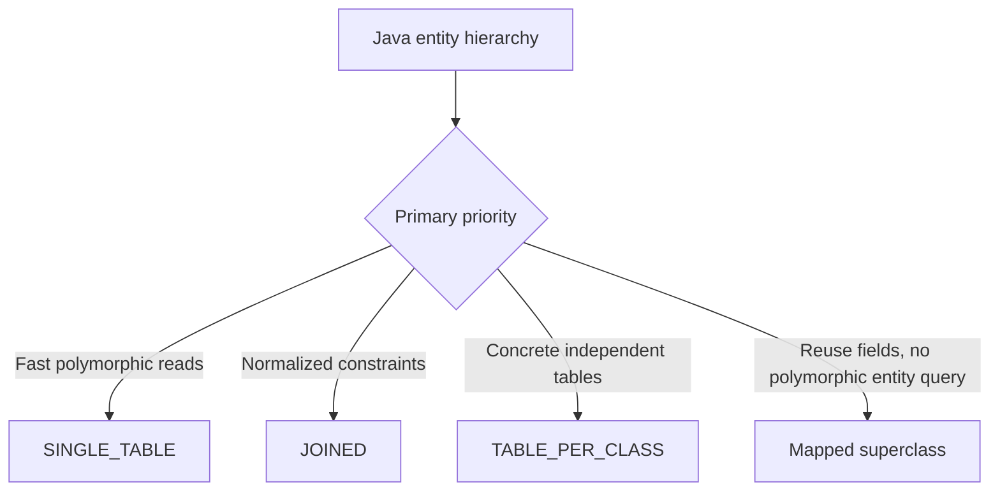

# Relationships and Inheritance

## Start with the relational model

Choose foreign keys, nullability, unique constraints, and indexes first. Then map the model. Java navigation direction does not decide database ownership; the side that writes the foreign key or join table does.

## Relationship defaults

| Mapping | Default fetch in JPA | Usually owning side |
|---|---|---|
| `@ManyToOne` | EAGER | side with foreign key |
| `@OneToOne` | EAGER | side with foreign key |
| `@OneToMany` | LAZY | other side normally owns FK |
| `@ManyToMany` | LAZY | either chosen side owns join table |

EAGER is a requirement; LAZY is a provider hint. Prefer explicitly designed query fetch plans rather than relying on defaults. Many teams mark to-one relations lazy where their provider supports it correctly.

## One-to-many / many-to-one

```java
@Entity
class PurchaseOrder {
    @OneToMany(mappedBy = "order", cascade = CascadeType.ALL, orphanRemoval = true)
    private final List<OrderLine> lines = new ArrayList<>();

    public void addLine(OrderLine line) {
        lines.add(line);
        line.attachTo(this);
    }

    public void removeLine(OrderLine line) {
        lines.remove(line);
        line.detachFromOrder();
    }
}

@Entity
class OrderLine {
    @ManyToOne(fetch = FetchType.LAZY, optional = false)
    @JoinColumn(name = "order_id", nullable = false)
    private PurchaseOrder order;
}
```

`mappedBy = "order"` names the **Java attribute** `OrderLine.order`. It marks `PurchaseOrder.lines` as the inverse side. Keep both sides synchronized in domain helper methods.

## Cascades are not database cascades

JPA cascades propagate EntityManager operations (`PERSIST`, `MERGE`, `REMOVE`, etc.) through an object graph. A database `ON DELETE CASCADE` is enforced by the database. They solve related but different problems.

- Do not use `CascadeType.ALL` automatically on every association.
- `orphanRemoval=true` deletes a child removed from its parent's collection/reference; use it only for privately owned children.
- Avoid cascading remove across shared or many-to-many entities.

## Many-to-many

```java
@ManyToMany
@JoinTable(
    name = "student_course",
    joinColumns = @JoinColumn(name = "student_id"),
    inverseJoinColumns = @JoinColumn(name = "course_id"),
    uniqueConstraints = @UniqueConstraint(columnNames = {"student_id", "course_id"})
)
private Set<Course> courses = new HashSet<>();
```

A correct bidirectional mapping uses one join table; the inverse side uses `mappedBy = "courses"`. In production, a join entity such as `Enrollment(student, course, enrolledAt, status)` is usually better because the relationship often gains attributes, identity, audit data, and lifecycle rules.



## One-to-one caution

A one-to-one is usually a foreign key plus a unique constraint. It can be modeled as a shared primary key using `@MapsId`. Lazy one-to-one behavior has provider/proxy constraints; verify SQL rather than assuming the annotation prevents a query.

## Avoid recursive JSON graphs

Do not treat `@JsonIgnore` as the default solution. Exposing entities from controllers couples the API to persistence, triggers lazy loading, leaks fields, and can recurse. Map entities to API DTOs inside a transaction. Jackson managed/back references or identity annotations are tactical alternatives, not an architectural boundary.

## Inheritance strategies



| Strategy | Schema | Strength | Cost |
|---|---|---|---|
| `SINGLE_TABLE` (default) | one table + discriminator | fastest polymorphic access, no joins | nullable subtype columns and weaker subtype constraints |
| `JOINED` | base table + subtype tables sharing PK | normalized, strong constraints | joins for polymorphic reads/writes |
| `TABLE_PER_CLASS` | table per concrete subtype | independent subtype rows | unions, duplicated columns, ID-generation complexity |
| `@MappedSuperclass` | inherited columns copied into entity tables | code/mapping reuse | superclass is not an entity and cannot be queried polymorphically |

The source PDF's statement that `SINGLE_TABLE` is good when “data integrity is not required” is too strong. It can preserve integrity, but subtype-specific `NOT NULL` and check constraints are harder. Choose from query patterns, constraints, and expected hierarchy growth.

Prefer composition over inheritance when types have substantially different lifecycles or schemas.
