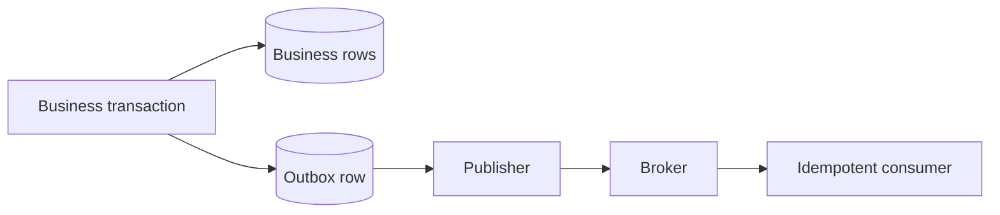

# Transactions and Concurrency

## Why transactions exist

A business operation often changes several rows. Without an atomic boundary, a crash after step 2 of 3 leaves partial state.

- **Atomicity:** all changes commit or none do.
- **Consistency:** committed work respects declared invariants; application logic and database constraints both matter.
- **Isolation:** concurrent executions behave according to the selected isolation guarantees.
- **Durability:** committed data survives failures covered by the database's durability contract.

## Spring versus Jakarta `@Transactional`

- `org.springframework.transaction.annotation.Transactional` supports Spring propagation, isolation, timeout, read-only hints, rollback rules, labels, and multiple transaction-manager selection.
- `jakarta.transaction.Transactional` is the Jakarta Transactions annotation with a smaller portable contract.

The PDF claim “Jakarta for one database, Spring for multiple databases” is incorrect. Distributed/multi-resource consistency depends on transaction managers and protocols (XA/JTA), not merely which annotation is imported. Modern services often avoid XA using outbox, saga, and idempotency patterns.

## Correct boundary

```java
@Service
class TransferService {
    @Transactional
    public void transfer(long fromId, long toId, Money amount) {
        Account from = accounts.getRequired(fromId);
        Account to = accounts.getRequired(toId);
        from.debit(amount);
        to.credit(amount);
    }
}
```

Put the boundary around a complete use case, usually in the service layer. A repository method per transaction cannot make a multi-repository use case atomic.

Spring's default proxy mode only intercepts calls that pass through the proxy. Self-invocation, private methods, manually created objects, or an incorrect transaction manager can make an annotation ineffective.

## Rollback rules

By default Spring rolls back on unchecked `RuntimeException` and `Error`, not every checked exception. Configure `rollbackFor` only when domain semantics require it. Do not catch an exception, suppress it, and assume rollback will happen.

## Propagation

| Mode | Meaning/use |
|---|---|
| `REQUIRED` | join existing transaction or create one; normal default |
| `REQUIRES_NEW` | suspend outer and start independent transaction; can exhaust pool or create surprising partial commits |
| `MANDATORY` | fail unless caller already opened transaction |
| `SUPPORTS` | join if present; otherwise non-transactional |
| `NESTED` | savepoint semantics if transaction manager/resource supports it |

`REQUIRES_NEW` is not a magic audit solution. An audit commit can survive while the business transaction rolls back; decide whether that is intended.

## Isolation anomalies

| Isolation | Dirty read | Non-repeatable read | Phantom read (standard guarantee) |
|---|---:|---:|---:|
| READ UNCOMMITTED | possible | possible | possible |
| READ COMMITTED | prevented | possible | possible |
| REPEATABLE READ | prevented | prevented | possible |
| SERIALIZABLE | prevented | prevented | prevented |

- **Dirty read:** reading another transaction's uncommitted change.
- **Non-repeatable read:** rereading a row and seeing another committed update/delete.
- **Phantom:** repeating a predicate/range query and seeing a changed matching row set.
- **Lost update/write skew:** important application anomalies not fully described by that three-row table.

Actual behavior varies by database implementation (MVCC, snapshots, next-key locks). `READ_COMMITTED` is common, not universally correct. Choose from invariants and contention, then test on the real database.

```java
@Transactional(isolation = Isolation.READ_COMMITTED, timeout = 5)
public void process() { ... }
```

Avoid forcing a global Hibernate/JDBC isolation setting unless all workloads need it. Per-use-case isolation and database defaults are easier to reason about.

## External calls and events

Do not hold database transactions open during slow network calls. A database rollback cannot unsend email or roll back another service. For reliable event publication use a transactional outbox:



## Senior checklist

- Keep transactions short and bounded.
- Enforce invariants with unique/check/FK constraints as well as code.
- Use optimistic locking for common read-modify-write contention.
- Define timeouts and handle deadlock/serialization retries with backoff.
- Never pass managed entities across threads.
- Know whether `readOnly=true` is an optimization hint or actually enforced in your stack.
