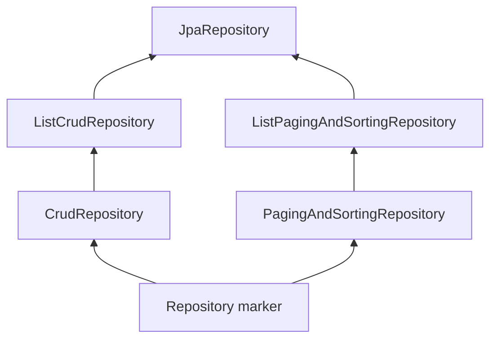

# Spring Data JPA

## What it adds

Spring Data JPA creates repository proxies and integrates JPA with query derivation, paging/sorting, specifications, projections, auditing, and Spring transactions. Hibernate still performs the ORM work.

```java
public interface CustomerRepository extends JpaRepository<Customer, Long> {
    Optional<Customer> findByEmailIgnoreCase(String email);

    Page<Customer> findByStatus(Status status, Pageable pageable);

    @EntityGraph(attributePaths = "address")
    Optional<Customer> findDetailedById(Long id);
}
```

The interface **extends** `JpaRepository<Customer, Long>`. It does not implement it.

## Repository hierarchy - conceptual view



Exact interface inheritance evolves between Spring Data generations; code to capabilities and check the versioned API. `JpaRepository` adds JPA-specific methods such as flush operations and batch deletion.

## `save()` is not always INSERT

Spring Data decides whether an entity is new, then delegates to `EntityManager.persist()` or `merge()`. Calling `save()` repeatedly on an already managed entity is unnecessary from pure JPA's perspective; dirty checking will flush it. Keep `save()` at repository boundaries for consistency, not as an “update now” command.

`saveAndFlush()` synchronizes SQL early; it still does not commit the transaction.

## Derived queries

```java
List<Customer> findTop20ByStatusAndCreatedAtBeforeOrderByCreatedAtAsc(
    Status status, Instant cutoff);
```

Derived names are excellent while readable. Switch to `@Query`, Specification, Querydsl, or a custom repository when names become a sentence or SQL behavior needs control.

## Sorting and pagination

```java
Sort sort = Sort.by(Sort.Order.desc("lastName"), Sort.Order.asc("firstName"));
PageRequest page = PageRequest.of(0, 50, sort); // zero-based page number
```

`Page<T>` usually performs a count query. Use `Slice<T>` when only “has next” matters. Offset pagination slows and becomes unstable at deep pages under concurrent writes; use stable keyset/cursor pagination for large datasets.

Never accept arbitrary property names for sorting without an allowlist.

## Explicit queries

```java
@Query("select c from Course c where lower(c.name) like lower(concat('%', :term, '%'))")
List<Course> search(@Param("term") String term);

@Query(value = "select * from course where search_vector @@ plainto_tsquery(:term)",
       nativeQuery = true)
List<Course> nativeSearch(@Param("term") String term);
```

The correct attribute is `nativeQuery = true`, not `nativeQuery.TRUE`.

## Repository transaction behavior

Inherited CRUD read methods are normally configured read-only; write methods are transactional. Declared query methods do not automatically inherit every desired transaction setting. Prefer service-layer transaction boundaries for a full use case.

## Auditing

```java
@EntityListeners(AuditingEntityListener.class)
class Customer {
    @CreatedDate private Instant createdAt;
    @LastModifiedDate private Instant updatedAt;
    @CreatedBy private String createdBy;
}
```

Enable with `@EnableJpaAuditing` and provide `AuditorAware<T>` if tracking principals. Auditing is not the same as immutable historical revisioning; use Envers or a dedicated audit/event model for history.

## Spring Data REST caution

Spring Data REST can expose repository resources with `@RepositoryRestResource`. It is useful for internal CRUD/prototypes, but direct repository exposure often leaks persistence structure, authorization gaps, and unstable API contracts. For long-lived public APIs prefer explicit controllers/services/DTOs. `@JsonIgnore` does not solve aggregate boundaries or query performance.
