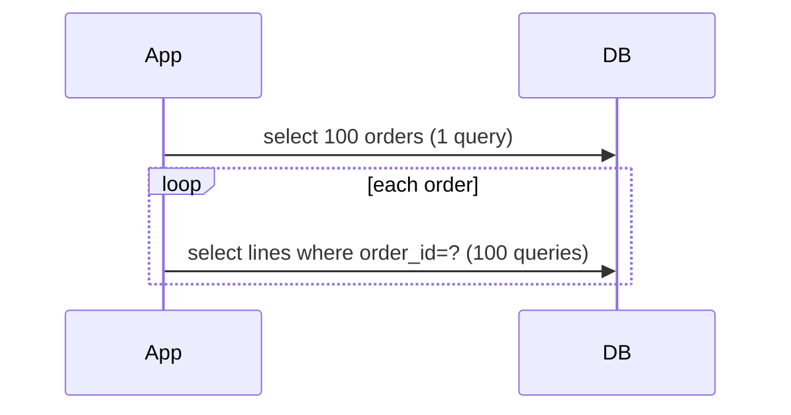

# Performance: Fetching, Batching, and Caching

## Measure before tuning

Inspect generated SQL, query counts, latency percentiles, rows returned, query plans, connection-pool wait time, and database CPU/I/O. SQL logging is useful in development but can leak parameters and overwhelm production logs. Prefer metrics/APM and narrow diagnostic logging.

## N+1 query problem



LAZY loading does **not** solve N+1; it delays the extra queries. EAGER loading also does not guarantee one SQL join. Solve per use case:

1. fetch join for a known small graph;
2. `@EntityGraph`/named entity graph;
3. DTO projection;
4. batch fetching (`hibernate.default_batch_fetch_size` or `@BatchSize`);
5. subselect fetching where appropriate;
6. redesign an oversized aggregate/query boundary.

Do not fetch-join multiple “bag” collections indiscriminately; cartesian row explosion and Hibernate limitations can result.

## First-level cache

The persistence context is an identity map and mandatory first-level cache. Repeated primary-key lookup in the same context normally returns the same managed instance without another select. It is scoped to the EntityManager/persistence context, not “one user.”

It is not a general query-result cache: running the same JPQL query may execute again even though returned entities are resolved to existing managed instances.

For large batches, flush and clear periodically so the context does not grow without bound:

```java
for (int i = 0; i < items.size(); i++) {
    entityManager.persist(items.get(i));
    if (i > 0 && i % BATCH_SIZE == 0) {
        entityManager.flush();
        entityManager.clear();
    }
}
```

Do not clear after every ordinary transaction as a universal optimization; transaction-scoped contexts close naturally.

## Second-level and query cache

- Second-level cache is optional and shared across persistence contexts for a SessionFactory/EntityManagerFactory.
- Enable it only for data with a favorable read/write ratio and understood consistency requirements.
- Entity/collection cache stores state by identifiers; the query cache stores result identifiers/scalars and depends on invalidation metadata.
- In a cluster, choose a cache provider/topology that supports the required invalidation and concurrency strategy.

The PDF's Ehcache 2 property `net.sf.ehcache.hibernate.EhCacheRegionFactory` is obsolete for modern Hibernate. Current Hibernate commonly uses JCache integration (`hibernate-jcache`) with a compatible cache provider; configuration is version-specific.

Spring's `@Cacheable` method cache is different from Hibernate's second-level cache. It caches method results at the service boundary and needs its own keys, eviction, TTL, serialization, and stampede strategy.

## JDBC write batching

Batching groups similar statements and reduces round trips. Typical Hibernate settings include `hibernate.jdbc.batch_size`, `hibernate.order_inserts`, and `hibernate.order_updates`. Verify generated-key strategy and driver support; `IDENTITY` generation can inhibit insert batching.

For millions of rows, use database bulk loading, JDBC batching, or a stateless/bulk path instead of keeping normal ORM entities managed.

## Indexes and constraints

Index foreign keys and actual filter/join/order predicates based on query plans. Too many indexes slow writes and consume space. A JPA `@Index` can document/generate DDL, but production indexes should be managed and reviewed in schema migrations.

## Open EntityManager in View

Keeping the persistence context open through web rendering permits accidental lazy loads in controllers/serializers and hides transaction/query boundaries. Many production systems set `spring.jpa.open-in-view=false`, fetch deliberately in the service/query layer, and return DTOs.

## Performance review checklist

- Is the query count bounded as result size grows?
- Is pagination performed in the database with deterministic ordering?
- Are only needed columns/relationships loaded?
- Are cardinality and cartesian multiplication understood?
- Does the connection pool match database capacity rather than request concurrency?
- Are cache hit ratio, invalidation, and stale-data tolerance measured?
- Are slow queries analyzed on production-like data?
