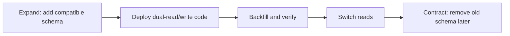

# Advanced Production Practices

## Schema migrations own production evolution

Use Flyway or Liquibase for repeatable, reviewed, forward-only schema changes. Keep `ddl-auto=validate` in deployed environments. A safe zero-downtime change is usually expand-migrate-contract:

Coordinate application versions during rolling deployment. Renaming/dropping a column in one step can break still-running old instances.

## Database constraints are part of the domain

Bean Validation improves messages before SQL, but concurrent requests can both pass an application check. Use database unique, foreign-key, `NOT NULL`, and check constraints as the final guard. Translate constraint violations into meaningful domain/API errors.

## Soft delete

Soft delete adds complexity to every unique constraint, association, index, audit query, and retention policy. Hibernate 6.4+ provides `@SoftDelete`; older recipes using custom `@SQLDelete` plus filters/`@Where` were easy to make inconsistent and are version-sensitive. Decide:

- Can deleted rows be restored?
- Must uniqueness ignore deleted rows?
- Who can query historical rows?
- When is physical purge required?
- Do foreign keys point to soft-deleted data?

Sometimes an append-only audit/history table plus physical delete is clearer.

## Multi-tenancy

Common models are database-per-tenant, schema-per-tenant, or discriminator column. A simple `tenant_id` filter is not sufficient unless every read/write, unique constraint, cache key, batch job, and administrative path is tenant-safe. Prefer database row-level security where appropriate and test cross-tenant leakage explicitly.

## Testing strategy

| Test | Purpose |
|---|---|
| Pure domain unit test | invariants without persistence |
| `@DataJpaTest` | mappings, queries, cascades, constraints |
| Testcontainers with production DB | dialect, isolation, indexes, native SQL, migrations |
| Query-count/performance test | detect N+1 and regressions |
| Migration test | upgrade a realistic prior schema/data set |

H2's dialect, locking, JSON, sequences, and SQL behavior differ from PostgreSQL/MySQL/etc. H2 is useful for fast tests, not proof of production compatibility.

## Time, money, and JSON

- Prefer `Instant` for a global point in time; use `LocalDate` for a calendar date and `ZonedDateTime` only when zone rules are part of the value.
- Store time consistently (normally UTC) and define database column semantics.
- Model money as amount plus currency; avoid floating-point.
- JSON columns are valuable for genuinely flexible subdocuments but do not abandon constraints/queryability accidentally.

## Domain events and audit history

JPA callbacks are suitable for local lifecycle concerns, not reliable external messaging. For integration events, write an outbox record in the same transaction and publish asynchronously. Make consumers idempotent.

Hibernate Envers provides revision history for entity changes. It is not automatically a business-event log and needs retention/query-volume planning.

## Observability

Track:

- transaction duration, failures, deadlocks, and retry rate;
- connection-pool active/idle/pending and acquisition time;
- query latency and rows scanned/returned;
- ORM statement count per request/use case;
- second-level cache hit/miss/put if enabled;
- optimistic-lock conflict rate;
- migration duration and lock impact.

Hibernate statistics are useful diagnostically but may have overhead. Enable them intentionally, not permanently by copying old properties. Logging category names vary between major Hibernate versions.

## Production code review questions

1. What is the aggregate and transaction boundary?
2. Which SQL is generated and how many round trips occur?
3. What happens under concurrent updates?
4. Which database constraint protects each invariant?
5. Can serialization trigger lazy queries or recursion?
6. How will this schema change roll out and roll back?
7. Does retry duplicate side effects?
8. What is the maximum result/collection size?
