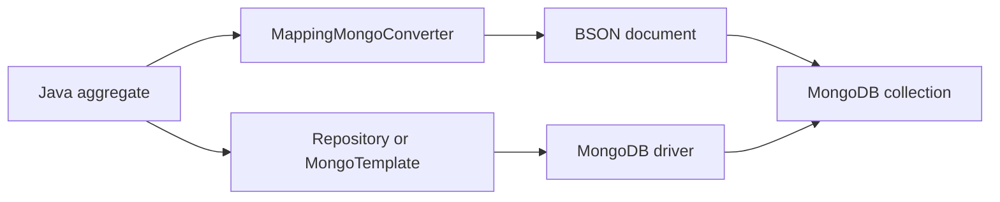
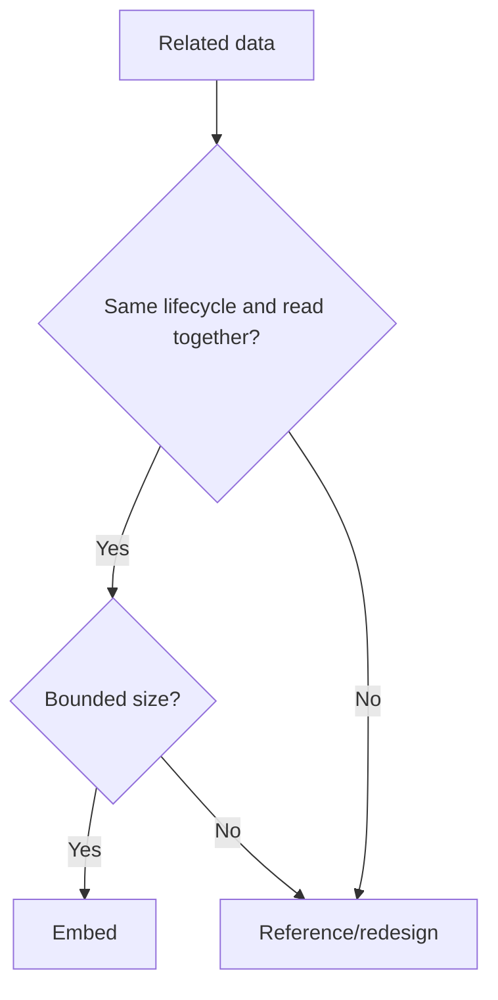

# Spring Data MongoDB: Object-Document Mapping

## Why it exists

MongoDB stores BSON documents, not rows joined through foreign keys. The Java driver exposes BSON operations; Spring Data MongoDB adds object-document mapping, repositories, `MongoTemplate`, type conversion, lifecycle callbacks, auditing, transactions, and aggregation support.

It is an **ODM/mapping framework**, not an ORM and not a JPA provider. Do not apply JPA annotations or relational relationship assumptions to MongoDB.



## Basic document

```java
@Document("orders")
@CompoundIndex(name = "customer_created", def = "{'customerId': 1, 'createdAt': -1}")
public class OrderDocument {
    @Id
    private ObjectId id;

    @Indexed
    private String customerId;

    private List<LineItem> items; // embedded value documents by default
    private Instant createdAt;

    @Version
    private Long version;
}

public interface OrderRepository
        extends MongoRepository<OrderDocument, ObjectId> {
    Slice<OrderDocument> findByCustomerIdOrderByCreatedAtDesc(
        String customerId, Pageable pageable);
}
```

## Model aggregates, not tables

Embed data when it is read/updated together, bounded in size, and owned by one aggregate. Reference when the child is large, independently updated/shared, or embedding would cause duplication/unbounded growth.



MongoDB has a document-size limit, and ever-growing arrays create hot/large documents. “Denormalize everything” is not a design rule.

## References

- Plain ID fields are explicit and predictable.
- `@DocumentReference` provides flexible Spring-managed references.
- `@DBRef` uses MongoDB DBRef values and has loading/proxy caveats.

MongoDB does not automatically enforce referential integrity or cascade saves. Spring's documentation warns about lazy reference proxy behavior and notes limitations in reactive reference resolution. Frequently, storing IDs and querying explicitly is the clearest design.

## Query options

| API | Use |
|---|---|
| Repository derived query | simple CRUD/query patterns |
| `@Query` | JSON query text near repository |
| `MongoTemplate` / `MongoOperations` | dynamic queries, atomic updates, fine control |
| Aggregation framework | pipelines, grouping, lookup, transformations |
| Change streams | consume database changes in supported deployments |

```java
Query query = Query.query(Criteria.where("status").is("OPEN"));
Update update = new Update().inc("attempts", 1).set("updatedAt", Instant.now());
mongoTemplate.updateMulti(query, update, JobDocument.class);
```

Prefer atomic update operators over load-modify-save when an entity does not need to be materialized.

## Transactions and consistency

A single MongoDB document update is atomic. Multi-document transactions exist on replica sets/sharded deployments, but add overhead and should not substitute for good aggregate boundaries. Configure a `MongoTransactionManager` (imperative) or reactive transaction manager and ensure calls participate in the same client session.

`@Version` supports optimistic concurrency for normal mapped saves. Also design idempotency and retry behavior for transient transaction errors.

## Indexes

Design indexes from query predicates and sort order. Review compound-index prefix rules, multikey behavior for arrays, uniqueness, TTL indexes, partial indexes, and explain plans. Automatic index creation may be disabled by default depending on Spring Data generation; production indexes belong in controlled migrations/operations.

## JPA versus MongoDB mapping

| JPA/RDBMS | Spring Data MongoDB |
|---|---|
| table/row | collection/document |
| joins + foreign keys | embedding, IDs, `$lookup`, references |
| persistence context/dirty checking | mapped save/update operations; no JPA persistence context |
| JPQL/Criteria | Mongo query document/Criteria/aggregation |
| schema constraints | flexible schema plus validation/indexes/application rules |
| transaction commonly spans rows | optimize for atomic aggregate/document updates |

## Senior design questions

- What is the aggregate boundary and maximum document size/growth?
- Which queries drive embed-versus-reference decisions?
- What consistency is required across documents/services?
- How are schema evolution and old document shapes handled?
- Are indexes bounded, selective, and compatible with sorting?
- Is shard-key choice aligned with access and growth patterns?
