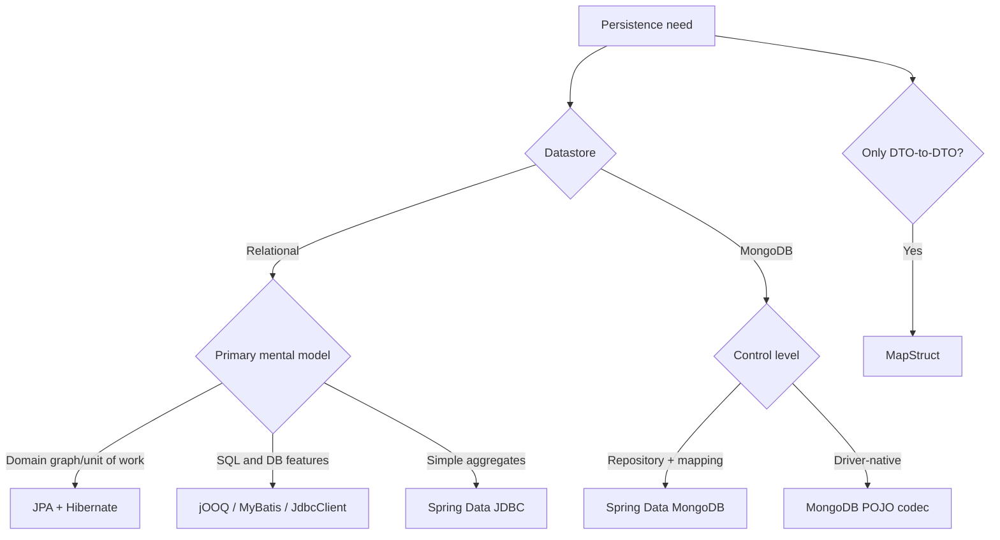

# Famous Java Persistence and Mapping Frameworks

“Mapping framework” can mean database persistence mapping or object-to-object DTO mapping. They are different categories.

## Relational persistence

| Framework/API | Style | Choose when |
|---|---|---|
| Jakarta Persistence (JPA) | standard ORM API | portability and entity/unit-of-work model matter |
| Hibernate ORM | leading JPA provider + native features | full ORM, large ecosystem, Spring integration |
| EclipseLink | JPA provider | Jakarta EE/reference-implementation heritage or its extensions fit |
| Apache OpenJPA | JPA provider | existing systems; much less common in new Spring applications |
| Spring Data JPA | repository layer over JPA | Spring repository/productivity features |
| Spring Data JDBC | aggregate-oriented, simpler mapping | fewer ORM mechanics; explicit aggregate persistence |
| jOOQ | type-safe SQL DSL/code generation | SQL is a first-class design asset and vendor features matter |
| MyBatis | SQL mapper | hand-authored SQL with configurable result mapping |
| Spring `JdbcTemplate` / `JdbcClient` | JDBC convenience | small explicit SQL layer with little framework magic |

Other ecosystems exist (Ebean, Doma, JDBI), but the table above covers the names most Java interviewers expect.

## NoSQL/document mapping

| Framework | Target |
|---|---|
| Spring Data MongoDB | MongoDB repositories, templates, mapping, aggregation |
| MongoDB Java driver POJO codec | lower-level Mongo-native POJO mapping |
| Morphia | MongoDB ODM |
| Spring Data Elasticsearch | Elasticsearch document/search mapping |
| Spring Data Redis | Redis mapping/repositories, with different data-model trade-offs |

Hibernate OGM was a historical attempt to use a JPA-like model over NoSQL and is discontinued/obsolete for new development. Prefer a datastore-native abstraction such as Spring Data MongoDB.

## DTO/object mapping (not ORM/ODM)

| Framework | Style |
|---|---|
| MapStruct | compile-time generated, type-safe mapping; strong default choice |
| ModelMapper | reflection/convention-driven runtime mapping |
| Orika | runtime bean mapping; more common in legacy systems |
| Jackson | primarily JSON serialization/deserialization, sometimes used for tree/object conversion |

DTO mappers do not manage database identity, queries, transactions, dirty checking, or schemas.

## Decision guide

Hybrid systems are normal: JPA for transactional aggregates, jOOQ/native SQL for reporting, and MapStruct for API DTOs. The important point is one clear transaction owner and no accidental dual writes.

